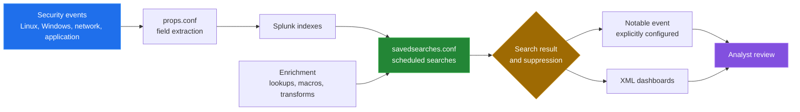

# splunk-security-alerts


> Reusable detection-as-code Splunk app — 13 production-tuned saved searches, lookup-driven allowlisting, two dashboards, and incident-response playbooks in one deployable package.

This repository is a Splunk app that turns security-relevant events into
scheduled saved-search results. It supplies field extractions, reusable search
macros, lookup-backed enrichment, alert definitions, dashboards, and a secure
deployment script. The checked-in files describe the detection logic; a live
Splunk instance and correctly ingested data are still required to observe alert
results.



## Why

Writing Splunk alerts from scratch means reinventing the same SPL patterns for brute-force, privilege escalation, lateral movement, and data exfiltration over and over. This app provides a version-controlled, CI-tested baseline that you adjust to your environment rather than author from zero. It pairs with [posix-ids](https://github.com/Bissbert/posix-ids), which generates the host-level JSON events that these searches consume.

## Quick start

Inspect the checked-in configuration without a Splunk installation:

```sh
python3 tools/measure_alerts.py
```

This command is verified in this checkout. It reads the app's `.conf`, `.csv`,
and dashboard files and reports the inventory used by the documentation. It
does not execute SPL or contact Splunk.

Deploy to a real Splunk host:

```bash
git clone https://github.com/Bissbert/splunk-security-alerts.git
cd splunk-security-alerts

# Automated deploy (prompts for Splunk admin password and install path)
./deployment/deploy_secure.sh

# Manual copy
cp -r security_alerts_app /opt/splunk/etc/apps/
chown -R splunk:splunk /opt/splunk/etc/apps/security_alerts_app
/opt/splunk/bin/splunk restart

# Edit your environment's trusted IPs before enabling alerts
nano security_alerts_app/lookups/authorized_ips.csv
```

The deployment command was not run in this documentation pass because this
workspace has no Splunk instance. It performs host-level changes, asks for
credentials, and defaults to writing a log outside the repository. See
[Operations](docs/operations.md) before using it.

## How it works

- `security_alerts_app/default/savedsearches.conf` — 13 saved searches running on 5- or 10-minute schedules, covering: unauthorized SSH access, privilege escalation, data exfiltration, brute-force login, lateral movement, new admin account creation, C2 communication, persistence mechanisms, port scanning, critical file changes, unusual protocols, credential abuse, and attack chain correlation.
- `security_alerts_app/default/props.conf` / `transforms.conf` — field extractions and lookup-backed transforms for log normalization.
- `security_alerts_app/lookups/` — CSV allowlists for authorized IPs, users, scanners, hosts, and known-bad IPs. Edit these to reduce false positives.
- `security_alerts_app/default/data/ui/views/` — Security Operations Center dashboard and SSH Monitoring dashboard.
- `security_alerts_app/bin/security_validator.py` — Python helper that validates lookup integrity and configuration on deploy.
- `security/playbooks/` — incident-response playbooks and a SOC operations runbook.
- `deployment/deploy_secure.sh` — hardened deploy script with SHA-256 verification and permission enforcement.
- `tests/test_searches.py` — Python-based search validation; `tests/run_tests.sh` runs the suite.

## Architecture

The app has source-side stages that parse incoming events, enrich them with
repository data, evaluate scheduled searches, and present or route results.
The exact relationship between the files is shown in
[the architecture write-up](docs/architecture-overview.md).

## Capabilities

| Capability | Source of truth | What it does |
|---|---|---|
| Event parsing | `default/props.conf` | Extracts fields from Linux, Windows, network, web, application, container, database, and security-tool logs. |
| Search reuse | `default/macros.conf` | Provides reusable index, time, identity, IP, process, risk, and parsing expressions. |
| Enrichment and routing | `default/transforms.conf` and `lookups/` | Defines lookup tables, field extraction rules, event routing, and classifications. |
| Detection | `default/savedsearches.conf` | Schedules searches for authentication, access, process, persistence, network, integrity, and correlation signals. |
| Visualization | `default/data/ui/views/*.xml` | Defines the Security Operations and SSH Monitoring dashboards. |
| Deployment | `deployment/deploy_secure.sh` | Validates, backs up, copies, permissions, and optionally restarts a Splunk app. |

## Configuration

All tuning is done through lookup CSV files and Splunk's saved search threshold parameters:

| File | Purpose |
|---|---|
| `lookups/authorized_ips.csv` | IPs that bypass the unauthorized-access alert |
| `lookups/authorized_users.csv` | Accounts excluded from privilege-escalation checks |
| `lookups/malicious_ips.csv` | Known-bad IPs used in exfiltration risk scoring |
| `lookups/sensitive_hosts.csv` | High-value hosts that raise alert severity |

Splunk version 8.0 or later required (Enterprise or Cloud). Logs must be indexed before alerts fire.

## Results

From `python3 tools/measure_alerts.py`, run in a Linux container by
`tools/linux-run.sh`. These count checked-in files; they are not runtime or
detection-performance benchmarks.

| Artifact | Value |
|---|---:|
| Saved-search stanzas | 13 |
| Static severity `5` / `4` / `3` | 4 / 5 / 4 |
| Searches with `alert.track = 1` | 13 |
| Searches with suppression enabled | 6 |
| Searches with `action.notable = 1` | 1 |
| Searches with `action.email = 1` | 0 |
| Searches with `action.script = 1` | 0 |
| Lookup CSV files | 7 |
| `macros.conf` / `props.conf` / `transforms.conf` stanzas | 24 / 14 / 42 |
| Dashboard views | 2 |
| Dashboard panels: security operations / SSH monitoring | 10 / 12 |

The alert names, thresholds, windows, suppression keys, routing, and false
positive notes are in the [alert reference](docs/alert-reference.md). The
method, the test results and what was not covered are in
[How measurements were made](docs/measurement.md).

## Repository layout

```text
security_alerts_app/
├── bin/                 validation helper
├── default/             app metadata, searches, parsing, macros, transforms,
│                        dashboards, and permissions
└── lookups/             CSV enrichment and allow-list data
deployment/              standard and secure deployment scripts
docs/                    source-backed diagrams and operating notes
scripts/                 hooks and package creation
security/                policies, playbooks, and security documentation
tests/                   repository validation scripts
tools/                   measurement script and the Linux container run
```

## Known limitations

- The repository does not contain a Splunk instance, sample event corpus, or
  live alert history. Search execution, detection latency, dashboard rendering,
  and false-positive rates are therefore not measured here.
- The saved searches configure a single explicit notable action. No email or
  script action is enabled in the checked-in stanzas, so the old claim of
  broad smart notification coverage is not supported by this source tree.
- The alert lifecycle implemented by the app ends at a tracked or routed search
  result. Analyst triage, escalation, resolution, and case management are
  operating procedures, not states implemented in these files.
- Seven lookup references in the configuration do not have matching CSV files.
  The exact names are listed in [Data and enrichment](docs/data-and-enrichment.md).
- The tests validate configuration only and do not execute SPL. Both test
  entry points currently exit 1 on a false positive in the bracket check, and
  the validator marks every search after the first error as failed (open
  entries 3 and 4 in [Bugs found](docs/BUGS-FOUND.md)).
- The secure deployment script was not run. It requires a live Splunk host,
  suitable permissions, credentials, and host-level tools.

## Documentation

Start with the [documentation index](docs/README.md), then use the component
write-ups for the alert lifecycle, configuration flow, enrichment data, and
operations. Every published measurement is explained in
[docs/measurement.md](docs/measurement.md).

## Status

Actively maintained.

## License

MIT
