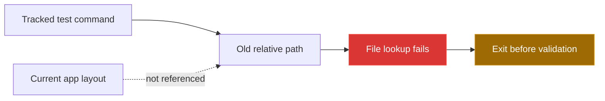

[← back to the overview](../README.md)

# Bugs found during the documentation pass

This file records defects found in tracked code. No tracked source file was
changed to correct them.



## `tests/test_searches.py:151` — stale saved-search path

### What happens

The test constructs `default/savedsearches.conf` relative to the repository
root. The current file is under
`security_alerts_app/default/savedsearches.conf`, so the test exits before it
loads any configuration.

### How to reproduce

From the repository root:

```sh
python3 tests/test_searches.py
```

Observed result:

```text
Error: Configuration file not found at .../default/savedsearches.conf
```

### Proposed fix (not applied)

```diff
--- a/tests/test_searches.py
+++ b/tests/test_searches.py
@@
-    config_path = Path(__file__).parent.parent / 'default' / 'savedsearches.conf'
+    config_path = (Path(__file__).parent.parent / 'security_alerts_app' /
+                   'default' / 'savedsearches.conf')
```

## `tests/run_tests.sh:22-26` — stale configuration paths

### What happens

The runner changes into `tests/` and checks `../default/*.conf`, but the app
configuration is under `../security_alerts_app/default/`. The first check
fails and the script exits before it reaches the remaining checks.

### How to reproduce

From the repository root:

```sh
bash tests/run_tests.sh
```

Observed result:

```text
Test 1: Checking configuration files...
../default/savedsearches.conf missing
```

### Proposed fix (not applied)

```diff
--- a/tests/run_tests.sh
+++ b/tests/run_tests.sh
@@
-    "../default/savedsearches.conf"
-    "../default/props.conf"
-    "../default/transforms.conf"
-    "../default/macros.conf"
+    "../security_alerts_app/default/savedsearches.conf"
+    "../security_alerts_app/default/props.conf"
+    "../security_alerts_app/default/transforms.conf"
+    "../security_alerts_app/default/macros.conf"
@@
-    "../lookups/authorized_ips.csv"
-    "../lookups/malicious_ips.csv"
-    "../lookups/sensitive_hosts.csv"
-    "../lookups/authorized_users.csv"
-    "../lookups/critical_files.csv"
+    "../security_alerts_app/lookups/authorized_ips.csv"
+    "../security_alerts_app/lookups/malicious_ips.csv"
+    "../security_alerts_app/lookups/sensitive_hosts.csv"
+    "../security_alerts_app/lookups/authorized_users.csv"
+    "../security_alerts_app/lookups/critical_files.csv"
@@
-    "../dashboards/security_operations_dashboard.xml"
-    "../dashboards/ssh_monitoring_dashboard.xml"
+    "../security_alerts_app/default/data/ui/views/security_operations_dashboard.xml"
+    "../security_alerts_app/default/data/ui/views/ssh_monitoring_dashboard.xml"
@@
-    "../default"
-    "../lookups"
-    "../dashboards"
-    "../scripts"
-    "../documentation"
+    "../security_alerts_app/default"
+    "../security_alerts_app/lookups"
+    "../security_alerts_app/default/data/ui/views"
+    "../security_alerts_app/bin"
+    "../docs"
@@
-if [[ -f "../scripts/deploy.sh" ]]; then
+if [[ -f "../deployment/deploy.sh" ]]; then
@@
-    if [[ -x "../scripts/deploy.sh" ]]; then
+    if [[ -x "../deployment/deploy.sh" ]]; then
```

The proposed paths reflect the current repository layout; the test behavior
and expected assertions would still need a separate verification run.
