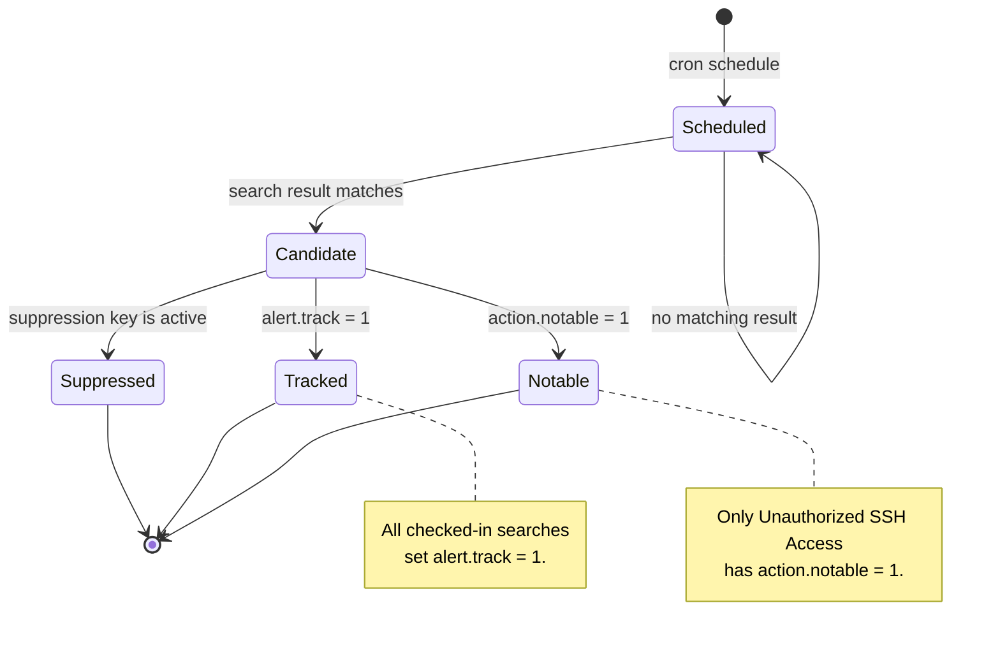
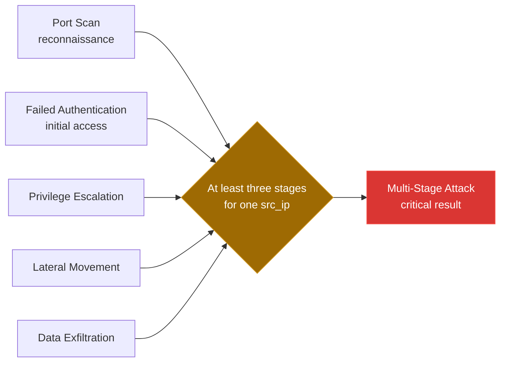

[← back to the overview](../README.md)

# Alert reference

The alert engine is the set of stanzas in
[`default/savedsearches.conf`](../security_alerts_app/default/savedsearches.conf).
It has a search schedule and time window for each definition, optional lookup
enrichment, a threshold or correlation condition, and optional action settings.

## Implemented lifecycle

The repository does not implement a generic raised → triaged → escalated →
resolved workflow. It implements scheduled evaluation, suppression, tracking,
and one explicit notable-event route:

Triage, escalation, containment, and resolution happen in the surrounding SOC
process. They are not persisted as states by the app files.

## Severity and routing matrix

The numeric value is the checked-in `alert.severity`. The label in parentheses
matches the severity values emitted by the searches where they are present.

| Configured severity | Search stanzas | Search result routing | Suppression |
|---|---|---|---:|
| `5` (critical) | Unauthorized SSH, Privilege Escalation, Data Exfiltration, Multi-Stage Attack Chain | One notable route exists for Unauthorized SSH; the other three have no explicit action. | 2 of 4 |
| `4` (high) | Persistence, Lateral Movement, Account Manipulation, Command and Control Beacon, Suspicious Process | No email, script, or notable action is enabled in these stanzas. | 2 of 5 |
| `3` (medium) | Failed Authentication, Port Scanning, Unusual Network Protocol, File Integrity | No email, script, or notable action is enabled in these stanzas. | 2 of 4 |

The direct action counts are:

| Configuration key | Enabled stanzas | Meaning in this repository |
|---|---:|---|
| `alert.track = 1` | 13 | Track search results in Splunk's alert history. |
| `alert.suppress = 1` | 6 | Suppress repeated results using the stanza's configured fields and period. |
| `action.notable = 1` | 1 | Create the configured notable event for Unauthorized SSH. |
| `action.email = 1` | 0 | No email action is enabled by the checked-in stanzas. |
| `action.script = 1` | 0 | No script action is enabled by the checked-in stanzas. |

These counts are produced by
[`tools/measure_alerts.py`](../tools/measure_alerts.py). An omitted action key
is documented as `none-configured`; it is not treated as an external
notification.

## Correlation relationship

The correlation stanza reads prior alert results rather than raw event types.
It groups stages by `src_ip` over its configured two-hour search window and
requires at least three distinct stages:

The correlation search does not include the persistence, account manipulation,
C2, suspicious process, unusual protocol, or file integrity stanzas as stages.
It also depends on earlier results carrying the expected `alert_name` and
`src_ip` fields.

## Per-alert reference

The table uses the configured schedule and dispatch window. The false-positive
notes are operational review points inferred from each search's filters and
lookups; they are not measured rates.

| Alert | What it detects | Configured severity | Schedule / window | False-positive notes |
|---|---|---:|---|---|
| Unauthorized SSH Access from Unknown IPs | Successful SSH from an IP that is not authorized. | `5` critical | Every 5 minutes; `-5m` to `now` | VPN egress, travel, jump hosts, or an incomplete `authorized_ips.csv`. |
| Privilege Escalation Detected | `sudo`, `su`, Windows special logon, or explicit-credential activity from a non-admin user. | `5` critical | Every 5 minutes; `-5m` to `now` | Approved maintenance, service accounts, or an incomplete `authorized_users.csv`. |
| Data Exfiltration Attempt | More than 100 MB of outbound traffic to an external destination, aggregated above the same threshold by source and user. | `5` critical | Every 10 minutes; `-10m` to `now` | Backups, cloud storage, replication, or other approved bulk transfers. |
| Persistence Mechanism Created | Scheduled tasks, services, cron or systemd activity, new users, registry autoruns, or startup scripts. | `4` high | Every 5 minutes; `-5m` to `now` | Configuration management, package installation, or approved account provisioning. |
| Lateral Movement Detected | Authentication from one source host to more than 5 distinct destination hosts. | `4` high | Every 15 minutes; `-15m` to `now` | Administrators, orchestration systems, vulnerability scanners, or field mapping gaps. |
| Account Manipulation | User creation, enablement, password reset, or privileged group changes with risk score above 60. | `4` high | Every 10 minutes; `-10m` to `now` | IAM automation, onboarding, offboarding, and approved privilege changes. |
| Command and Control Beacon | Repeated network or DNS activity with a beacon score above 60 based on count and variance. | `4` high | Every 30 minutes; `-1h` to `now` | Polling services, monitoring agents, software updates, or stable APIs. |
| Suspicious Process Execution | Encoded commands, evasion flags, command chaining, reverse shells, or living-off-the-land process use. | `4` high | Every 5 minutes; `-5m` to `now` | Administrative scripts, automation, developer tooling, or expected interpreter use. |
| Failed Authentication Spike | More than 10 failures in a 5-minute bucket, with higher dynamic severity for larger or malicious-source spikes. | `3` medium | Every 5 minutes; `-5m` to `now` | Password rotation, stale service credentials, login tests, or shared NAT egress. |
| Port Scanning Activity | More than 20 distinct destination ports in a 1-minute bucket, excluding authorized scanners. | `3` medium | Every 5 minutes; `-5m` to `now` | Approved vulnerability scans, inventory discovery, or an incomplete `authorized_scanners.csv`. |
| Unusual Network Protocol | More than 10 events using a protocol not marked standard and not TCP, UDP, or ICMP. | `3` medium | Every 15 minutes; `-15m` to `now` | Proprietary protocols, parser differences, or an incomplete `standard_protocols.csv`. |
| File Integrity Violation | Changes under protected system paths when the event indicates create, delete, modify, or permission activity. | `3` medium | Every 10 minutes; `-10m` to `now` | Package updates, hardening tools, configuration management, or expected rotations. |
| Multi-Stage Attack Chain | At least 3 distinct prior alert stages for one source IP within a 2-hour window. | `5` critical | Every 30 minutes; `-2h` to `now` | Related but benign activity from one NAT, scanner, or shared infrastructure. |

## Dynamic result fields

Several searches add a `severity` field inside the SPL in addition to the
numeric stanza setting. That field can vary by result: persistence uses asset
context, C2 uses malicious-IP context, failed authentication uses failure
volume and threat context, and file integrity uses critical-file context. The
numeric `alert.severity` row above remains the configured alert priority.
