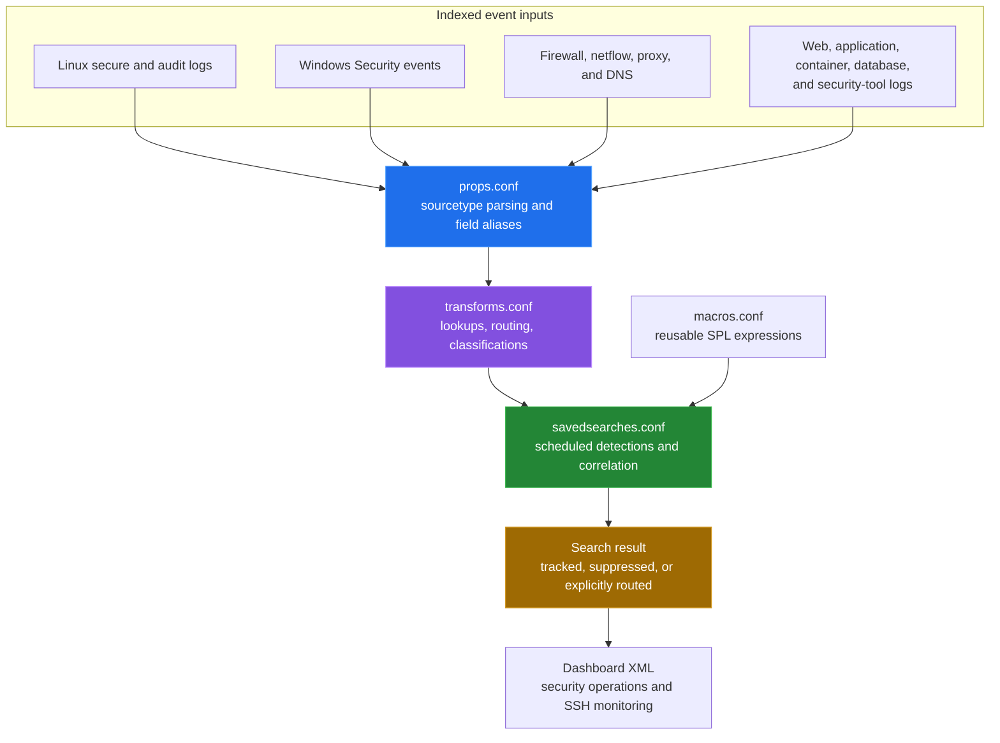
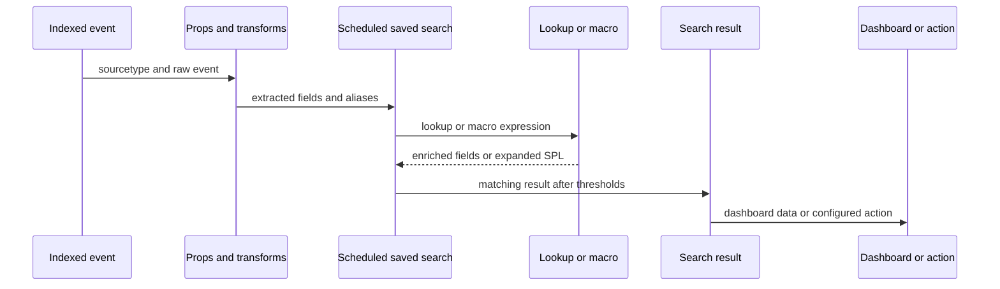

[← back to the overview](../README.md)

# Architecture overview

The repository is a Splunk app package. Its checked-in configuration describes
how indexed events are parsed, enriched, searched, and displayed. It does not
contain Splunk's indexers, search heads, data inputs, or an external case
management system.

## Configuration boundaries

| File | Role in the flow | Stanzas |
|---|---|---:|
| `default/props.conf` | Parses event formats and creates aliases or calculated fields. | 14 |
| `default/transforms.conf` | Defines lookups and regular-expression transforms, including routing and classification rules. | 42 |
| `default/macros.conf` | Stores reusable SPL fragments and parameterized expressions. | 24 |
| `default/savedsearches.conf` | Defines the scheduled detection and correlation searches. | 13 |
| `default/data/ui/views/*.xml` | Defines the dashboards rendered by Splunk Web. | 2 views |
| `lookups/*.csv` | Supplies allow-lists, threat indicators, asset context, and protocol context. | 7 files |

The counts above come from
[`tools/measure_alerts.py`](../tools/measure_alerts.py); they are repository
inventory, not runtime capacity or search-performance measurements.

## Search execution path

The search definitions reference a mixture of raw fields and aliases. For
example, `props.conf` maps source fields into common names such as `src_ip`,
`dest_ip`, `user`, and `host`, while individual searches still contain their
own `coalesce` and `eval` logic. There is no separate correlation service in
the repository: the multi-stage search is a saved search using `multisearch`.

## Dashboards

The two checked-in views are:

| View | Panels | Main focus |
|---|---:|---|
| `security_operations_dashboard.xml` | 10 | Active threats, alert timeline, attacking IPs, targeted systems, categories, and critical results. |
| `ssh_monitoring_dashboard.xml` | 12 | SSH access, failures, sources, users, authentication methods, geography, and brute-force views. |

Panel counts are parsed from the XML by the measurement script. The repository
does not include a live dashboard screenshot or data snapshot, so panel data
and rendering are not verified here.

## What is outside this repository

- Splunk indexer and search-head topology.
- Inputs or forwarder configuration that sends events into Splunk.
- The event volume, retention, or scheduling capacity of a target deployment.
- Email, script, PagerDuty, SOAR, or ticketing integrations. The checked-in
  saved searches do not enable those action types.
- Analyst case state. See [the alert lifecycle](alert-reference.md) for the
  states actually represented by the configuration.
