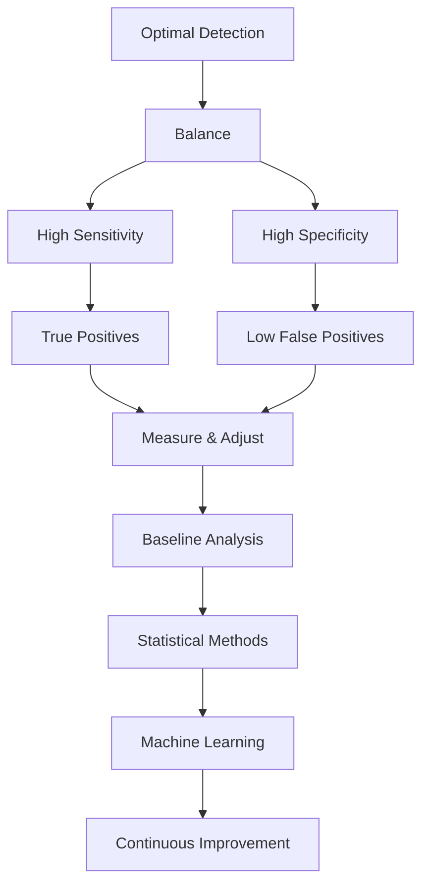

# Advanced Alert Tuning Guide

## Table of Contents
1. [Tuning Philosophy](#tuning-philosophy)
2. [Baseline Establishment](#baseline-establishment)
3. [Statistical Analysis Methods](#statistical-analysis-methods)
4. [Machine Learning Integration](#machine-learning-integration)
5. [Alert-Specific Advanced Tuning](#alert-specific-advanced-tuning)
6. [False Positive Reduction Strategies](#false-positive-reduction-strategies)
7. [Dynamic Threshold Management](#dynamic-threshold-management)
8. [Performance Optimization](#performance-optimization)
9. [Tuning Automation](#tuning-automation)
10. [Measurement and Validation](#measurement-and-validation)

---

## Tuning Philosophy

### Core Principles



### Risk-Based Tuning Framework

| Risk Level | False Negative Tolerance | False Positive Tolerance | Tuning Approach |
|------------|-------------------------|-------------------------|-----------------|
| Critical Assets | Zero | High | Conservative thresholds |
| High Value | Very Low | Medium | Balanced approach |
| Standard | Low | Low | Optimized thresholds |
| Low Value | Medium | Very Low | Aggressive filtering |

---

## Baseline Establishment

### Environmental Profiling

#### Step 1: Data Collection Period

```spl
# Collect 30-day baseline data
index=* earliest=-30d latest=now
| bucket _time span=1h
| stats count as events,
        dc(src_ip) as unique_sources,
        dc(dest_ip) as unique_destinations,
        dc(user) as unique_users,
        avg(bytes_out) as avg_bytes,
        stdev(bytes_out) as stdev_bytes by _time, index
| eval hour=strftime(_time, "%H")
| eval day_of_week=strftime(_time, "%w")
| eval is_business_hours=if((hour>=8 AND hour<=17) AND (day_of_week>=1 AND day_of_week<=5), 1, 0)
| stats avg(events) as baseline_events,
        stdev(events) as stdev_events,
        perc95(events) as p95_events,
        perc99(events) as p99_events by hour, day_of_week, is_business_hours, index
| outputlookup baseline_metrics.csv
```

#### Step 2: Behavioral Pattern Analysis

```spl
# Analyze user behavior patterns
index=* user=* earliest=-30d
| eval hour=strftime(_time, "%H")
| stats count as activity_count,
        dc(host) as systems_accessed,
        dc(action) as action_diversity,
        values(src_ip) as source_ips by user, hour
| eventstats avg(activity_count) as avg_activity,
            stdev(activity_count) as stdev_activity,
            avg(systems_accessed) as avg_systems by user
| eval baseline_score = (activity_count - avg_activity) / stdev_activity
| where abs(baseline_score) < 3
| stats avg(activity_count) as normal_activity,
        avg(systems_accessed) as normal_systems,
        values(source_ips) as normal_ips by user
| outputlookup user_baseline.csv
```

#### Step 3: Network Traffic Profiling

```spl
# Network communication patterns
index=network earliest=-30d
| eval hour_bucket=floor(date_hour/4)*4
| stats sum(bytes_out) as total_bytes,
        dc(dest_port) as unique_ports,
        dc(dest_ip) as unique_destinations by src_ip, hour_bucket
| eventstats avg(total_bytes) as avg_bytes,
            stdev(total_bytes) as stdev_bytes,
            perc95(unique_destinations) as p95_dests by src_ip
| eval normalized_bytes = (total_bytes - avg_bytes) / stdev_bytes
| eval is_normal = if(abs(normalized_bytes) < 2 AND unique_destinations < p95_dests, 1, 0)
| stats avg(total_bytes) as baseline_bytes,
        avg(unique_ports) as baseline_ports,
        avg(unique_destinations) as baseline_destinations,
        stdev(total_bytes) as stdev_bytes by src_ip
| outputlookup network_baseline.csv
```

### Seasonal Patterns

```python
#!/usr/bin/env python3
import pandas as pd
import numpy as np
from statsmodels.tsa.seasonal import seasonal_decompose
import json

def analyze_seasonal_patterns(data_file):
    """Identify seasonal patterns in alert data"""

    # Load historical data
    df = pd.read_csv(data_file, parse_dates=['_time'])
    df.set_index('_time', inplace=True)

    # Perform seasonal decomposition
    decomposition = seasonal_decompose(df['alert_count'],
                                      model='additive',
                                      period=24*7)  # Weekly seasonality

    # Extract components
    trend = decomposition.trend
    seasonal = decomposition.seasonal
    residual = decomposition.resid

    # Calculate seasonal factors
    seasonal_factors = {}
    for hour in range(24):
        for day in range(7):
            key = f"{day}_{hour}"
            mask = (df.index.hour == hour) & (df.index.dayofweek == day)
            seasonal_factors[key] = float(seasonal[mask].mean())

    # Identify anomaly thresholds
    residual_std = residual.std()
    thresholds = {
        'low': float(trend.mean() - 2 * residual_std),
        'medium': float(trend.mean()),
        'high': float(trend.mean() + 2 * residual_std),
        'critical': float(trend.mean() + 3 * residual_std)
    }

    return {
        'seasonal_factors': seasonal_factors,
        'thresholds': thresholds,
        'trend_direction': 'increasing' if trend.iloc[-1] > trend.iloc[0] else 'decreasing'
    }

# Analyze patterns
patterns = analyze_seasonal_patterns('/tmp/alert_history.csv')
print(json.dumps(patterns, indent=2))
```

---

## Statistical Analysis Methods

### Standard Deviation Method

```spl
# Dynamic threshold using standard deviation
index=* alert_name="Failed Authentication Spike" earliest=-7d
| bucket _time span=1h
| stats count as failures by _time, src_ip
| eventstats avg(failures) as avg_failures,
            stdev(failures) as stdev_failures by src_ip
| eval sigma_score = (failures - avg_failures) / stdev_failures
| eval threshold_multiplier = case(
    date_hour >= 2 AND date_hour <= 6, 1.5,  # Lower threshold at night
    date_wday = 0 OR date_wday = 6, 2.0,     # Higher threshold on weekends
    1=1, 1.0
)
| eval dynamic_threshold = avg_failures + (threshold_multiplier * stdev_failures * 2)
| where failures > dynamic_threshold
| eval severity = case(
    sigma_score > 4, "critical",
    sigma_score > 3, "high",
    sigma_score > 2, "medium",
    1=1, "low"
)
```

### Interquartile Range (IQR) Method

```spl
# IQR-based outlier detection
index=* bytes_out>0 earliest=-24h
| bucket _time span=5m
| stats sum(bytes_out) as total_bytes by _time, src_ip
| eventstats perc25(total_bytes) as q1,
            perc75(total_bytes) as q3 by src_ip
| eval iqr = q3 - q1
| eval lower_bound = q1 - (1.5 * iqr)
| eval upper_bound = q3 + (1.5 * iqr)
| eval is_outlier = if(total_bytes < lower_bound OR total_bytes > upper_bound, 1, 0)
| where is_outlier = 1
| eval outlier_severity = case(
    total_bytes > q3 + (3 * iqr), "extreme",
    total_bytes > q3 + (2 * iqr), "severe",
    1=1, "moderate"
)
```

### Moving Average with Exponential Smoothing

```spl
# Exponential weighted moving average
index=* alert_name="Port Scanning" earliest=-48h
| bucket _time span=1h
| stats dc(dest_port) as unique_ports by _time, src_ip
| sort src_ip, _time
| streamstats window=24 avg(unique_ports) as simple_ma by src_ip
| eval alpha = 0.3
| streamstats current=f last(unique_ports) as prev_value by src_ip
| eval ewma = if(isnull(prev_value), unique_ports, alpha * unique_ports + (1 - alpha) * prev_value)
| eval deviation = abs(unique_ports - ewma)
| eventstats avg(deviation) as avg_deviation,
            stdev(deviation) as stdev_deviation by src_ip
| eval anomaly_score = (deviation - avg_deviation) / stdev_deviation
| where anomaly_score > 2
```

### Z-Score Normalization

```python
#!/usr/bin/env python3
import numpy as np
from scipy import stats
import pandas as pd

def calculate_dynamic_thresholds(data, confidence_levels=[90, 95, 99]):
    """Calculate z-score based dynamic thresholds"""

    # Remove outliers using IQR method first
    Q1 = data.quantile(0.25)
    Q3 = data.quantile(0.75)
    IQR = Q3 - Q1
    filtered_data = data[(data >= Q1 - 1.5*IQR) & (data <= Q3 + 1.5*IQR)]

    # Calculate z-scores
    mean = filtered_data.mean()
    std = filtered_data.std()

    thresholds = {}
    for confidence in confidence_levels:
        z_score = stats.norm.ppf(confidence/100)
        thresholds[f"{confidence}%"] = mean + (z_score * std)

    return {
        'mean': float(mean),
        'std': float(std),
        'thresholds': thresholds,
        'outlier_cutoff': float(mean + 3*std)
    }

# Example usage
data = pd.Series(np.random.normal(100, 15, 1000))
thresholds = calculate_dynamic_thresholds(data)
print(f"Dynamic Thresholds: {thresholds}")
```

---

## Machine Learning Integration

### Isolation Forest for Anomaly Detection

```python
#!/usr/bin/env python3
from sklearn.ensemble import IsolationForest
import pandas as pd
import numpy as np
import pickle

class AnomalyDetector:
    def __init__(self, contamination=0.1):
        """Initialize Isolation Forest model"""
        self.model = IsolationForest(
            contamination=contamination,
            random_state=42,
            n_estimators=100
        )
        self.scaler = None

    def train(self, training_data):
        """Train the anomaly detection model"""
        # Prepare features
        features = self.extract_features(training_data)

        # Fit the model
        self.model.fit(features)

        # Save the model
        with open('/opt/soc/models/anomaly_detector.pkl', 'wb') as f:
            pickle.dump(self.model, f)

        return self

    def extract_features(self, data):
        """Extract relevant features for anomaly detection"""
        features = pd.DataFrame()

        features['hour'] = data['_time'].dt.hour
        features['day_of_week'] = data['_time'].dt.dayofweek
        features['event_count'] = data['event_count']
        features['unique_sources'] = data['unique_sources']
        features['unique_destinations'] = data['unique_destinations']
        features['bytes_transferred'] = data['bytes_transferred']

        # Add rolling statistics
        features['rolling_mean'] = data['event_count'].rolling(window=24).mean()
        features['rolling_std'] = data['event_count'].rolling(window=24).std()

        # Add time-based features
        features['is_weekend'] = (features['day_of_week'] >= 5).astype(int)
        features['is_business_hours'] = ((features['hour'] >= 8) &
                                        (features['hour'] <= 17)).astype(int)

        return features.fillna(0)

    def predict(self, new_data):
        """Predict anomalies in new data"""
        features = self.extract_features(new_data)
        predictions = self.model.predict(features)

        # -1 for anomalies, 1 for normal
        anomaly_scores = self.model.score_samples(features)

        results = pd.DataFrame({
            'timestamp': new_data['_time'],
            'is_anomaly': predictions == -1,
            'anomaly_score': anomaly_scores
        })

        return results

    def update_model(self, feedback_data):
        """Update model with feedback from analysts"""
        # Retrain with corrected labels
        corrected_features = self.extract_features(feedback_data)
        self.model.fit(corrected_features[feedback_data['is_normal']])

        return self

# Train the model
detector = AnomalyDetector(contamination=0.05)
training_data = pd.read_csv('/opt/soc/data/historical_alerts.csv')
detector.train(training_data)

# Use for real-time detection
new_data = pd.read_csv('/opt/soc/data/current_alerts.csv')
anomalies = detector.predict(new_data)
print(f"Detected {anomalies['is_anomaly'].sum()} anomalies")
```

### Clustering for Behavioral Groups

```python
#!/usr/bin/env python3
from sklearn.cluster import DBSCAN
from sklearn.preprocessing import StandardScaler
import pandas as pd
import numpy as np

def create_behavioral_clusters(user_data):
    """Create user behavioral clusters for peer group analysis"""

    # Prepare features
    features = user_data[['avg_login_hour', 'systems_accessed',
                          'data_transferred', 'failed_auth_rate']].values

    # Standardize features
    scaler = StandardScaler()
    scaled_features = scaler.fit_transform(features)

    # Perform clustering
    clustering = DBSCAN(eps=0.5, min_samples=5)
    clusters = clustering.fit_predict(scaled_features)

    # Assign clusters to users
    user_data['behavior_cluster'] = clusters

    # Calculate cluster statistics
    cluster_stats = {}
    for cluster_id in np.unique(clusters):
        if cluster_id != -1:  # -1 indicates noise/outliers
            cluster_mask = clusters == cluster_id
            cluster_stats[cluster_id] = {
                'size': int(np.sum(cluster_mask)),
                'avg_login_hour': float(user_data[cluster_mask]['avg_login_hour'].mean()),
                'avg_systems': float(user_data[cluster_mask]['systems_accessed'].mean()),
                'avg_data_transfer': float(user_data[cluster_mask]['data_transferred'].mean())
            }

    return user_data, cluster_stats

# Create behavioral groups
user_data = pd.read_csv('/opt/soc/data/user_behavior.csv')
clustered_data, stats = create_behavioral_clusters(user_data)

# Save cluster assignments
clustered_data.to_csv('/opt/splunk/var/lib/splunk/lookups/user_clusters.csv', index=False)
print(f"Created {len(stats)} behavioral clusters")
```

---

## Alert-Specific Advanced Tuning

### SSH Access Monitoring

#### Geolocation-Based Tuning

```spl
# Geographic anomaly detection
index=* source="/var/log/secure*" "Accepted publickey" earliest=-7d
| iplocation src_ip
| lookup user_geo_baseline.csv user OUTPUT expected_country, expected_city
| eval geo_match = if(Country=expected_country, 1, 0)
| eval distance = case(
    Country!=expected_country, "different_country",
    City!=expected_city, "different_city",
    1=1, "same_location"
)
| eval risk_score = case(
    distance="different_country" AND Country IN ("CN", "RU", "KP", "IR"), 100,
    distance="different_country", 80,
    distance="different_city" AND time_since_last < 3600, 60,
    distance="different_city", 40,
    1=1, 0
)
| where risk_score > 50
```

#### Time-Based Access Patterns

```spl
# Detect unusual access times for users
index=* source="/var/log/secure*" "session opened" earliest=-30d
| eval hour=strftime(_time, "%H")
| stats count as access_count by user, hour
| eventstats sum(access_count) as total_access by user
| eval hour_percentage = (access_count / total_access) * 100
| where hour_percentage > 0.1
| stats values(hour) as normal_hours by user
| outputlookup user_normal_hours.csv
| append [
    search index=* source="/var/log/secure*" "session opened" earliest=-1h
    | eval hour=strftime(_time, "%H")
    | lookup user_normal_hours.csv user OUTPUT normal_hours
    | where NOT match(normal_hours, hour)
    | eval severity="high"
]
```

### Data Exfiltration Detection

#### Adaptive Byte Threshold

```python
#!/usr/bin/env python3
import pandas as pd
import numpy as np
from scipy import stats

class AdaptiveThreshold:
    def __init__(self, window_size=168):  # 1 week in hours
        self.window_size = window_size
        self.thresholds = {}

    def calculate_threshold(self, src_ip, historical_data):
        """Calculate adaptive threshold for specific source"""

        # Get recent data for this source
        src_data = historical_data[historical_data['src_ip'] == src_ip]

        if len(src_data) < self.window_size:
            # Not enough history, use global threshold
            global_threshold = historical_data['bytes_out'].quantile(0.99)
            return global_threshold

        # Calculate exponentially weighted statistics
        ewm_mean = src_data['bytes_out'].ewm(span=24).mean().iloc[-1]
        ewm_std = src_data['bytes_out'].ewm(span=24).std().iloc[-1]

        # Account for time of day
        current_hour = pd.Timestamp.now().hour
        hour_data = src_data[src_data['hour'] == current_hour]

        if len(hour_data) > 10:
            hour_mean = hour_data['bytes_out'].mean()
            hour_std = hour_data['bytes_out'].std()

            # Combine global and hourly statistics
            combined_mean = 0.7 * ewm_mean + 0.3 * hour_mean
            combined_std = 0.7 * ewm_std + 0.3 * hour_std
        else:
            combined_mean = ewm_mean
            combined_std = ewm_std

        # Calculate adaptive threshold
        base_threshold = combined_mean + (3 * combined_std)

        # Apply risk multiplier based on destination
        risk_multiplier = self.get_risk_multiplier(src_ip)
        adaptive_threshold = base_threshold * risk_multiplier

        return adaptive_threshold

    def get_risk_multiplier(self, src_ip):
        """Get risk multiplier based on asset criticality"""
        # This would lookup actual asset criticality
        critical_systems = ['10.0.1.10', '10.0.1.11', '10.0.1.12']

        if src_ip in critical_systems:
            return 0.5  # Lower threshold for critical systems
        else:
            return 1.0  # Normal threshold

    def update_thresholds(self, historical_data):
        """Update all thresholds"""
        for src_ip in historical_data['src_ip'].unique():
            self.thresholds[src_ip] = self.calculate_threshold(src_ip, historical_data)

        return self.thresholds

# Usage
threshold_manager = AdaptiveThreshold()
historical_data = pd.read_csv('/opt/soc/data/network_history.csv')
thresholds = threshold_manager.update_thresholds(historical_data)

# Save thresholds to lookup
pd.DataFrame(list(thresholds.items()),
            columns=['src_ip', 'adaptive_threshold']).to_csv(
    '/opt/splunk/var/lib/splunk/lookups/adaptive_thresholds.csv',
    index=False
)
```

### Privilege Escalation Detection

#### Context-Aware Scoring

```spl
# Context-aware privilege escalation detection
index=* (EventCode=4672 OR sudo OR su) earliest=-1h
| eval context_score = 0
| eval context_score = context_score + case(
    date_hour >= 22 OR date_hour <= 6, 20,
    date_hour >= 18 OR date_hour <= 8, 10,
    1=1, 0
)
| eval context_score = context_score + case(
    date_wday = 0 OR date_wday = 6, 15,
    1=1, 0
)
| lookup user_roles.csv user OUTPUT role, is_admin, last_priv_esc
| eval context_score = context_score + case(
    is_admin = "false", 30,
    role = "contractor", 20,
    role = "intern", 25,
    1=1, 0
)
| eval time_since_last = now() - strptime(last_priv_esc, "%Y-%m-%d %H:%M:%S")
| eval context_score = context_score + case(
    time_since_last < 300, -20,
    time_since_last < 3600, -10,
    time_since_last > 2592000, 15,
    1=1, 0
)
| lookup critical_systems.csv host OUTPUT criticality
| eval context_score = context_score + case(
    criticality = "critical", 40,
    criticality = "high", 20,
    criticality = "medium", 10,
    1=1, 0
)
| where context_score > 50
| eval severity = case(
    context_score > 80, "critical",
    context_score > 60, "high",
    context_score > 40, "medium",
    1=1, "low"
)
```

---

## False Positive Reduction Strategies

### Intelligent Whitelisting

```python
#!/usr/bin/env python3
import pandas as pd
from datetime import datetime, timedelta
import hashlib

class SmartWhitelist:
    def __init__(self):
        self.whitelist = pd.DataFrame()
        self.confidence_threshold = 0.95

    def analyze_false_positives(self, fp_data):
        """Analyze false positive patterns"""

        # Group by common attributes
        patterns = fp_data.groupby(['alert_name', 'src_ip', 'dest_ip', 'action']).agg({
            'alert_id': 'count',
            'resolution_time': 'mean',
            'analyst': 'nunique'
        }).rename(columns={'alert_id': 'fp_count'})

        # Calculate confidence scores
        patterns['confidence'] = patterns.apply(self.calculate_confidence, axis=1)

        # Generate whitelist entries
        whitelist_candidates = patterns[patterns['confidence'] > self.confidence_threshold]

        return whitelist_candidates

    def calculate_confidence(self, row):
        """Calculate confidence score for whitelist entry"""
        score = 0

        # Multiple analysts confirmed FP
        if row['analyst'] > 2:
            score += 0.3

        # Consistent FP over time
        if row['fp_count'] > 10:
            score += 0.3

        # Quick resolution (obvious FP)
        if row['resolution_time'] < 300:  # 5 minutes
            score += 0.2

        # High frequency
        if row['fp_count'] > 20:
            score += 0.2

        return min(score, 1.0)

    def generate_whitelist_entry(self, pattern):
        """Generate whitelist entry with expiration"""

        entry = {
            'whitelist_id': hashlib.md5(str(pattern).encode()).hexdigest()[:8],
            'alert_name': pattern['alert_name'],
            'src_ip': pattern['src_ip'],
            'dest_ip': pattern['dest_ip'],
            'action': pattern['action'],
            'confidence': pattern['confidence'],
            'created_date': datetime.now().isoformat(),
            'expiration_date': (datetime.now() + timedelta(days=30)).isoformat(),
            'auto_generated': True,
            'review_required': pattern['confidence'] < 0.98
        }

        return entry

    def update_whitelist(self, fp_data):
        """Update whitelist with new entries"""

        candidates = self.analyze_false_positives(fp_data)

        new_entries = []
        for idx, pattern in candidates.iterrows():
            entry = self.generate_whitelist_entry(pattern)
            new_entries.append(entry)

        # Add to whitelist
        new_whitelist = pd.DataFrame(new_entries)
        self.whitelist = pd.concat([self.whitelist, new_whitelist], ignore_index=True)

        # Remove expired entries
        self.whitelist = self.whitelist[
            pd.to_datetime(self.whitelist['expiration_date']) > datetime.now()
        ]

        # Save whitelist
        self.whitelist.to_csv(
            '/opt/splunk/var/lib/splunk/lookups/smart_whitelist.csv',
            index=False
        )

        return len(new_entries)

# Usage
whitelist_manager = SmartWhitelist()
fp_data = pd.read_csv('/opt/soc/data/false_positives.csv')
new_entries = whitelist_manager.update_whitelist(fp_data)
print(f"Added {new_entries} new whitelist entries")
```

### Contextual Suppression

```spl
# Context-aware alert suppression
index=* alert_name="Failed Authentication Spike" earliest=-1h
| lookup smart_whitelist.csv alert_name, src_ip, dest_ip OUTPUT whitelist_id, confidence
| eval suppress = if(isnotnull(whitelist_id) AND confidence > 0.95, 1, 0)
| lookup maintenance_windows.csv _time OUTPUT is_maintenance
| eval suppress = if(is_maintenance="true", 1, suppress)
| lookup known_scanners.csv src_ip OUTPUT is_scanner
| eval suppress = if(is_scanner="true" AND severity!="critical", 1, suppress)
| where suppress = 0
| eval suppression_reason = case(
    isnotnull(whitelist_id), "whitelisted_pattern",
    is_maintenance="true", "maintenance_window",
    is_scanner="true", "authorized_scanner",
    1=1, "none"
)
```

---

## Dynamic Threshold Management

### Time-Based Dynamic Thresholds

```spl
# Implement dynamic thresholds based on time patterns
| inputlookup baseline_metrics.csv
| eval current_hour = strftime(now(), "%H")
| eval current_day = strftime(now(), "%w")
| where hour = current_hour AND day_of_week = current_day
| eval threshold_multiplier = case(
    is_business_hours = 1, 1.0,
    current_day = 0 OR current_day = 6, 2.0,
    current_hour >= 22 OR current_hour <= 6, 1.5,
    1=1, 1.2
)
| eval dynamic_threshold = baseline_events + (stdev_events * 2 * threshold_multiplier)
| fields index, dynamic_threshold
| outputlookup dynamic_thresholds.csv
```

### Feedback Loop Implementation

```python
#!/usr/bin/env python3
import pandas as pd
import numpy as np
from datetime import datetime, timedelta

class ThresholdOptimizer:
    def __init__(self, learning_rate=0.1):
        self.learning_rate = learning_rate
        self.threshold_history = []

    def calculate_performance(self, threshold, alerts_data):
        """Calculate threshold performance metrics"""

        tp = len(alerts_data[(alerts_data['value'] > threshold) &
                             (alerts_data['is_true_positive'] == True)])
        fp = len(alerts_data[(alerts_data['value'] > threshold) &
                             (alerts_data['is_true_positive'] == False)])
        fn = len(alerts_data[(alerts_data['value'] <= threshold) &
                             (alerts_data['is_true_positive'] == True)])
        tn = len(alerts_data[(alerts_data['value'] <= threshold) &
                             (alerts_data['is_true_positive'] == False)])

        precision = tp / (tp + fp) if (tp + fp) > 0 else 0
        recall = tp / (tp + fn) if (tp + fn) > 0 else 0
        f1_score = 2 * (precision * recall) / (precision + recall) if (precision + recall) > 0 else 0

        return {
            'threshold': threshold,
            'precision': precision,
            'recall': recall,
            'f1_score': f1_score,
            'false_positive_rate': fp / (fp + tn) if (fp + tn) > 0 else 0
        }

    def optimize_threshold(self, alerts_data, current_threshold):
        """Optimize threshold using gradient descent"""

        # Test different thresholds
        test_range = np.linspace(
            current_threshold * 0.5,
            current_threshold * 1.5,
            20
        )

        performances = []
        for test_threshold in test_range:
            perf = self.calculate_performance(test_threshold, alerts_data)
            performances.append(perf)

        # Find best threshold
        best_perf = max(performances, key=lambda x: x['f1_score'])

        # Apply learning rate for gradual adjustment
        new_threshold = current_threshold + (
            self.learning_rate * (best_perf['threshold'] - current_threshold)
        )

        # Store history
        self.threshold_history.append({
            'timestamp': datetime.now(),
            'old_threshold': current_threshold,
            'new_threshold': new_threshold,
            'f1_score': best_perf['f1_score'],
            'precision': best_perf['precision'],
            'recall': best_perf['recall']
        })

        return new_threshold

    def get_recommendations(self):
        """Get threshold tuning recommendations"""

        if len(self.threshold_history) < 5:
            return "Insufficient data for recommendations"

        recent_history = pd.DataFrame(self.threshold_history[-10:])

        # Analyze trends
        threshold_trend = np.polyfit(
            range(len(recent_history)),
            recent_history['new_threshold'],
            1
        )[0]

        f1_trend = np.polyfit(
            range(len(recent_history)),
            recent_history['f1_score'],
            1
        )[0]

        recommendations = []

        if threshold_trend > 0 and f1_trend > 0:
            recommendations.append("Threshold increases are improving performance")
        elif threshold_trend < 0 and f1_trend > 0:
            recommendations.append("Threshold decreases are improving performance")
        elif abs(f1_trend) < 0.01:
            recommendations.append("Performance has stabilized, current threshold is optimal")
        else:
            recommendations.append("Performance is degrading, review recent changes")

        if recent_history['precision'].iloc[-1] < 0.9:
            recommendations.append("High false positive rate, consider increasing threshold")

        if recent_history['recall'].iloc[-1] < 0.8:
            recommendations.append("Low detection rate, consider decreasing threshold")

        return recommendations

# Usage
optimizer = ThresholdOptimizer(learning_rate=0.15)
alerts_data = pd.read_csv('/opt/soc/data/alert_feedback.csv')
current_threshold = 100
new_threshold = optimizer.optimize_threshold(alerts_data, current_threshold)
recommendations = optimizer.get_recommendations()

print(f"Optimized threshold: {current_threshold} -> {new_threshold}")
print(f"Recommendations: {recommendations}")
```

---

## Performance Optimization

### Search Optimization Techniques

#### 1. Index-Time Field Extraction

```conf
# props.conf optimization
[linux_secure]
EXTRACT-ssh_info = sshd\[\d+\]:\s+(?<ssh_action>Accepted|Failed)\s+(?<auth_method>\S+)\s+for\s+(?<user>\S+)\s+from\s+(?<src_ip>\S+)
FIELDALIAS-source_ip = src_ip AS source_ip
REPORT-ssh_events = ssh_extraction
KV_MODE = none
MAX_TIMESTAMP_LOOKAHEAD = 32
SHOULD_LINEMERGE = false
TRUNCATE = 10000
```

#### 2. Summary Indexing

```spl
# Create summary index for expensive searches
| savedsearch "Failed Authentication Analysis"
| eval _time=now()
| collect index=security_summary sourcetype=failed_auth_summary

# Use summary data for dashboards
index=security_summary sourcetype=failed_auth_summary earliest=-24h
| timechart span=1h sum(count) as failures by src_ip
```

#### 3. Acceleration and Data Models

```spl
# Build accelerated data model
| datamodel "Security" "Authentication" search
| eval action=case(
    action="success", "Successful",
    action="failure", "Failed",
    1=1, "Unknown"
)
| stats count by action, src_ip, user
```

### Memory Management

```python
#!/usr/bin/env python3
import psutil
import subprocess
import json

class PerformanceMonitor:
    def __init__(self):
        self.thresholds = {
            'cpu_percent': 80,
            'memory_percent': 85,
            'disk_percent': 90
        }

    def check_splunk_performance(self):
        """Monitor Splunk performance metrics"""

        metrics = {}

        # System metrics
        metrics['cpu_percent'] = psutil.cpu_percent(interval=1)
        metrics['memory_percent'] = psutil.virtual_memory().percent
        metrics['disk_percent'] = psutil.disk_usage('/opt/splunk').percent

        # Splunk-specific metrics
        splunk_status = subprocess.run(
            ['/opt/splunk/bin/splunk', 'show', 'jobs'],
            capture_output=True,
            text=True
        )

        # Parse active searches
        active_searches = len([line for line in splunk_status.stdout.split('\n')
                             if 'RUNNING' in line])
        metrics['active_searches'] = active_searches

        # Check for issues
        issues = []
        for metric, value in metrics.items():
            if metric in self.thresholds and value > self.thresholds[metric]:
                issues.append(f"{metric} exceeds threshold: {value}%")

        return metrics, issues

    def optimize_searches(self, issues):
        """Implement optimizations based on issues"""

        optimizations = []

        if 'memory_percent' in str(issues):
            optimizations.append("Reduce search time windows")
            optimizations.append("Implement summary indexing")
            optimizations.append("Increase search head memory")

        if 'active_searches' in str(issues) and metrics['active_searches'] > 50:
            optimizations.append("Implement search scheduling")
            optimizations.append("Reduce search frequency")
            optimizations.append("Combine similar searches")

        if 'disk_percent' in str(issues):
            optimizations.append("Implement data retention policies")
            optimizations.append("Archive old data")
            optimizations.append("Increase storage capacity")

        return optimizations

# Monitor performance
monitor = PerformanceMonitor()
metrics, issues = monitor.check_splunk_performance()

if issues:
    optimizations = monitor.optimize_searches(issues)
    print(f"Performance Issues: {issues}")
    print(f"Recommended Optimizations: {optimizations}")
else:
    print("System performance is optimal")
```

---

## Tuning Automation

### Automated Threshold Adjustment

```python
#!/usr/bin/env python3
import pandas as pd
import numpy as np
from datetime import datetime, timedelta
import requests
import json

class AutoTuner:
    def __init__(self, splunk_url, auth_token):
        self.splunk_url = splunk_url
        self.headers = {'Authorization': f'Bearer {auth_token}'}
        self.tuning_history = []

    def get_alert_performance(self, alert_name, days=7):
        """Get alert performance metrics from Splunk"""

        query = f"""
        | inputlookup alert_tracker.csv
        | where alert_name="{alert_name}" AND
                resolution_time > relative_time(now(), "-{days}d")
        | stats count as total,
                sum(eval(if(resolution="false_positive",1,0))) as fp,
                sum(eval(if(resolution="true_positive",1,0))) as tp,
                avg(eval(resolution_time-alert_time)) as avg_response
        """

        # Execute search (simplified for example)
        response = requests.post(
            f"{self.splunk_url}/services/search/jobs",
            data={'search': query},
            headers=self.headers
        )

        # Parse results
        results = response.json()

        return {
            'total': results.get('total', 0),
            'false_positives': results.get('fp', 0),
            'true_positives': results.get('tp', 0),
            'avg_response_time': results.get('avg_response', 0)
        }

    def calculate_new_threshold(self, current_threshold, performance):
        """Calculate new threshold based on performance"""

        fp_rate = performance['false_positives'] / performance['total'] if performance['total'] > 0 else 0

        # Adjustment factor based on FP rate
        adjustment_factor = 1.0

        if fp_rate > 0.20:  # >20% false positives
            adjustment_factor = 1.2  # Increase threshold by 20%
        elif fp_rate > 0.10:  # >10% false positives
            adjustment_factor = 1.1  # Increase threshold by 10%
        elif fp_rate < 0.02 and performance['true_positives'] < 5:  # Very few alerts
            adjustment_factor = 0.9  # Decrease threshold by 10%

        new_threshold = current_threshold * adjustment_factor

        return new_threshold, adjustment_factor

    def update_alert_threshold(self, alert_name, new_threshold):
        """Update alert threshold in Splunk"""

        # Get current search
        get_search = requests.get(
            f"{self.splunk_url}/servicesNS/-/-/saved/searches/{alert_name}",
            headers=self.headers
        )

        current_config = get_search.json()
        current_search = current_config.get('search', '')

        # Update threshold in search
        # This is simplified - actual implementation would parse the SPL properly
        import re
        new_search = re.sub(
            r'(where\s+\w+\s*[><=]+\s*)(\d+)',
            f'\\1{int(new_threshold)}',
            current_search
        )

        # Update the saved search
        update_data = {
            'search': new_search,
            'description': f"Auto-tuned on {datetime.now().isoformat()}"
        }

        response = requests.post(
            f"{self.splunk_url}/servicesNS/-/-/saved/searches/{alert_name}",
            data=update_data,
            headers=self.headers
        )

        return response.status_code == 200

    def auto_tune_alert(self, alert_name, current_threshold):
        """Main auto-tuning function"""

        # Get performance metrics
        performance = self.get_alert_performance(alert_name)

        # Calculate new threshold
        new_threshold, adjustment_factor = self.calculate_new_threshold(
            current_threshold,
            performance
        )

        # Log tuning decision
        tuning_record = {
            'timestamp': datetime.now(),
            'alert_name': alert_name,
            'old_threshold': current_threshold,
            'new_threshold': new_threshold,
            'adjustment_factor': adjustment_factor,
            'performance': performance,
            'applied': False
        }

        # Only apply if change is significant
        if abs(adjustment_factor - 1.0) > 0.05:
            success = self.update_alert_threshold(alert_name, new_threshold)
            tuning_record['applied'] = success

            if success:
                print(f"Auto-tuned {alert_name}: {current_threshold} -> {new_threshold}")
            else:
                print(f"Failed to update {alert_name}")
        else:
            print(f"No tuning needed for {alert_name}")

        self.tuning_history.append(tuning_record)

        return new_threshold if tuning_record['applied'] else current_threshold

    def generate_tuning_report(self):
        """Generate tuning report"""

        df = pd.DataFrame(self.tuning_history)

        report = {
            'total_evaluations': len(df),
            'alerts_tuned': len(df[df['applied'] == True]),
            'average_adjustment': df['adjustment_factor'].mean(),
            'most_tuned': df['alert_name'].value_counts().head(5).to_dict()
        }

        return report

# Usage
auto_tuner = AutoTuner('https://splunk.example.com:8089', 'YOUR_TOKEN')

# Auto-tune all alerts
alerts_to_tune = [
    ('Failed Authentication Spike', 10),
    ('Data Exfiltration Attempt', 104857600),
    ('Port Scanning Activity', 20)
]

for alert_name, current_threshold in alerts_to_tune:
    new_threshold = auto_tuner.auto_tune_alert(alert_name, current_threshold)

# Generate report
report = auto_tuner.generate_tuning_report()
print(json.dumps(report, indent=2))
```

---

## Measurement and Validation

### Tuning Effectiveness Metrics

```spl
# Measure tuning effectiveness over time
| inputlookup tuning_history.csv
| eval tuning_date = strftime(tuning_timestamp, "%Y-%m-%d")
| join alert_name tuning_date [
    | inputlookup alert_tracker.csv
    | eval alert_date = strftime(alert_time, "%Y-%m-%d")
    | where alert_date > tuning_date
    | stats count as post_tuning_alerts,
            sum(eval(if(resolution="false_positive",1,0))) as post_fp,
            sum(eval(if(resolution="true_positive",1,0))) as post_tp
    by alert_name, alert_date
]
| eval post_fp_rate = round((post_fp / post_tuning_alerts) * 100, 2)
| eval effectiveness = case(
    post_fp_rate < 5 AND post_tp > 10, "Highly Effective",
    post_fp_rate < 10 AND post_tp > 5, "Effective",
    post_fp_rate < 20, "Moderate",
    1=1, "Needs Improvement"
)
| table alert_name, tuning_date, old_threshold, new_threshold,
        post_tuning_alerts, post_fp_rate, effectiveness
```

### A/B Testing Framework

```python
#!/usr/bin/env python3
import pandas as pd
import numpy as np
from scipy import stats
import random

class AlertABTesting:
    def __init__(self, control_threshold, test_threshold):
        self.control_threshold = control_threshold
        self.test_threshold = test_threshold
        self.control_results = []
        self.test_results = []

    def assign_group(self):
        """Randomly assign to control or test group"""
        return 'control' if random.random() < 0.5 else 'test'

    def process_event(self, event_value):
        """Process event through A/B test"""
        group = self.assign_group()

        if group == 'control':
            threshold = self.control_threshold
            alert_triggered = event_value > threshold
            self.control_results.append({
                'value': event_value,
                'threshold': threshold,
                'triggered': alert_triggered
            })
        else:
            threshold = self.test_threshold
            alert_triggered = event_value > threshold
            self.test_results.append({
                'value': event_value,
                'threshold': threshold,
                'triggered': alert_triggered
            })

        return group, alert_triggered

    def calculate_statistics(self):
        """Calculate A/B test statistics"""

        control_df = pd.DataFrame(self.control_results)
        test_df = pd.DataFrame(self.test_results)

        # Calculate alert rates
        control_rate = control_df['triggered'].mean() if len(control_df) > 0 else 0
        test_rate = test_df['triggered'].mean() if len(test_df) > 0 else 0

        # Perform statistical test
        if len(control_df) > 30 and len(test_df) > 30:
            _, p_value = stats.ttest_ind(
                control_df['triggered'],
                test_df['triggered']
            )
        else:
            p_value = 1.0

        return {
            'control_alerts': len(control_df[control_df['triggered'] == True]),
            'test_alerts': len(test_df[test_df['triggered'] == True]),
            'control_rate': control_rate,
            'test_rate': test_rate,
            'rate_difference': test_rate - control_rate,
            'p_value': p_value,
            'significant': p_value < 0.05
        }

    def get_recommendation(self):
        """Get recommendation based on test results"""

        stats = self.calculate_statistics()

        if stats['significant']:
            if stats['rate_difference'] < -0.1:
                return f"Test threshold ({self.test_threshold}) significantly reduces alerts"
            elif stats['rate_difference'] > 0.1:
                return f"Test threshold ({self.test_threshold}) significantly increases alerts"
            else:
                return "No significant difference between thresholds"
        else:
            return "Insufficient data for statistical significance"

# Run A/B test
ab_test = AlertABTesting(control_threshold=100, test_threshold=120)

# Simulate events
for _ in range(1000):
    event_value = np.random.lognormal(4.5, 0.5)
    group, triggered = ab_test.process_event(event_value)

# Get results
statistics = ab_test.calculate_statistics()
recommendation = ab_test.get_recommendation()

print(f"A/B Test Results: {statistics}")
print(f"Recommendation: {recommendation}")
```

### ROC Curve Analysis

```python
#!/usr/bin/env python3
from sklearn.metrics import roc_curve, auc
import matplotlib.pyplot as plt
import pandas as pd
import numpy as np

def analyze_threshold_performance(data, thresholds):
    """Analyze performance across multiple thresholds"""

    results = []

    for threshold in thresholds:
        predictions = (data['value'] > threshold).astype(int)
        actual = data['is_true_positive'].astype(int)

        tp = sum((predictions == 1) & (actual == 1))
        fp = sum((predictions == 1) & (actual == 0))
        tn = sum((predictions == 0) & (actual == 0))
        fn = sum((predictions == 0) & (actual == 1))

        tpr = tp / (tp + fn) if (tp + fn) > 0 else 0  # Sensitivity
        fpr = fp / (fp + tn) if (fp + tn) > 0 else 0  # 1 - Specificity

        results.append({
            'threshold': threshold,
            'tpr': tpr,
            'fpr': fpr,
            'precision': tp / (tp + fp) if (tp + fp) > 0 else 0,
            'f1_score': 2 * tp / (2 * tp + fp + fn) if (2 * tp + fp + fn) > 0 else 0
        })

    return pd.DataFrame(results)

def find_optimal_threshold(performance_df):
    """Find optimal threshold based on different criteria"""

    # Youden's J statistic (maximize TPR - FPR)
    performance_df['youden'] = performance_df['tpr'] - performance_df['fpr']
    youden_optimal = performance_df.loc[performance_df['youden'].idxmax()]

    # Maximum F1 score
    f1_optimal = performance_df.loc[performance_df['f1_score'].idxmax()]

    # Closest to top-left corner (0,1)
    performance_df['distance'] = np.sqrt(performance_df['fpr']**2 + (1-performance_df['tpr'])**2)
    distance_optimal = performance_df.loc[performance_df['distance'].idxmin()]

    return {
        'youden': youden_optimal['threshold'],
        'f1_score': f1_optimal['threshold'],
        'roc_distance': distance_optimal['threshold']
    }

# Load alert data
data = pd.read_csv('/opt/soc/data/alert_validation.csv')

# Test different thresholds
thresholds = np.linspace(data['value'].min(), data['value'].max(), 100)
performance = analyze_threshold_performance(data, thresholds)

# Find optimal thresholds
optimal_thresholds = find_optimal_threshold(performance)
print(f"Optimal Thresholds: {optimal_thresholds}")

# Plot ROC curve
plt.figure(figsize=(10, 6))
plt.plot(performance['fpr'], performance['tpr'], 'b-', label='ROC Curve')
plt.plot([0, 1], [0, 1], 'r--', label='Random Classifier')
plt.xlabel('False Positive Rate')
plt.ylabel('True Positive Rate')
plt.title('ROC Curve for Alert Threshold')
plt.legend()
plt.grid(True)
plt.savefig('/opt/soc/reports/roc_curve.png')
```

---

## Appendix: Tuning Cheat Sheet

### Quick Tuning Guidelines

| Alert Type | Initial Threshold | Tuning Method | Key Metrics |
|------------|------------------|---------------|-------------|
| Failed Auth | 10 attempts/5min | Standard Deviation | FP rate, User impact |
| Data Exfil | 100MB/10min | Adaptive percentile | Data sensitivity |
| Port Scan | 20 ports/5min | IQR method | Scanner identification |
| Privilege Esc | Any non-admin | Context scoring | User roles |
| Lateral Movement | 5 systems/15min | Clustering | Movement patterns |
| C2 Beacon | Regularity >80% | FFT analysis | Beacon intervals |
| Process Exec | High-risk process | ML classification | Process chains |
| File Integrity | Any change | Whitelist | Change frequency |

### Common Pitfalls to Avoid

1. **Over-tuning**: Making too many changes too quickly
2. **Under-sampling**: Not enough data for statistical validity
3. **Ignoring context**: Not considering time/day/user patterns
4. **Global thresholds**: Using same threshold for all entities
5. **No validation**: Not testing changes before production
6. **Missing feedback**: Not incorporating analyst feedback
7. **Static thresholds**: Not adapting to environment changes

### Tuning Automation Scripts

```bash
#!/bin/bash
# Daily tuning automation

# Update baselines
/opt/soc/scripts/update_baselines.py

# Run threshold optimization
/opt/soc/scripts/optimize_thresholds.py

# Generate tuning report
/opt/soc/scripts/generate_tuning_report.py

# Apply approved changes
/opt/soc/scripts/apply_tuning_changes.py --approved-only

# Validate changes
/opt/soc/scripts/validate_tuning.py

# Send report
/opt/soc/scripts/send_tuning_report.py --email soc-team@example.com
```

---

## Document Metadata

**Version:** 2.0
**Last Updated:** 2024-10-18
**Next Review:** 2024-11-18
**Classification:** SOC Internal
**Owner:** Security Operations Team