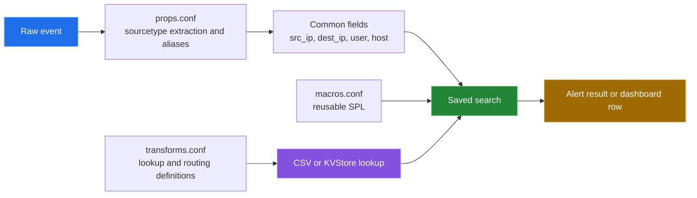

[← back to the overview](../README.md)

# Data and enrichment

The app keeps parsing, reusable SPL, lookup definitions, and lookup data in
separate files. Saved searches combine those layers with local `eval`, `where`,
`stats`, and `rex` expressions.



## Configuration layers

| File | What it contains | Stanzas |
|---|---|---:|
| [`props.conf`](../security_alerts_app/default/props.conf) | Sourcetype parsing, field extraction, aliases, and calculated fields. | 14 |
| [`transforms.conf`](../security_alerts_app/default/transforms.conf) | Lookup definitions, regular expressions, routing, event types, and calculated fields. | 42 |
| [`macros.conf`](../security_alerts_app/default/macros.conf) | Reusable and parameterized SPL expressions. | 24 |
| [`savedsearches.conf`](../security_alerts_app/default/savedsearches.conf) | Search logic that calls lookups and uses normalized fields. | 13 |

The counts are from the committed measurement script. The extraction rules
cover Linux secure logs, Windows Security events, firewall and iptables data,
web access logs, JSON application logs, syslog, Docker, Kubernetes, MySQL,
PostgreSQL, AIDE, and Snort.

## Lookup data

The seven CSV files currently present in `security_alerts_app/lookups/` have the
following measured shape:

| File | Columns | Data rows | Used for |
|---|---:|---:|---|
| `authorized_ips.csv` | 4 | 7 | SSH allow-list checks. |
| `authorized_scanners.csv` | 4 | 3 | Port-scan allow-list checks. |
| `authorized_users.csv` | 5 | 10 | Admin and account-change context. |
| `critical_files.csv` | 4 | 15 | File-integrity prioritization. |
| `malicious_ips.csv` | 6 | 5 | Threat context for IPs and destinations. |
| `sensitive_hosts.csv` | 6 | 10 | Asset sensitivity and production context. |
| `standard_protocols.csv` | 4 | 10 | Protocol classification. |

The row and column counts come from `csv.reader` in
[`tools/measure_alerts.py`](../tools/measure_alerts.py). They describe the
checked-in seed data, not the size or freshness of a deployed lookup.

## How searches consume the lookups

| Lookup | Consumers in `savedsearches.conf` | Effect |
|---|---|---|
| `authorized_ips.csv` | Unauthorized SSH | Removes successful SSH sources marked authorized. |
| `authorized_users.csv` | Privilege Escalation, Account Manipulation | Distinguishes approved admin or modifier accounts. |
| `malicious_ips.csv` | Data Exfiltration, Command and Control Beacon, Failed Authentication Spike | Adds threat context and can raise a dynamic result severity. |
| `sensitive_hosts.csv` | Persistence Mechanism Created | Increases dynamic severity for sensitive hosts. |
| `authorized_scanners.csv` | Port Scanning Activity | Excludes known authorized scanners. |
| `standard_protocols.csv` | Unusual Network Protocol | Identifies standard protocol values before filtering. |
| `critical_files.csv` | File Integrity Violation | Prioritizes files marked critical. |

The correlation search consumes prior alert results by `alert_name` and groups
them by `src_ip`; it does not directly call a lookup.

## Referenced but absent lookup files

The source audit found 14 distinct `.csv` references in the default
configuration and seven matching files in the repository. These references do
not have a matching checked-in CSV:

```text
blocked_ips.csv
container_metadata.csv
data_classification.csv
file_hashes.csv
mitre_attack_mapping.csv
risk_scores.csv
windows_event_codes.csv
```

This is a source-level finding. Whether a target Splunk deployment supplies
some of these files from another app or local configuration was not verified.

## Field normalization caveat

The app defines aliases and macros for common fields, but the saved searches
also normalize fields locally. A deployment therefore needs event data whose
sourcetypes and field names match the assumptions in both `props.conf` and the
individual search. This pass did not execute SPL against sample events.
