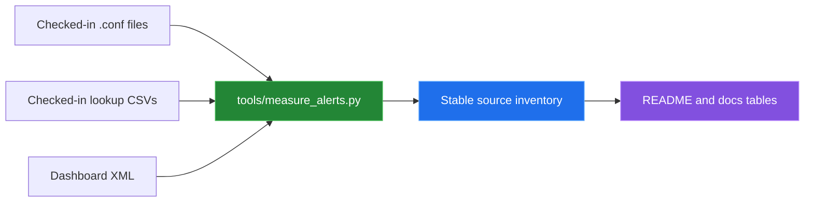

[← back to the overview](../README.md)

# How measurements were made

Every number in this documentation comes from one script that runs in a Linux
container:

```sh
sh tools/linux-run.sh > media/captures/linux-run.txt
```

[`tools/linux-run.sh`](../tools/linux-run.sh) starts `python:3.12-slim-bookworm`,
mounts the repository read-only, copies it, and runs the measurement script,
a syntax check of every shell script, a compile of the validator helper, the
unit tests and both test entry points. The full
output is [`media/captures/linux-run.txt`](../media/captures/linux-run.txt).

No Splunk instance runs. The official image only starts after its license is
accepted, so the numbers describe checked-in files, not search execution,
alert volume, latency or detection quality.

## Environment

| | |
|---|---|
| Kernel | Linux 6.5.11-linuxkit, aarch64 (Docker Desktop VM) |
| Image | `python:3.12-slim-bookworm` (`sha256:392307d2…23564e`), Python 3.12.14 |
| Tools | GNU bash 5.2.15, xmllint (libxml 2.9.14) |
| Date | 2026-09-24 |

## The measurement script

[`tools/measure_alerts.py`](../tools/measure_alerts.py) uses only Python's
standard library. It reads `savedsearches.conf` with `configparser`, counts
configuration stanzas, reads lookup rows with `csv.reader`, parses dashboard
XML with `xml.etree.ElementTree`, and compares `.csv` references with files
present in `lookups/`.



## Results

`python3 tools/measure_alerts.py` reported:

| Measurement | Result |
|---|---:|
| Saved-search stanzas | 13 |
| Static severity values `3`, `4`, `5` | 4, 5, 4 stanzas |
| Tracked searches | 13 |
| Suppressed searches | 6 |
| Notable actions | 1 |
| Email actions | 0 |
| Script actions | 0 |
| Lookup files | 7 |
| `macros.conf` stanzas | 24 |
| `props.conf` stanzas | 14 |
| `transforms.conf` stanzas | 42 |
| Dashboard views | 2 |
| Dashboard panels | 10 and 12 per view |
| Distinct `.csv` references in default configs | 14 |
| Referenced `.csv` files without a matching checked-in file | 7 |

The same command prints each alert's name, static severity, cron schedule,
dispatch window, dynamic severity literals, explicit action route, suppression
flag, and saved-search lookup references. The per-alert table in
[Alert reference](alert-reference.md) is based on that output plus the search
expressions themselves.

## Scripts and tests

| Check | Result |
|---|---|
| `bash -n` on `deployment/deploy.sh`, `deployment/deploy_secure.sh`, `scripts/install-hooks.sh`, `scripts/package-splunk-app.sh`, `tests/run_tests.sh` | All pass. |
| In-memory `compile()` of `security_alerts_app/bin/security_validator.py` | Passes. |
| `python3 tests/test_searches.py` | Loads and validates all 13 searches. 13 valid, 0 errors, 3 warnings, exit 0. |
| `python3 -m unittest test_validator test_app_files` | 27 tests, OK, exit 0. |
| `bash tests/run_tests.sh` | Finds all configuration files, lookups and dashboards; both dashboards pass `xmllint`; the Python validation and the unit tests pass. Exit 0. |

Before the fixes listed in [Bugs found](BUGS-FOUND.md), the validator flagged
an escaped bracket inside a quoted regex as unbalanced and then reported every
later search as failed (entries 3 and 4), and the unit tests found a lookup on
a column `malicious_ips.csv` does not have (entry 5). Entries 1 and 2, the
stale paths that stopped both scripts before they validated anything, are
fixed.

The three warnings say that **Command and Control Beacon**, **Failed
Authentication Spike** and **Port Scanning Activity** use a time-based command
without an explicit time range. Each of them sets its window with
`dispatch.earliest_time` (`-1h`, `-5m` and `-5m`), which the validator does not
read.

## Not covered

- SPL execution against real events, and whether any alert fires for a
  representative attack or benign event. This needs a Splunk instance, whose
  license was not accepted for this run.
- False-positive or false-negative rates.
- Alert latency, search runtime, indexing capacity, or dashboard rendering.
- Deployment success, Splunk version compatibility, restart behavior, or
  authentication. The deployment scripts were syntax-checked only.
