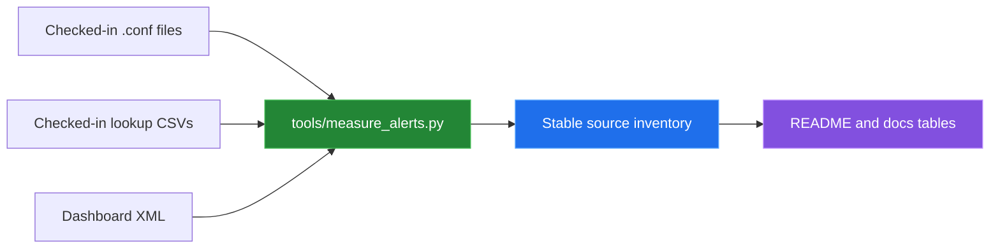

[← back to the overview](../README.md)

# How measurements were made

The repository has no Splunk instance or sample event corpus in this
workspace. The measurements in the documentation are therefore measurements of
checked-in files, not search execution, alert volume, latency, or detection
quality.

## The measurement script

[`tools/measure_alerts.py`](../tools/measure_alerts.py) uses only Python's
standard library. It reads `savedsearches.conf` with `configparser`, counts
configuration stanzas, reads lookup rows with `csv.reader`, parses dashboard
XML with `xml.etree.ElementTree`, and compares `.csv` references with files
present in `lookups/`.



Run it from the repository root:

```sh
python3 tools/measure_alerts.py
```

## Recorded source results

The command run for this pass reported:

| Measurement | Result |
|---|---:|
| Saved-search stanzas | 13 |
| Static severity values `3`, `4`, `5` | 4, 5, 4 stanzas |
| Tracked searches | 13 |
| Suppressed searches | 6 |
| Notable actions | 1 |
| Email actions | 0 |
| Script actions | 0 |
| Lookup files | 7 |
| `macros.conf` stanzas | 24 |
| `props.conf` stanzas | 14 |
| `transforms.conf` stanzas | 42 |
| Dashboard views | 2 |
| Dashboard panels | 10 and 12 per view |
| Distinct `.csv` references in default configs | 14 |
| Referenced `.csv` files without a matching checked-in file | 7 |

The same command prints each alert's name, static severity, cron schedule,
dispatch window, dynamic severity literals, explicit action route, suppression
flag, and saved-search lookup references. The per-alert table in
[Alert reference](alert-reference.md) is based on that output plus the search
expressions themselves.

## Other commands actually run

These source checks were also run:

| Command | Result |
|---|---|
| `bash -n deployment/deploy.sh deployment/deploy_secure.sh scripts/install-hooks.sh scripts/package-splunk-app.sh tests/run_tests.sh` | Passed. |
| In-memory `compile()` of `tests/test_searches.py` and `security_alerts_app/bin/security_validator.py` | Both passed; no bytecode was written. |
| `python3 tests/test_searches.py` | Failed before validation because it looks for `default/savedsearches.conf`. |
| `bash tests/run_tests.sh` | Failed at its first path check for `../default/savedsearches.conf`. |

The two failures are documented, with file and line references and proposed
unapplied diffs, in [Bugs found](BUGS-FOUND.md).

## Not measured

- SPL execution against real events.
- Whether any alert fires for a representative attack or benign event.
- False-positive or false-negative rates.
- Alert latency, search runtime, indexing capacity, or dashboard performance.
- Deployment success, Splunk version compatibility, restart behavior, or
  authentication.
- A terminal capture or animation. No animations are shipped because a real
  Splunk run was not available; the diagrams are source-derived.
