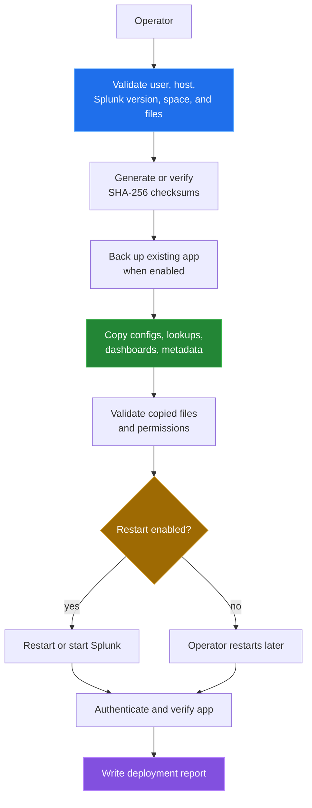

[← back to the overview](../README.md)

# Operations

The repository contains a standard deployment script, a secure deployment
script, dashboards, a validator, and a test runner. The deployment scripts are
host operations; the checks below are safe source-only checks that can run
without Splunk.

## Secure deployment flow



`deployment/deploy_secure.sh` defaults to secure mode, backup, checksum
verification, and restart. It also writes a timestamped log under `/var/log`,
asks for credentials during verification unless `SPLUNK_AUTH` is supplied, and
expects a real Splunk home. Those side effects are why the deployment command
is only syntax-checked here.

## Checks in a Linux container

`tools/linux-run.sh` runs every check that does not need Splunk in a
`python:3.12-slim-bookworm` container:

```sh
sh tools/linux-run.sh
```

It runs `tools/measure_alerts.py`, `bash -n` on the five shell scripts,
compiles `security_alerts_app/bin/security_validator.py`, and runs the
repository's own tests:

```sh
python3 tests/test_searches.py
python3 -m unittest test_validator test_app_files   # from tests/
bash tests/run_tests.sh
```

Everything succeeds. The validator reports 13 of 13 searches valid with three
warnings, the 27 unit tests pass, and both test entry points exit 0. To run
only the test suite, use `sh tests/docker.sh`. The bugs fixed along the way
are in [Bugs found](BUGS-FOUND.md). The output is in
[How measurements were made](measurement.md#scripts-and-tests).

## Dashboards

The package defines two XML views. The source measurement reports 10 panels in
`security_operations_dashboard.xml` and 12 panels in
`ssh_monitoring_dashboard.xml`. The XML files were counted and parsed by the
measurement script, but they were not rendered in Splunk Web. Query results,
panel performance, and visual correctness are therefore not measured.

## Validator and packaging

`security_alerts_app/bin/security_validator.py` is a source-side security
check helper that accepts an app path. `scripts/package-splunk-app.sh` creates a
compressed `.spl` package and checksum after copying the app into a temporary
build directory. Neither command was run because packaging and validation can
create files or require host-specific tools; no generated output is part of
this documentation pass.
