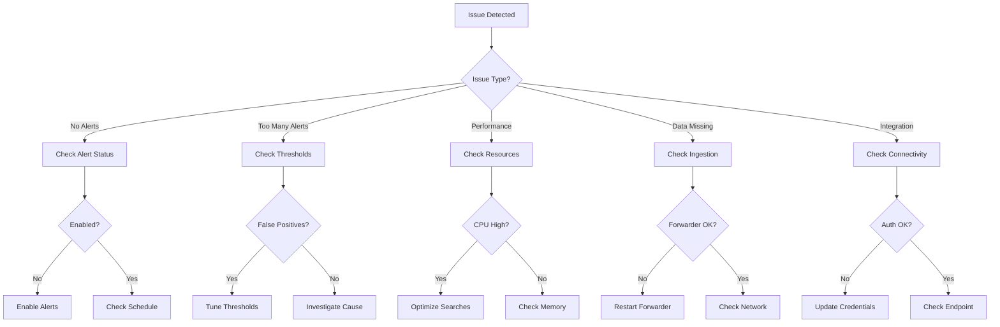
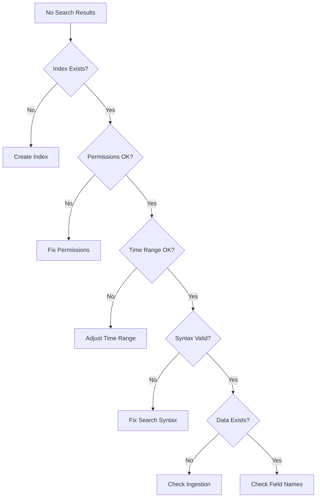

# Splunk Security Alerts Troubleshooting Guide

## Table of Contents
1. [Common Issues Quick Reference](#common-issues-quick-reference)
2. [Alert Not Firing Issues](#alert-not-firing-issues)
3. [False Positive Troubleshooting](#false-positive-troubleshooting)
4. [Performance Issues](#performance-issues)
5. [Data Ingestion Problems](#data-ingestion-problems)
6. [Search & Query Issues](#search--query-issues)
7. [Integration Failures](#integration-failures)
8. [Dashboard & Visualization Issues](#dashboard--visualization-issues)
9. [Lookup Table Problems](#lookup-table-problems)
10. [System Health Checks](#system-health-checks)
11. [Emergency Procedures](#emergency-procedures)
12. [Root Cause Analysis](#root-cause-analysis)

---

## Common Issues Quick Reference

### Issue Resolution Matrix

| Symptom | Likely Cause | Quick Fix | See Section |
|---------|-------------|-----------|-------------|
| No alerts firing | Disabled searches | Enable in Settings | [Alert Not Firing](#alert-not-firing-issues) |
| Too many alerts | Low thresholds | Adjust thresholds | [False Positives](#false-positive-troubleshooting) |
| Slow searches | Large time range | Optimize SPL | [Performance](#performance-issues) |
| Missing data | Forwarder down | Restart forwarder | [Data Ingestion](#data-ingestion-problems) |
| Empty lookups | File corruption | Restore from backup | [Lookup Tables](#lookup-table-problems) |
| Dashboard errors | Invalid XML | Validate syntax | [Dashboards](#dashboard--visualization-issues) |
| Integration fails | API changes | Update credentials | [Integrations](#integration-failures) |

### Diagnostic Decision Tree



---

## Alert Not Firing Issues

### Issue: Alert Never Triggers

#### Diagnostic Steps

1. **Check Alert Status**
```spl
| rest /servicesNS/-/-/saved/searches
| search title="YOUR_ALERT_NAME"
| fields title, disabled, is_scheduled, next_scheduled_time, cron_schedule
| eval status=if(disabled=1, "DISABLED", "ENABLED")
```

2. **Verify Search Syntax**
```spl
# Test the base search
index=* <YOUR_SEARCH_CONDITIONS>
| head 10
```

3. **Check Time Range**
```spl
# Verify events exist in the time range
index=* earliest=-1h latest=now
| stats count by index, sourcetype
```

#### Common Causes & Solutions

##### Cause 1: Alert Disabled

**Diagnosis:**
```bash
curl -k -u admin:password \
  https://localhost:8089/servicesNS/-/-/saved/searches/YOUR_ALERT_NAME \
  | grep disabled
```

**Solution:**
```bash
# Enable the alert
curl -k -u admin:password \
  -X POST https://localhost:8089/servicesNS/-/-/saved/searches/YOUR_ALERT_NAME/enable
```

##### Cause 2: Incorrect Time Range

**Diagnosis:**
```spl
| rest /servicesNS/-/-/saved/searches
| search title="YOUR_ALERT_NAME"
| fields title, dispatch.earliest_time, dispatch.latest_time
```

**Solution:**
```python
#!/usr/bin/env python3
import requests

def fix_alert_time_range(alert_name, earliest, latest):
    """Fix alert time range configuration"""

    url = f"https://localhost:8089/servicesNS/-/-/saved/searches/{alert_name}"

    data = {
        'dispatch.earliest_time': earliest,  # e.g., '-15m'
        'dispatch.latest_time': latest       # e.g., 'now'
    }

    response = requests.post(
        url,
        auth=('admin', 'password'),
        data=data,
        verify=False
    )

    return response.status_code == 200

# Fix time range
fix_alert_time_range('Unauthorized_SSH_Access', '-15m', 'now')
```

##### Cause 3: Threshold Too High

**Diagnosis:**
```spl
# Check actual values vs threshold
index=* source="/var/log/secure*"
| stats count by src_ip
| eval threshold=10
| eval would_trigger=if(count > threshold, "YES", "NO")
| sort -count
```

**Solution:**
```spl
# Determine appropriate threshold using historical data
index=* source="/var/log/secure*" earliest=-30d
| bucket _time span=1h
| stats count by _time
| eventstats avg(count) as avg_count, stdev(count) as stdev_count
| eval suggested_threshold = avg_count + (2 * stdev_count)
| stats avg(suggested_threshold) as recommended_threshold
```

### Issue: Alert Fires Intermittently

#### Diagnostic Query
```spl
# Check alert execution history
| rest /servicesNS/-/-/saved/searches/YOUR_ALERT_NAME/history
| table triggered_alert_count, result_count, status, run_time, _time
| sort -_time
```

#### Common Causes

##### Cause 1: Search Timeout

**Diagnosis:**
```spl
| rest /servicesNS/-/-/saved/searches/YOUR_ALERT_NAME/history
| search status="timeout"
| stats count
```

**Solution:**
```bash
# Increase search timeout
curl -k -u admin:password \
  -X POST https://localhost:8089/servicesNS/-/-/saved/searches/YOUR_ALERT_NAME \
  -d dispatch.max_time=600
```

##### Cause 2: Concurrent Search Limit

**Diagnosis:**
```spl
| rest /servicesNS/-/-/server/status/limits/search-concurrency
| fields max_searches_per_cpu, max_searches_perc, current_searches
```

**Solution:**
```python
#!/usr/bin/env python3
def adjust_search_priority(alert_name, priority='high'):
    """Adjust search priority to ensure execution"""

    priorities = {
        'highest': 10,
        'high': 7,
        'normal': 5,
        'low': 3
    }

    url = f"https://localhost:8089/servicesNS/-/-/saved/searches/{alert_name}"

    data = {
        'priority': priorities.get(priority, 5),
        'schedule_priority': 'higher'
    }

    response = requests.post(url, auth=('admin', 'password'), data=data, verify=False)
    return response.status_code == 200
```

---

## False Positive Troubleshooting

### Issue: High False Positive Rate

#### Analysis Dashboard
```spl
# False positive analysis dashboard
| inputlookup alert_tracker.csv
| where resolution="false_positive"
| stats count as fp_count by alert_name, reason
| join alert_name [
    | inputlookup alert_tracker.csv
    | stats count as total_count by alert_name
]
| eval fp_rate = round((fp_count / total_count) * 100, 2)
| where fp_rate > 20
| sort -fp_rate
```

#### Root Cause Analysis

##### Pattern 1: Time-Based False Positives

**Diagnosis:**
```spl
# Analyze false positives by time
| inputlookup alert_tracker.csv
| where resolution="false_positive"
| eval hour=strftime(alert_time, "%H")
| eval day_of_week=strftime(alert_time, "%A")
| stats count by hour, day_of_week, alert_name
| eval is_pattern = if(count > 5, "YES", "NO")
```

**Solution:**
```spl
# Implement time-based suppression
index=* alert_name="Failed Authentication Spike"
| eval hour=strftime(_time, "%H")
| eval suppress = case(
    hour >= 2 AND hour <= 4, 1,  # Maintenance window
    date_wday = 0, 1,             # Sunday maintenance
    1=1, 0
)
| where suppress = 0
```

##### Pattern 2: Known Service Accounts

**Diagnosis:**
```spl
# Identify service account patterns
| inputlookup alert_tracker.csv
| where resolution="false_positive" AND reason="service_account"
| stats values(user) as service_accounts by alert_name
```

**Solution:**
```python
#!/usr/bin/env python3
import pandas as pd

def update_service_account_whitelist(fp_data):
    """Update service account whitelist from false positives"""

    # Load existing whitelist
    whitelist = pd.read_csv('/opt/splunk/etc/apps/splunk-alerting/lookups/service_accounts.csv')

    # Extract service accounts from false positives
    service_accounts = fp_data[
        (fp_data['resolution'] == 'false_positive') &
        (fp_data['reason'] == 'service_account')
    ]['user'].unique()

    # Add to whitelist
    new_accounts = pd.DataFrame({
        'user': service_accounts,
        'is_service_account': 'true',
        'added_date': pd.Timestamp.now(),
        'added_by': 'auto_tuning'
    })

    # Merge and save
    updated_whitelist = pd.concat([whitelist, new_accounts]).drop_duplicates(subset=['user'])
    updated_whitelist.to_csv(
        '/opt/splunk/etc/apps/splunk-alerting/lookups/service_accounts.csv',
        index=False
    )

    return len(service_accounts)

# Update whitelist
fp_data = pd.read_csv('/tmp/false_positives.csv')
updated = update_service_account_whitelist(fp_data)
print(f"Added {updated} service accounts to whitelist")
```

### Issue: Legitimate Activity Flagged

#### Investigation Process

1. **Collect Context**
```spl
# Get full context of flagged activity
index=* src_ip="<FLAGGED_IP>" earliest=-24h
| transaction src_ip maxspan=1h
| table _time, user, action, dest_ip, bytes_out, duration
```

2. **Check Historical Baseline**
```spl
# Compare with historical behavior
index=* user="<FLAGGED_USER>" earliest=-30d
| bucket _time span=1d
| stats avg(bytes_out) as daily_avg,
        stdev(bytes_out) as daily_stdev,
        max(bytes_out) as daily_max by _time
| eval baseline_threshold = daily_avg + (3 * daily_stdev)
```

3. **Correlation Check**
```spl
# Check for correlated legitimate activities
index=* earliest=-1h
| search (user="<FLAGGED_USER>" OR src_ip="<FLAGGED_IP>")
| eval activity_type = case(
    searchmatch("backup"), "backup_operation",
    searchmatch("rsync"), "data_sync",
    searchmatch("git"), "code_deployment",
    searchmatch("update"), "system_update",
    1=1, "unknown"
)
| stats count by activity_type
```

---

## Performance Issues

### Issue: Slow Search Performance

#### Performance Diagnostics

```spl
# Check search performance metrics
| rest /servicesNS/-/-/saved/searches/*/history
| eval runtime_minutes = round(runtime / 60, 2)
| where runtime_minutes > 5
| stats avg(runtime_minutes) as avg_runtime,
        max(runtime_minutes) as max_runtime,
        count as slow_searches by title
| sort -avg_runtime
```

#### Optimization Strategies

##### Strategy 1: Search Optimization

**Before (Slow):**
```spl
index=* | search EventCode=4625 | stats count by src_ip
```

**After (Optimized):**
```spl
index=windows EventCode=4625 | stats count by src_ip
```

**Advanced Optimization:**
```python
#!/usr/bin/env python3
def optimize_search_query(original_query):
    """Optimize SPL query for performance"""

    optimizations = {
        'index=*': 'index=security OR index=network',
        '| search ': ' ',  # Move to base search
        '| where ': '| search ',  # Use search instead of where when possible
        '| eval _time': '| bin _time',  # Use bin for time bucketing
        '| transaction': '| stats',  # Replace transaction with stats when possible
    }

    optimized = original_query
    for old, new in optimizations.items():
        optimized = optimized.replace(old, new)

    # Add field extraction optimization
    if 'rex' in optimized and 'table' not in optimized:
        optimized += ' | fields <required_fields>'

    return optimized

# Example usage
original = 'index=* | search EventCode=4625 | transaction src_ip maxspan=1h'
optimized = optimize_search_query(original)
print(f"Optimized: {optimized}")
```

##### Strategy 2: Summary Indexing

```python
#!/usr/bin/env python3
import subprocess

def create_summary_index(search_name, search_query):
    """Create summary index for expensive searches"""

    # Create summary index
    summary_config = f"""
[{search_name}_summary]
search = {search_query} | collect index=summary_security
cron_schedule = */15 * * * *
dispatch.earliest_time = -15m
dispatch.latest_time = now
enableSched = 1
    """

    # Write configuration
    with open(f'/opt/splunk/etc/apps/splunk-alerting/local/savedsearches.conf', 'a') as f:
        f.write(summary_config)

    # Reload configuration
    subprocess.run([
        '/opt/splunk/bin/splunk',
        'reload',
        'deploy-server',
        '-auth', 'admin:password'
    ])

    return True

# Create summary index for expensive search
create_summary_index(
    'failed_auth_summary',
    'index=security EventCode=4625 | stats count by src_ip, dest_ip, user'
)
```

### Issue: High CPU Usage

#### Diagnosis
```bash
#!/bin/bash
# Check Splunk process CPU usage

# Get Splunk processes
ps aux | grep splunk | grep -v grep | awk '{print $2, $3, $11}' | while read pid cpu cmd; do
    if (( $(echo "$cpu > 80" | bc -l) )); then
        echo "High CPU: PID=$pid CPU=$cpu% CMD=$cmd"

        # Get search details if it's a search process
        if [[ $cmd == *"search"* ]]; then
            /opt/splunk/bin/splunk list jobs -auth admin:password | grep $pid
        fi
    fi
done
```

#### Resolution
```python
#!/usr/bin/env python3
import psutil
import subprocess
import time

def manage_high_cpu_searches():
    """Manage searches causing high CPU usage"""

    splunk_procs = [p for p in psutil.process_iter(['pid', 'name', 'cpu_percent'])
                    if 'splunk' in p.info['name']]

    for proc in splunk_procs:
        if proc.info['cpu_percent'] > 80:
            # Get search details
            result = subprocess.run(
                ['/opt/splunk/bin/splunk', 'list', 'jobs'],
                capture_output=True,
                text=True
            )

            # Parse and identify expensive search
            for line in result.stdout.split('\n'):
                if str(proc.info['pid']) in line:
                    # Extract search ID
                    search_id = line.split()[0]

                    # Check if it's a scheduled search
                    if 'scheduled' in line.lower():
                        print(f"High CPU scheduled search: {search_id}")
                        # Don't kill scheduled searches, just log
                    else:
                        print(f"Killing high CPU ad-hoc search: {search_id}")
                        subprocess.run([
                            '/opt/splunk/bin/splunk',
                            'control', 'cancel-job', search_id
                        ])

    return True

# Monitor and manage CPU usage
while True:
    manage_high_cpu_searches()
    time.sleep(60)  # Check every minute
```

---

## Data Ingestion Problems

### Issue: No Data Coming In

#### Diagnostic Checklist

```python
#!/usr/bin/env python3
import subprocess
import socket

def diagnose_ingestion():
    """Comprehensive data ingestion diagnosis"""

    issues = []

    # 1. Check forwarder status
    try:
        result = subprocess.run(
            ['systemctl', 'status', 'splunkforwarder'],
            capture_output=True,
            text=True
        )
        if 'inactive' in result.stdout or 'failed' in result.stdout:
            issues.append("Forwarder service is down")
    except:
        issues.append("Cannot check forwarder status")

    # 2. Check network connectivity
    splunk_server = 'splunk.example.com'
    port = 9997
    try:
        sock = socket.socket(socket.AF_INET, socket.SOCK_STREAM)
        sock.settimeout(5)
        result = sock.connect_ex((splunk_server, port))
        if result != 0:
            issues.append(f"Cannot connect to Splunk on {splunk_server}:{port}")
        sock.close()
    except:
        issues.append("Network connectivity check failed")

    # 3. Check disk space
    result = subprocess.run(['df', '-h', '/opt/splunkforwarder'], capture_output=True, text=True)
    for line in result.stdout.split('\n'):
        if '/opt/splunkforwarder' in line:
            usage = int(line.split()[4].rstrip('%'))
            if usage > 90:
                issues.append(f"Low disk space: {usage}% used")

    # 4. Check input configuration
    result = subprocess.run(
        ['/opt/splunkforwarder/bin/splunk', 'list', 'monitor'],
        capture_output=True,
        text=True
    )
    if not result.stdout:
        issues.append("No inputs configured")

    return issues

# Run diagnosis
issues = diagnose_ingestion()
if issues:
    print("Ingestion issues found:")
    for issue in issues:
        print(f"  - {issue}")
else:
    print("No ingestion issues detected")
```

#### Resolution Steps

##### Step 1: Restart Forwarder
```bash
#!/bin/bash
# Safe forwarder restart

# Check if forwarder is running
if systemctl is-active splunkforwarder > /dev/null 2>&1; then
    echo "Forwarder is running, performing graceful restart..."
    systemctl restart splunkforwarder
else
    echo "Forwarder is not running, starting..."
    systemctl start splunkforwarder
fi

# Verify restart
sleep 10
if systemctl is-active splunkforwarder > /dev/null 2>&1; then
    echo "Forwarder restarted successfully"

    # Check connection to indexer
    /opt/splunkforwarder/bin/splunk list forward-server -auth admin:password
else
    echo "Forwarder failed to start, checking logs..."
    tail -50 /opt/splunkforwarder/var/log/splunk/splunkd.log
fi
```

##### Step 2: Fix Network Issues
```python
#!/usr/bin/env python3
import subprocess
import re

def fix_forwarder_connection():
    """Fix forwarder connection issues"""

    # Get current forwarding configuration
    result = subprocess.run(
        ['/opt/splunkforwarder/bin/splunk', 'list', 'forward-server'],
        capture_output=True,
        text=True,
        input='admin\npassword\n'
    )

    if 'Active' not in result.stdout:
        # No active forwarders, add one
        subprocess.run([
            '/opt/splunkforwarder/bin/splunk', 'add', 'forward-server',
            'splunk.example.com:9997',
            '-auth', 'admin:password'
        ])

        # Enable forwarding
        subprocess.run([
            '/opt/splunkforwarder/bin/splunk', 'enable', 'app', 'SplunkForwarder',
            '-auth', 'admin:password'
        ])

        # Restart to apply changes
        subprocess.run(['systemctl', 'restart', 'splunkforwarder'])

        return "Forwarding configuration fixed"

    return "Forwarding configuration OK"

# Fix connection
result = fix_forwarder_connection()
print(result)
```

### Issue: Data Lag

#### Detection Query
```spl
# Check data lag by sourcetype
| tstats latest(_time) as latest_event by index, sourcetype
| eval lag_seconds = now() - latest_event
| eval lag_minutes = round(lag_seconds / 60, 2)
| where lag_minutes > 5
| sort -lag_minutes
```

#### Resolution
```python
#!/usr/bin/env python3
import time
import subprocess

def monitor_and_fix_lag():
    """Monitor and fix data ingestion lag"""

    while True:
        # Check for lag
        search_query = """
        | tstats latest(_time) as latest by index, sourcetype
        | eval lag_minutes = round((now() - latest) / 60, 2)
        | where lag_minutes > 10
        """

        result = subprocess.run(
            ['/opt/splunk/bin/splunk', 'search', search_query],
            capture_output=True,
            text=True
        )

        if result.stdout:
            print("Data lag detected, taking action...")

            # Clear frozen buckets if disk space issue
            df_result = subprocess.run(['df', '-h', '/opt/splunk'], capture_output=True, text=True)
            usage = int(df_result.stdout.split('\n')[1].split()[4].rstrip('%'))

            if usage > 80:
                print("High disk usage, cleaning frozen buckets...")
                subprocess.run(['rm', '-rf', '/opt/splunk/var/lib/splunk/*/frozendb/*'])

            # Restart problem inputs
            subprocess.run([
                '/opt/splunkforwarder/bin/splunk', 'restart'
            ])

        time.sleep(300)  # Check every 5 minutes

# Start monitoring
monitor_and_fix_lag()
```

---

## Search & Query Issues

### Issue: Search Returns No Results

#### Diagnostic Process



#### Resolution Scripts

```python
#!/usr/bin/env python3
import re

def validate_search_syntax(search_query):
    """Validate and fix common SPL syntax errors"""

    issues = []
    fixes = []

    # Check for unmatched quotes
    quote_count = search_query.count('"')
    if quote_count % 2 != 0:
        issues.append("Unmatched quotes")
        fixes.append("Add missing quote")

    # Check for unmatched parentheses
    open_parens = search_query.count('(')
    close_parens = search_query.count(')')
    if open_parens != close_parens:
        issues.append(f"Unmatched parentheses: {open_parens} open, {close_parens} close")
        fixes.append("Balance parentheses")

    # Check for invalid field names
    field_pattern = r'\b[a-zA-Z_][a-zA-Z0-9_]*\b'
    invalid_fields = re.findall(r'[^a-zA-Z0-9_\s\(\)\[\]"\'\|\=\>\<\!\*]', search_query)
    if invalid_fields:
        issues.append(f"Invalid characters in field names: {invalid_fields}")
        fixes.append("Use valid field name characters")

    # Check for common typos
    typos = {
        'sourctype': 'sourcetype',
        'indx': 'index',
        'earlist': 'earliest',
        'lastest': 'latest',
        'stat': 'stats',
        'time_chart': 'timechart'
    }

    fixed_query = search_query
    for typo, correct in typos.items():
        if typo in search_query:
            issues.append(f"Possible typo: {typo}")
            fixed_query = fixed_query.replace(typo, correct)
            fixes.append(f"Replace {typo} with {correct}")

    return {
        'original': search_query,
        'fixed': fixed_query,
        'issues': issues,
        'fixes': fixes,
        'valid': len(issues) == 0
    }

# Validate search
search = 'index=security sourctype=linux_secure | stat count by src_ip'
validation = validate_search_syntax(search)
print(f"Validation: {validation}")
```

### Issue: Field Extraction Not Working

#### Diagnosis
```spl
# Check field extraction configuration
| rest /servicesNS/-/-/data/props/extractions
| search attribute=EXTRACT-* OR attribute=REPORT-*
| table title, attribute, value
```

#### Fix Field Extraction
```python
#!/usr/bin/env python3
import re

def create_field_extraction(sourcetype, sample_event):
    """Create field extraction from sample event"""

    extractions = {}

    # Common patterns
    patterns = {
        'ip_address': r'\b(?:[0-9]{1,3}\.){3}[0-9]{1,3}\b',
        'username': r'user[=:\s]+([a-zA-Z0-9._-]+)',
        'timestamp': r'\d{4}-\d{2}-\d{2}[\sT]\d{2}:\d{2}:\d{2}',
        'email': r'[a-zA-Z0-9._%+-]+@[a-zA-Z0-9.-]+\.[a-zA-Z]{2,}',
        'url': r'https?://[^\s]+',
        'mac_address': r'([0-9A-Fa-f]{2}[:-]){5}([0-9A-Fa-f]{2})',
        'error_code': r'error[_\s]code[=:\s]+(\d+)',
        'status': r'status[=:\s]+(\w+)'
    }

    props_conf = f"[{sourcetype}]\n"

    for field_name, pattern in patterns.items():
        matches = re.findall(pattern, sample_event)
        if matches:
            extractions[field_name] = matches
            props_conf += f"EXTRACT-{field_name} = {pattern}\n"

    # Write to props.conf
    with open('/opt/splunk/etc/apps/splunk-alerting/local/props.conf', 'a') as f:
        f.write(props_conf)

    return extractions

# Create extractions
sample = "2024-10-18 10:30:45 Failed login for user=john.doe from 192.168.1.100 status=failed error_code=401"
extractions = create_field_extraction('custom_auth', sample)
print(f"Extracted fields: {extractions}")
```

---

## Integration Failures

### Issue: Webhook Not Receiving Alerts

#### Diagnostic Steps

```python
#!/usr/bin/env python3
import requests
import json

def test_webhook_connectivity(webhook_url, test_payload=None):
    """Test webhook connectivity and response"""

    if not test_payload:
        test_payload = {
            'test': True,
            'alert_name': 'Test Alert',
            'timestamp': '2024-10-18T10:00:00Z'
        }

    tests = {
        'connectivity': False,
        'authentication': False,
        'payload_accepted': False,
        'response_valid': False
    }

    try:
        # Test basic connectivity
        response = requests.get(webhook_url.replace('/webhook', '/health'), timeout=5)
        tests['connectivity'] = response.status_code < 500

        # Test webhook endpoint
        response = requests.post(
            webhook_url,
            json=test_payload,
            headers={'Content-Type': 'application/json'},
            timeout=10
        )

        tests['authentication'] = response.status_code != 401
        tests['payload_accepted'] = response.status_code in [200, 201, 202]
        tests['response_valid'] = response.headers.get('Content-Type', '').startswith('application/json')

        return {
            'success': all(tests.values()),
            'tests': tests,
            'response_code': response.status_code,
            'response_body': response.text[:500]
        }

    except requests.exceptions.ConnectionError:
        return {'success': False, 'error': 'Connection failed', 'tests': tests}
    except requests.exceptions.Timeout:
        return {'success': False, 'error': 'Connection timeout', 'tests': tests}
    except Exception as e:
        return {'success': False, 'error': str(e), 'tests': tests}

# Test webhook
result = test_webhook_connectivity('https://example.com/webhook/splunk')
print(f"Webhook test: {result}")
```

### Issue: API Authentication Failing

#### Common Authentication Issues

```python
#!/usr/bin/env python3
import requests
import base64
import hashlib
import hmac
import time

class AuthenticationFixer:
    def test_basic_auth(self, url, username, password):
        """Test basic authentication"""
        try:
            response = requests.get(url, auth=(username, password), timeout=5)
            return response.status_code != 401
        except:
            return False

    def test_token_auth(self, url, token):
        """Test token authentication"""
        headers = {
            'Authorization': f'Bearer {token}',
            'X-API-Key': token,  # Try multiple header formats
            'apikey': token
        }

        for header_name, header_value in headers.items():
            try:
                response = requests.get(
                    url,
                    headers={header_name: header_value},
                    timeout=5
                )
                if response.status_code != 401:
                    return True, header_name
            except:
                continue

        return False, None

    def generate_signature(self, secret, payload):
        """Generate HMAC signature for webhook"""
        signature = hmac.new(
            secret.encode(),
            payload.encode(),
            hashlib.sha256
        ).hexdigest()

        return signature

    def fix_auth_issues(self, integration_config):
        """Diagnose and fix authentication issues"""

        fixes = []

        # Test current authentication
        if integration_config['auth_type'] == 'basic':
            if not self.test_basic_auth(
                integration_config['url'],
                integration_config['username'],
                integration_config['password']
            ):
                fixes.append("Basic auth failed - check credentials")
                fixes.append("Ensure password is not expired")

        elif integration_config['auth_type'] == 'token':
            success, header = self.test_token_auth(
                integration_config['url'],
                integration_config['token']
            )
            if not success:
                fixes.append("Token auth failed - regenerate token")
                fixes.append("Check token expiration")
            else:
                fixes.append(f"Use header: {header}")

        # Check for IP whitelisting
        try:
            response = requests.get(integration_config['url'], timeout=5)
            if response.status_code == 403:
                fixes.append("Possible IP whitelist issue - add Splunk server IP")
        except:
            fixes.append("Connection failed - check network/firewall")

        return fixes

# Test authentication
auth_fixer = AuthenticationFixer()
config = {
    'auth_type': 'token',
    'url': 'https://api.example.com/v1/test',
    'token': 'YOUR_TOKEN'
}
fixes = auth_fixer.fix_auth_issues(config)
print(f"Authentication fixes needed: {fixes}")
```

---

## Dashboard & Visualization Issues

### Issue: Dashboard Not Loading

#### Diagnostic Query
```spl
# Check dashboard configuration
| rest /servicesNS/-/-/data/ui/views
| search title="YOUR_DASHBOARD_NAME"
| fields title, disabled, eai:data
| eval xml_valid=if(match(eai:data, "<dashboard>.*</dashboard>"), "Yes", "No")
```

#### XML Validation and Repair

```python
#!/usr/bin/env python3
import xml.etree.ElementTree as ET
import re

def validate_dashboard_xml(xml_content):
    """Validate and fix dashboard XML"""

    issues = []
    fixes = []

    try:
        # Parse XML
        root = ET.fromstring(xml_content)

        # Check for required elements
        if root.tag != 'dashboard' and root.tag != 'form':
            issues.append("Root element must be <dashboard> or <form>")

        # Check for label
        label = root.find('label')
        if label is None:
            issues.append("Missing <label> element")
            fixes.append("Add <label>Dashboard Name</label>")

        # Check panels
        panels = root.findall('.//panel')
        if not panels:
            issues.append("No panels found")
            fixes.append("Add at least one panel with visualization")

        # Check for invalid characters
        if '&' in xml_content and '&amp;' not in xml_content:
            issues.append("Unescaped & character")
            fixes.append("Replace & with &amp;")

        # Check for empty panels
        for i, panel in enumerate(panels):
            if not panel.findall('.//search'):
                issues.append(f"Panel {i+1} has no search")
                fixes.append(f"Add search to panel {i+1}")

    except ET.ParseError as e:
        issues.append(f"XML Parse Error: {str(e)}")

        # Try to fix common XML errors
        fixed_xml = xml_content

        # Fix unclosed tags
        unclosed = re.findall(r'<([^/>]+)>(?!.*</\1>)', xml_content)
        for tag in unclosed:
            fixed_xml += f"</{tag}>"
            fixes.append(f"Added closing tag </{tag}>")

        # Fix quotes
        fixed_xml = re.sub(r'([a-zA-Z]+)=([^"\s>]+)', r'\1="\2"', fixed_xml)

    return {
        'valid': len(issues) == 0,
        'issues': issues,
        'fixes': fixes
    }

# Validate dashboard
with open('/opt/splunk/etc/apps/splunk-alerting/local/data/ui/views/security_dashboard.xml', 'r') as f:
    xml_content = f.read()

validation = validate_dashboard_xml(xml_content)
print(f"Dashboard validation: {validation}")
```

### Issue: Visualization Not Rendering

#### Fix Visualization Issues

```python
#!/usr/bin/env python3
def fix_visualization_config(panel_xml):
    """Fix common visualization configuration issues"""

    fixes = []

    # Ensure proper chart configuration
    if '<chart>' in panel_xml and 'charting.chart' not in panel_xml:
        panel_xml = panel_xml.replace(
            '<chart>',
            '<chart>\n<option name="charting.chart">column</option>'
        )
        fixes.append("Added default chart type")

    # Fix time range
    if 'earliest' not in panel_xml:
        panel_xml = panel_xml.replace(
            '<search>',
            '<search>\n<earliest>-24h@h</earliest>\n<latest>now</latest>'
        )
        fixes.append("Added time range")

    # Fix missing query
    if '<query></query>' in panel_xml or '<query/>' in panel_xml:
        panel_xml = panel_xml.replace(
            '<query></query>',
            '<query>index=security | stats count by sourcetype</query>'
        )
        fixes.append("Added placeholder query")

    # Fix color settings
    if 'seriesColors' not in panel_xml and '<chart>' in panel_xml:
        panel_xml = panel_xml.replace(
            '</chart>',
            '<option name="charting.seriesColors">[0xFF0000,0x00FF00,0x0000FF]</option>\n</chart>'
        )
        fixes.append("Added color scheme")

    return panel_xml, fixes

# Fix visualization
original_panel = """
<panel>
  <chart>
    <search>
      <query></query>
    </search>
  </chart>
</panel>
"""

fixed_panel, fixes = fix_visualization_config(original_panel)
print(f"Applied fixes: {fixes}")
print(f"Fixed panel:\n{fixed_panel}")
```

---

## Lookup Table Problems

### Issue: Lookup Table Empty or Corrupted

#### Diagnosis and Recovery

```python
#!/usr/bin/env python3
import csv
import os
import shutil
from datetime import datetime

class LookupTableManager:
    def __init__(self, lookup_dir='/opt/splunk/etc/apps/splunk-alerting/lookups'):
        self.lookup_dir = lookup_dir

    def diagnose_lookup(self, filename):
        """Diagnose lookup table issues"""

        filepath = os.path.join(self.lookup_dir, filename)
        issues = []

        # Check if file exists
        if not os.path.exists(filepath):
            issues.append("File does not exist")
            return issues

        # Check file size
        file_size = os.path.getsize(filepath)
        if file_size == 0:
            issues.append("File is empty")
            return issues

        # Check CSV validity
        try:
            with open(filepath, 'r') as f:
                reader = csv.DictReader(f)
                headers = reader.fieldnames

                if not headers:
                    issues.append("No headers found")

                row_count = 0
                for row in reader:
                    row_count += 1
                    # Check for empty values
                    if all(not v for v in row.values()):
                        issues.append(f"Empty row at line {row_count + 1}")

                if row_count == 0:
                    issues.append("No data rows")

        except csv.Error as e:
            issues.append(f"CSV parsing error: {str(e)}")
        except Exception as e:
            issues.append(f"File read error: {str(e)}")

        # Check permissions
        if not os.access(filepath, os.R_OK):
            issues.append("File not readable")
        if not os.access(filepath, os.W_OK):
            issues.append("File not writable")

        return issues

    def repair_lookup(self, filename):
        """Attempt to repair corrupted lookup"""

        filepath = os.path.join(self.lookup_dir, filename)

        # Backup original
        backup_path = f"{filepath}.backup.{datetime.now().strftime('%Y%m%d%H%M%S')}"
        shutil.copy2(filepath, backup_path)

        repairs = []

        # Try to fix CSV issues
        try:
            with open(filepath, 'r') as f:
                content = f.read()

            # Fix common issues
            # Remove blank lines
            lines = [line for line in content.split('\n') if line.strip()]
            content = '\n'.join(lines)
            repairs.append("Removed blank lines")

            # Fix line endings
            content = content.replace('\r\n', '\n').replace('\r', '\n')
            repairs.append("Fixed line endings")

            # Ensure headers exist
            if not content or ',' not in content.split('\n')[0]:
                # Add default headers based on filename
                if 'authorized_ips' in filename:
                    content = "src_ip,authorized,description\n" + content
                elif 'authorized_users' in filename:
                    content = "user,is_admin,role\n" + content
                repairs.append("Added default headers")

            # Write repaired content
            with open(filepath, 'w') as f:
                f.write(content)

            # Verify repair
            post_issues = self.diagnose_lookup(filename)
            if not post_issues:
                repairs.append("Repair successful")
            else:
                repairs.append(f"Remaining issues: {post_issues}")

        except Exception as e:
            repairs.append(f"Repair failed: {str(e)}")
            # Restore backup
            shutil.copy2(backup_path, filepath)
            repairs.append("Restored from backup")

        return repairs

    def rebuild_lookup(self, filename, default_data=None):
        """Rebuild lookup from scratch"""

        filepath = os.path.join(self.lookup_dir, filename)

        # Default data for common lookups
        defaults = {
            'authorized_ips.csv': [
                ['src_ip', 'authorized', 'description'],
                ['10.0.0.0/8', 'true', 'Internal network'],
                ['192.168.0.0/16', 'true', 'Private network']
            ],
            'authorized_users.csv': [
                ['user', 'is_admin', 'role'],
                ['admin', 'true', 'administrator'],
                ['splunk', 'true', 'service_account']
            ],
            'malicious_ips.csv': [
                ['dest_ip', 'is_malicious', 'threat_type', 'last_seen'],
            ],
            'sensitive_hosts.csv': [
                ['host', 'is_production', 'is_sensitive', 'asset_value'],
            ]
        }

        data = default_data or defaults.get(filename, [['column1', 'column2']])

        with open(filepath, 'w', newline='') as f:
            writer = csv.writer(f)
            writer.writerows(data)

        return f"Rebuilt {filename} with {len(data)-1} rows"

# Manage lookups
manager = LookupTableManager()

# Diagnose issues
issues = manager.diagnose_lookup('authorized_ips.csv')
if issues:
    print(f"Issues found: {issues}")

    # Attempt repair
    repairs = manager.repair_lookup('authorized_ips.csv')
    print(f"Repairs attempted: {repairs}")

    # If repair fails, rebuild
    if any('failed' in r for r in repairs):
        result = manager.rebuild_lookup('authorized_ips.csv')
        print(f"Rebuild result: {result}")
```

---

## System Health Checks

### Comprehensive Health Check Script

```python
#!/usr/bin/env python3
import subprocess
import psutil
import json
from datetime import datetime

class SplunkHealthChecker:
    def __init__(self):
        self.checks = {}
        self.thresholds = {
            'cpu_percent': 80,
            'memory_percent': 85,
            'disk_percent': 90,
            'index_replication': 2,
            'search_factor': 2
        }

    def check_splunk_services(self):
        """Check Splunk service status"""

        services = ['splunk', 'splunkforwarder']
        status = {}

        for service in services:
            try:
                result = subprocess.run(
                    ['systemctl', 'is-active', service],
                    capture_output=True,
                    text=True
                )
                status[service] = result.stdout.strip() == 'active'
            except:
                status[service] = False

        self.checks['services'] = status
        return status

    def check_system_resources(self):
        """Check system resource usage"""

        resources = {
            'cpu_percent': psutil.cpu_percent(interval=1),
            'memory_percent': psutil.virtual_memory().percent,
            'disk_percent': psutil.disk_usage('/opt/splunk').percent,
            'network_connections': len(psutil.net_connections()),
            'open_files': len(psutil.Process().open_files())
        }

        # Check against thresholds
        issues = []
        for metric, value in resources.items():
            if metric in self.thresholds and value > self.thresholds[metric]:
                issues.append(f"{metric} exceeds threshold: {value}% > {self.thresholds[metric]}%")

        self.checks['resources'] = resources
        self.checks['resource_issues'] = issues
        return resources

    def check_indexer_health(self):
        """Check indexer cluster health"""

        try:
            result = subprocess.run(
                ['/opt/splunk/bin/splunk', 'show', 'cluster-status', '-auth', 'admin:password'],
                capture_output=True,
                text=True
            )

            health = {
                'cluster_status': 'healthy' if 'stable' in result.stdout.lower() else 'unhealthy',
                'replication_factor_met': 'replication_factor_met=1' in result.stdout,
                'search_factor_met': 'search_factor_met=1' in result.stdout
            }

        except:
            health = {'status': 'unable to check'}

        self.checks['indexer_health'] = health
        return health

    def check_search_scheduler(self):
        """Check search scheduler status"""

        try:
            result = subprocess.run(
                ['/opt/splunk/bin/splunk', 'list', 'jobs', '-auth', 'admin:password'],
                capture_output=True,
                text=True
            )

            # Count running searches
            running = result.stdout.count('RUNNING')
            queued = result.stdout.count('QUEUED')
            failed = result.stdout.count('FAILED')

            scheduler_health = {
                'running_searches': running,
                'queued_searches': queued,
                'failed_searches': failed,
                'scheduler_status': 'healthy' if queued < 10 else 'congested'
            }

        except:
            scheduler_health = {'status': 'unable to check'}

        self.checks['scheduler'] = scheduler_health
        return scheduler_health

    def check_data_ingestion(self):
        """Check data ingestion rate"""

        try:
            # Get ingestion metrics
            result = subprocess.run([
                '/opt/splunk/bin/splunk', 'search',
                '| rest /servicesNS/-/-/server/introspection/indexer',
                '-auth', 'admin:password'
            ], capture_output=True, text=True)

            # Parse results (simplified)
            ingestion = {
                'status': 'active',
                'rate': 'normal',
                'issues': []
            }

        except:
            ingestion = {'status': 'unable to check'}

        self.checks['ingestion'] = ingestion
        return ingestion

    def generate_health_report(self):
        """Generate comprehensive health report"""

        # Run all checks
        self.check_splunk_services()
        self.check_system_resources()
        self.check_indexer_health()
        self.check_search_scheduler()
        self.check_data_ingestion()

        # Calculate overall health score
        total_checks = 0
        passed_checks = 0

        for category, results in self.checks.items():
            if isinstance(results, dict):
                for key, value in results.items():
                    total_checks += 1
                    if value == True or value == 'healthy' or value == 'active':
                        passed_checks += 1

        health_score = (passed_checks / total_checks * 100) if total_checks > 0 else 0

        report = {
            'timestamp': datetime.now().isoformat(),
            'health_score': round(health_score, 2),
            'status': 'healthy' if health_score > 80 else 'degraded' if health_score > 60 else 'critical',
            'checks': self.checks,
            'recommendations': self.generate_recommendations()
        }

        return report

    def generate_recommendations(self):
        """Generate recommendations based on health checks"""

        recommendations = []

        # Service recommendations
        if 'services' in self.checks:
            for service, status in self.checks['services'].items():
                if not status:
                    recommendations.append(f"Start {service} service: systemctl start {service}")

        # Resource recommendations
        if 'resource_issues' in self.checks and self.checks['resource_issues']:
            for issue in self.checks['resource_issues']:
                if 'cpu' in issue:
                    recommendations.append("Optimize searches or add more CPU resources")
                elif 'memory' in issue:
                    recommendations.append("Increase memory allocation or reduce concurrent searches")
                elif 'disk' in issue:
                    recommendations.append("Clean up old data or increase disk space")

        # Scheduler recommendations
        if 'scheduler' in self.checks:
            if self.checks['scheduler'].get('queued_searches', 0) > 10:
                recommendations.append("Reduce search frequency or add search heads")

        return recommendations

# Run health check
checker = SplunkHealthChecker()
report = checker.generate_health_report()

print(f"Health Score: {report['health_score']}%")
print(f"Status: {report['status']}")
print(f"Recommendations:")
for rec in report['recommendations']:
    print(f"  - {rec}")

# Save report
with open(f"/var/log/splunk_health_{datetime.now().strftime('%Y%m%d_%H%M%S')}.json", 'w') as f:
    json.dump(report, f, indent=2)
```

---

## Emergency Procedures

### Critical System Recovery

```bash
#!/bin/bash
# Emergency Splunk recovery script

echo "=== Splunk Emergency Recovery ==="
echo "Starting at $(date)"

# 1. Stop all Splunk services
echo "Stopping Splunk services..."
systemctl stop splunk || /opt/splunk/bin/splunk stop

# 2. Check and fix file system
echo "Checking file system..."
fsck -y /opt/splunk

# 3. Clear locks
echo "Clearing lock files..."
rm -f /opt/splunk/var/run/splunk/*.pid
rm -f /opt/splunk/var/run/splunk/*.lock

# 4. Fix permissions
echo "Fixing permissions..."
chown -R splunk:splunk /opt/splunk
chmod -R 755 /opt/splunk/bin
chmod -R 644 /opt/splunk/etc

# 5. Clear dispatch directory if full
DISPATCH_SIZE=$(du -s /opt/splunk/var/run/splunk/dispatch | cut -f1)
if [ $DISPATCH_SIZE -gt 10000000 ]; then  # 10GB
    echo "Clearing dispatch directory..."
    rm -rf /opt/splunk/var/run/splunk/dispatch/*
fi

# 6. Validate configuration
echo "Validating configuration..."
/opt/splunk/bin/splunk btool check

# 7. Start in safe mode
echo "Starting Splunk in safe mode..."
/opt/splunk/bin/splunk start --accept-license --answer-yes

# 8. Run diagnostics
echo "Running diagnostics..."
/opt/splunk/bin/splunk diag

echo "Recovery complete at $(date)"
```

### Data Recovery Procedures

```python
#!/usr/bin/env python3
import os
import shutil
import tarfile
from datetime import datetime, timedelta

class DataRecovery:
    def __init__(self):
        self.splunk_home = '/opt/splunk'
        self.backup_dir = '/backup/splunk'

    def recover_index(self, index_name, recovery_point=None):
        """Recover specific index from backup"""

        if not recovery_point:
            recovery_point = datetime.now() - timedelta(days=1)

        backup_file = os.path.join(
            self.backup_dir,
            f"{index_name}_{recovery_point.strftime('%Y%m%d')}.tar.gz"
        )

        if not os.path.exists(backup_file):
            return f"No backup found for {index_name} at {recovery_point}"

        # Extract backup
        index_path = os.path.join(self.splunk_home, 'var', 'lib', 'splunk', index_name)

        # Backup current corrupted data
        if os.path.exists(index_path):
            corrupt_backup = f"{index_path}.corrupt.{datetime.now().strftime('%Y%m%d%H%M%S')}"
            shutil.move(index_path, corrupt_backup)

        # Extract backup
        with tarfile.open(backup_file, 'r:gz') as tar:
            tar.extractall(os.path.dirname(index_path))

        # Fix permissions
        os.system(f"chown -R splunk:splunk {index_path}")

        # Rebuild index
        os.system(f"/opt/splunk/bin/splunk rebuild {index_name}")

        return f"Recovered {index_name} from {backup_file}"

    def recover_configuration(self, app_name):
        """Recover app configuration from backup"""

        backup_path = os.path.join(self.backup_dir, 'apps', app_name)
        app_path = os.path.join(self.splunk_home, 'etc', 'apps', app_name)

        if not os.path.exists(backup_path):
            return f"No backup found for app {app_name}"

        # Backup current configuration
        if os.path.exists(app_path):
            current_backup = f"{app_path}.backup.{datetime.now().strftime('%Y%m%d%H%M%S')}"
            shutil.copytree(app_path, current_backup)

        # Restore from backup
        shutil.rmtree(app_path, ignore_errors=True)
        shutil.copytree(backup_path, app_path)

        # Reload configuration
        os.system("/opt/splunk/bin/splunk reload deploy-server")

        return f"Recovered configuration for {app_name}"

# Perform recovery
recovery = DataRecovery()
print(recovery.recover_index('security'))
print(recovery.recover_configuration('splunk-alerting'))
```

---

## Root Cause Analysis

### RCA Template and Process

```python
#!/usr/bin/env python3
import json
from datetime import datetime

class RootCauseAnalysis:
    def __init__(self, incident_id):
        self.incident_id = incident_id
        self.analysis = {
            'incident_id': incident_id,
            'date': datetime.now().isoformat(),
            'timeline': [],
            'root_causes': [],
            'contributing_factors': [],
            'impact': {},
            'remediation': [],
            'prevention': []
        }

    def add_timeline_event(self, timestamp, event, impact_level='info'):
        """Add event to timeline"""
        self.analysis['timeline'].append({
            'timestamp': timestamp,
            'event': event,
            'impact_level': impact_level
        })

    def analyze_logs(self):
        """Analyze logs for root cause"""

        # Search for errors before incident
        search_query = f"""
        index=_internal earliest=-24h latest=now
        (ERROR OR FATAL OR CRITICAL)
        | transaction host startswith=ERROR
        | table _time, host, message, eventcount
        | sort _time
        """

        # Execute search and analyze results
        # This would connect to Splunk API in production

        return "Log analysis complete"

    def identify_root_cause(self):
        """Use 5-whys technique to identify root cause"""

        whys = []

        # Example 5-whys analysis
        whys.append({
            'why': 'Why did alerts stop firing?',
            'because': 'The search scheduler was not running searches'
        })
        whys.append({
            'why': 'Why was the scheduler not running searches?',
            'because': 'The search queue was full'
        })
        whys.append({
            'why': 'Why was the search queue full?',
            'because': 'Too many concurrent searches were configured'
        })
        whys.append({
            'why': 'Why were too many searches configured?',
            'because': 'No resource limits were set'
        })
        whys.append({
            'why': 'Why were no resource limits set?',
            'because': 'Configuration best practices were not followed'
        })

        self.analysis['root_causes'] = [whys[-1]['because']]
        self.analysis['five_whys'] = whys

        return self.analysis['root_causes']

    def calculate_impact(self):
        """Calculate incident impact"""

        self.analysis['impact'] = {
            'duration_minutes': 120,
            'alerts_missed': 45,
            'critical_alerts_missed': 3,
            'services_affected': ['Security Monitoring', 'Compliance Reporting'],
            'data_loss': False,
            'security_breach': False,
            'compliance_violation': True
        }

        return self.analysis['impact']

    def generate_remediation_plan(self):
        """Generate remediation plan"""

        self.analysis['remediation'] = [
            {
                'action': 'Configure search concurrency limits',
                'command': 'Edit limits.conf: max_searches_per_cpu = 2',
                'priority': 'immediate'
            },
            {
                'action': 'Implement search scheduling priorities',
                'command': 'Set priority levels in savedsearches.conf',
                'priority': 'high'
            },
            {
                'action': 'Add monitoring for search queue depth',
                'command': 'Create alert for queue_size > 50',
                'priority': 'medium'
            }
        ]

        self.analysis['prevention'] = [
            'Implement configuration management',
            'Regular capacity planning reviews',
            'Automated health checks',
            'Search optimization training'
        ]

        return self.analysis['remediation']

    def generate_report(self):
        """Generate RCA report"""

        report = f"""
# Root Cause Analysis Report

## Incident: {self.incident_id}
## Date: {self.analysis['date']}

### Executive Summary
{self.analysis['root_causes'][0] if self.analysis['root_causes'] else 'Under investigation'}

### Timeline
"""
        for event in self.analysis['timeline']:
            report += f"- **{event['timestamp']}**: {event['event']} ({event['impact_level']})\n"

        report += f"""
### Root Cause Analysis (5 Whys)
"""
        if 'five_whys' in self.analysis:
            for i, why in enumerate(self.analysis['five_whys'], 1):
                report += f"{i}. {why['why']}\n   - {why['because']}\n"

        report += f"""
### Impact Assessment
- Duration: {self.analysis['impact'].get('duration_minutes', 'Unknown')} minutes
- Alerts Missed: {self.analysis['impact'].get('alerts_missed', 'Unknown')}
- Critical Alerts: {self.analysis['impact'].get('critical_alerts_missed', 'Unknown')}

### Remediation Actions
"""
        for action in self.analysis['remediation']:
            report += f"- **[{action['priority'].upper()}]** {action['action']}\n"

        report += """
### Prevention Measures
"""
        for measure in self.analysis['prevention']:
            report += f"- {measure}\n"

        return report

# Perform RCA
rca = RootCauseAnalysis('INC-2024-001')
rca.add_timeline_event('2024-10-18 10:00:00', 'First alert failure detected', 'warning')
rca.add_timeline_event('2024-10-18 10:30:00', 'Multiple alerts failing', 'critical')
rca.add_timeline_event('2024-10-18 11:00:00', 'Search scheduler stopped', 'critical')
rca.add_timeline_event('2024-10-18 12:00:00', 'Service restored', 'info')

rca.identify_root_cause()
rca.calculate_impact()
rca.generate_remediation_plan()

report = rca.generate_report()
print(report)

# Save report
with open(f"/var/reports/RCA_{rca.incident_id}.md", 'w') as f:
    f.write(report)
```

---

## Troubleshooting Cheat Sheet

### Quick Commands

```bash
# Service Management
systemctl status splunk
systemctl restart splunk
/opt/splunk/bin/splunk status

# Search Management
/opt/splunk/bin/splunk list jobs
/opt/splunk/bin/splunk control cancel-job <JOB_ID>

# Configuration Validation
/opt/splunk/bin/splunk btool check
/opt/splunk/bin/splunk btool savedsearches list --debug

# Index Management
/opt/splunk/bin/splunk list index
/opt/splunk/bin/splunk clean eventdata -index <INDEX_NAME>

# License Usage
/opt/splunk/bin/splunk list licenser-pools

# Forwarder Management
/opt/splunkforwarder/bin/splunk list forward-server
/opt/splunkforwarder/bin/splunk list monitor

# Log Inspection
tail -f /opt/splunk/var/log/splunk/splunkd.log
tail -f /opt/splunk/var/log/splunk/scheduler.log

# Performance
top -p $(pgrep -d',' splunkd)
iostat -x 1
vmstat 1

# Disk Usage
du -sh /opt/splunk/var/lib/splunk/*
df -h /opt/splunk
```

### Common SPL Fixes

```spl
# Fix time range issues
earliest=-15m@m latest=now

# Fix field extraction
| rex field=_raw "pattern(?<field_name>[^,]+)"

# Fix stats aggregation
| stats count BY field INSTEAD OF | stats count(field)

# Fix transaction
| transaction field maxspan=1h maxpause=30s

# Fix lookup
| lookup lookup_file.csv field AS input_field OUTPUT output_field

# Fix subsearch
[search index=other | fields field | dedup field]

# Fix join
| join type=left field [search index=other | stats values(field2) BY field]
```

---

## Document Metadata

**Version:** 1.0
**Last Updated:** 2024-10-18
**Next Review:** 2024-11-18
**Owner:** Security Operations Team
**Classification:** Internal Use Only