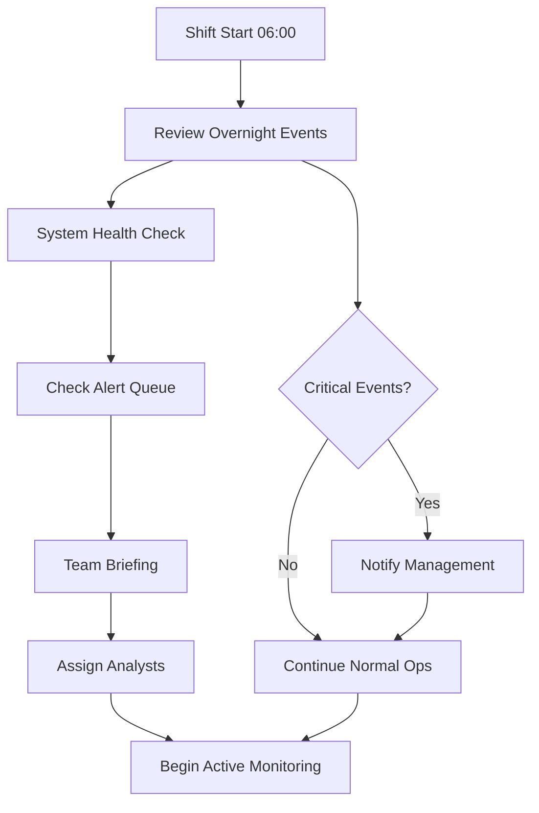
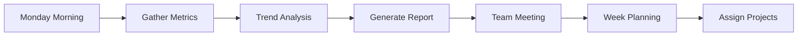
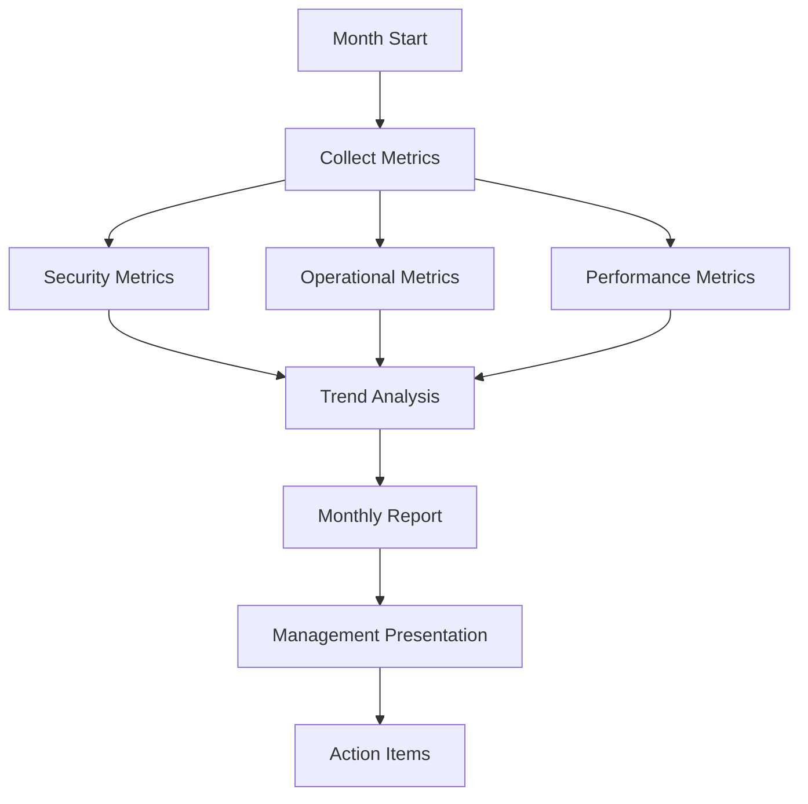
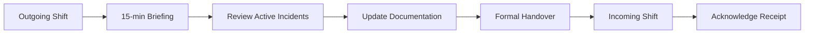
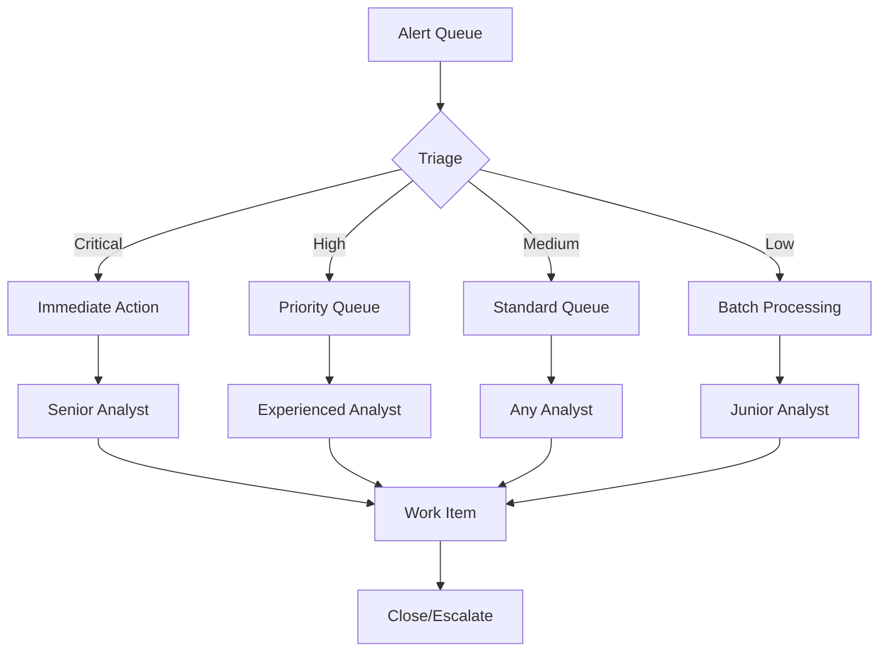
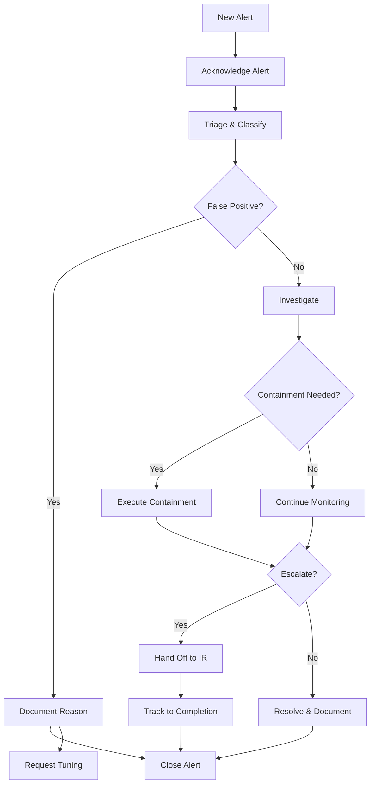
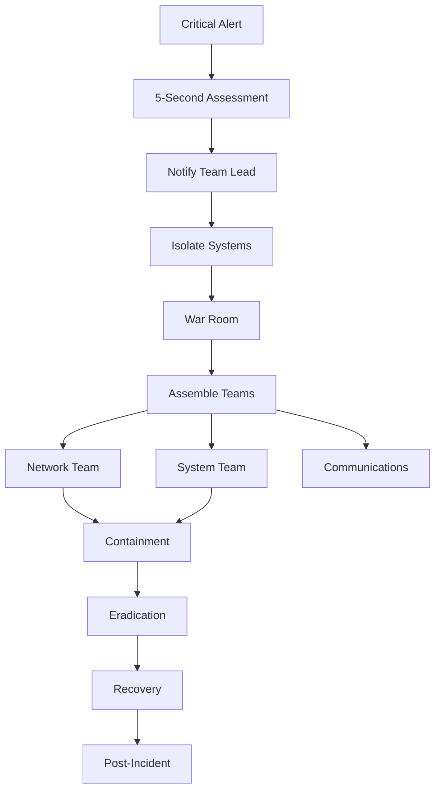

# SOC Operations Runbook

## Table of Contents
1. [Daily Operations](#daily-operations)
2. [Weekly Operations](#weekly-operations)
3. [Monthly Operations](#monthly-operations)
4. [Shift Handover Procedures](#shift-handover-procedures)
5. [Alert Queue Management](#alert-queue-management)
6. [Performance Monitoring](#performance-monitoring)
7. [Operational Metrics](#operational-metrics)
8. [Standard Operating Procedures](#standard-operating-procedures)
9. [Emergency Procedures](#emergency-procedures)
10. [Team Training & Development](#team-training--development)

---

## Daily Operations

### Morning Shift Start (06:00)

#### Pre-Shift Checklist



#### 1. System Health Verification (06:00-06:15)

**Splunk Infrastructure Check**:
```spl
| rest /servicesNS/-/-/server/info
| fields splunk_server, version, startup_time, licenseState
| append [ | rest /servicesNS/-/-/server/status/resource-usage/splunk-processes
          | fields splunk_server, data.pct_memory, data.pct_cpu ]
| stats values(*) as * by splunk_server
| eval status=if(licenseState="OK" AND 'data.pct_cpu'<80 AND 'data.pct_memory'<80, "Healthy", "Attention Required")
```

**Alert Engine Status**:
```spl
| rest /servicesNS/-/-/saved/searches
| search is_scheduled=1 disabled=0
| fields title, cron_schedule, next_scheduled_time, actions
| eval time_until_next=round((strptime(next_scheduled_time, "%Y-%m-%d %H:%M:%S") - now()) / 60, 0)
| where time_until_next < 0
| stats count as overdue_alerts
| eval alert_status=if(overdue_alerts=0, "All alerts running", overdue_alerts . " alerts overdue")
```

**Data Ingestion Monitoring**:
```spl
| tstats count WHERE index=* BY index _time span=1h
| timechart span=1h sum(count) as events by index
| eval expected_rate=case(
    index="security", 100000,
    index="network", 500000,
    index="windows", 200000,
    1=1, 50000
)
| eval status=if(events < expected_rate * 0.8, "Below Normal", "Normal")
```

#### 2. Overnight Event Review (06:15-06:45)

**Critical Alert Summary**:
```spl
index=* severity IN (critical, high) earliest=-12h@h latest=now
| stats count by severity, alert_name, src_ip, dest_ip, user
| sort -severity, -count
| head 20
```

**Unacknowledged Alerts**:
```spl
| inputlookup alert_tracker.csv
| where status="new" OR status="pending"
| eval age_hours=round((now() - alert_time) / 3600, 1)
| where age_hours > 1
| sort -severity, -age_hours
| table alert_id, alert_name, severity, age_hours, assigned_to
```

**Failed Authentication Overnight Trend**:
```spl
index=* (EventCode=4625 OR "Failed password") earliest=-12h@h latest=@h
| timechart span=1h count by host
| eval threshold=100
| where count > threshold
```

#### 3. Queue Prioritization (06:45-07:00)

**Alert Triage Matrix**:

| Priority | Severity | Age | Action Required | SLA |
|----------|----------|-----|-----------------|-----|
| P1 | Critical | Any | Immediate | 5 min |
| P2 | High | <1hr | Urgent | 15 min |
| P3 | High | >1hr | High | 30 min |
| P4 | Medium | <4hr | Standard | 1 hour |
| P5 | Medium | >4hr | Scheduled | 2 hours |
| P6 | Low | Any | Best Effort | 8 hours |

**Queue Distribution Query**:
```spl
| inputlookup alert_queue.csv
| eval priority=case(
    severity="critical", "P1",
    severity="high" AND age_minutes<60, "P2",
    severity="high" AND age_minutes>=60, "P3",
    severity="medium" AND age_minutes<240, "P4",
    severity="medium" AND age_minutes>=240, "P5",
    1=1, "P6"
)
| stats count by priority, assigned_analyst
| eval workload=case(count<5, "Light", count<10, "Normal", count<15, "Heavy", 1=1, "Overloaded")
```

### Hourly Checks (Every Hour)

#### Alert Performance Monitoring

```spl
# Check alert execution times
| rest /servicesNS/-/-/saved/searches
| search is_scheduled=1
| join title [ | rest /servicesNS/-/-/saved/searches/*/history
               | fields title, run_time, result_count, status ]
| where run_time > 60
| table title, run_time, result_count, status
| sort -run_time
```

#### Threat Intelligence Update Check

```bash
#!/bin/bash
# Threat Intel Feed Update Check

FEED_DIR="/opt/splunk/var/lib/splunk/lookups"
FEED_AGE_LIMIT=86400  # 24 hours in seconds

for feed in malicious_ips.csv suspicious_domains.csv threat_indicators.csv; do
    if [ -f "${FEED_DIR}/${feed}" ]; then
        file_age=$(($(date +%s) - $(stat -c %Y "${FEED_DIR}/${feed}")))
        if [ $file_age -gt $FEED_AGE_LIMIT ]; then
            echo "WARNING: ${feed} is older than 24 hours"
            # Trigger update process
            /opt/scripts/update_threat_intel.sh "${feed}"
        fi
    fi
done
```

### Mid-Day Operations (12:00)

#### Shift Performance Review

```spl
# Analyst productivity metrics
| inputlookup alert_tracker.csv
| where assigned_time > relative_time(now(), "-6h@h")
| stats count as alerts_handled,
        avg(eval(resolution_time-assigned_time)) as avg_resolution_seconds,
        sum(eval(if(escalated="true",1,0))) as escalations by assigned_to
| eval avg_resolution_minutes=round(avg_resolution_seconds/60, 1)
| eval efficiency_score=round((alerts_handled*100)/(avg_resolution_minutes+escalations*10), 0)
| sort -efficiency_score
```

#### Resource Utilization Check

```spl
# Search head utilization
| rest /servicesNS/-/-/server/status/resource-usage/splunk-processes
| fields splunk_server, "data.pct_cpu", "data.pct_memory", "data.fd_used"
| rename "data.*" as *
| eval cpu_status=case(pct_cpu>90, "Critical", pct_cpu>75, "Warning", 1=1, "Normal")
| eval mem_status=case(pct_memory>90, "Critical", pct_memory>75, "Warning", 1=1, "Normal")
| table splunk_server, pct_cpu, cpu_status, pct_memory, mem_status, fd_used
```

### Evening Shift Transition (18:00)

#### End of Day Report Generation

```spl
# Daily summary statistics
| multisearch
    [ search index=* severity=* earliest=@d latest=now
      | stats count by severity
      | eval metric="total_alerts" ]
    [ search index=* severity=critical earliest=@d latest=now
      | stats dc(src_ip) as value
      | eval metric="unique_critical_sources" ]
    [ search index=* alert_name="*" earliest=@d latest=now
      | stats count as value by alert_name
      | sort -value
      | head 5
      | eval metric="top_alerts" ]
| stats values(*) as * by metric
```

---

## Weekly Operations

### Monday - Weekly Planning

#### 1. Previous Week Review (09:00-10:00)



**Weekly Alert Trend Analysis**:
```spl
index=* severity=* earliest=-7d@w latest=@w
| timechart span=1d count by severity
| eval day_of_week=strftime(_time, "%A")
| stats avg(critical) as avg_critical,
        avg(high) as avg_high,
        avg(medium) as avg_medium,
        max(critical) as peak_critical by day_of_week
```

**False Positive Analysis**:
```spl
| inputlookup alert_tracker.csv
| where resolution="false_positive" AND resolution_time > relative_time(now(), "-7d@w")
| stats count by alert_name, reason
| sort -count
| head 10
| eval tuning_needed=if(count>5, "Yes", "No")
```

#### 2. Threat Landscape Review (10:00-11:00)

**External Threat Intelligence Summary**:
```bash
#!/bin/bash
# Weekly Threat Intel Summary

echo "=== Weekly Threat Intelligence Summary ==="
echo "Generated: $(date)"
echo ""

# Check new IOCs added this week
echo "New IOCs This Week:"
find /opt/splunk/var/lib/splunk/lookups -name "*.csv" -mtime -7 | while read file; do
    echo "  $(basename $file): $(wc -l < $file) entries"
done

# Check feeds status
echo ""
echo "Feed Update Status:"
for feed in OSINT ISAC Commercial; do
    last_update=$(stat -c %y /opt/splunk/var/lib/splunk/lookups/${feed,,}_feed.csv 2>/dev/null)
    echo "  $feed: Last updated $last_update"
done
```

### Tuesday - Maintenance Window

#### 1. Lookup Table Maintenance (02:00-03:00)

**Automated Lookup Cleanup**:
```python
#!/usr/bin/env python3
import csv
import os
from datetime import datetime, timedelta

LOOKUP_DIR = "/opt/splunk/var/lib/splunk/lookups"
MAX_AGE_DAYS = 90

def cleanup_lookup(filename):
    """Remove entries older than MAX_AGE_DAYS"""
    input_file = os.path.join(LOOKUP_DIR, filename)
    temp_file = input_file + ".tmp"

    cutoff_date = datetime.now() - timedelta(days=MAX_AGE_DAYS)

    with open(input_file, 'r') as infile, open(temp_file, 'w', newline='') as outfile:
        reader = csv.DictReader(infile)
        writer = csv.DictWriter(outfile, fieldnames=reader.fieldnames)
        writer.writeheader()

        for row in reader:
            if 'last_seen' in row:
                last_seen = datetime.fromisoformat(row['last_seen'])
                if last_seen > cutoff_date:
                    writer.writerow(row)
            else:
                writer.writerow(row)

    os.rename(temp_file, input_file)
    print(f"Cleaned up {filename}")

# Clean up each lookup
for lookup_file in ['malicious_ips.csv', 'suspicious_domains.csv']:
    cleanup_lookup(lookup_file)
```

#### 2. Alert Tuning Session (10:00-12:00)

**Threshold Adjustment Workflow**:
```spl
# Identify alerts needing tuning
| inputlookup alert_tracker.csv
| where resolution_time > relative_time(now(), "-7d")
| stats count as total,
        sum(eval(if(resolution="false_positive",1,0))) as false_positives,
        sum(eval(if(resolution="true_positive",1,0))) as true_positives by alert_name
| eval fp_rate=round((false_positives/total)*100, 1)
| where fp_rate > 20 OR total > 100
| sort -fp_rate
| table alert_name, total, false_positives, true_positives, fp_rate
| eval recommendation=case(
    fp_rate > 50, "Increase threshold significantly",
    fp_rate > 30, "Moderate threshold increase",
    fp_rate > 20, "Minor threshold adjustment",
    total > 200, "Consider adding suppression",
    1=1, "Monitor"
)
```

### Wednesday - Training Day

#### 1. Skill Assessment (09:00-10:00)

**Individual Performance Metrics**:
```spl
# Analyst skill matrix
| inputlookup analyst_training.csv
| join analyst [ | inputlookup alert_tracker.csv
                 | where resolution_time > relative_time(now(), "-30d")
                 | stats avg(eval(resolution_time-assigned_time)) as avg_response,
                         count as alerts_handled,
                         dc(alert_type) as alert_variety by assigned_to
                 | rename assigned_to as analyst ]
| eval skill_score = round((alert_variety*10 + alerts_handled/10) / (avg_response/60), 0)
| table analyst, last_training, skill_score, alerts_handled, alert_variety
| sort -skill_score
```

#### 2. Weekly Training Topics

| Week | Topic | Duration | Materials |
|------|-------|----------|-----------|
| 1 | New Alert Reviews | 1 hour | Recent alerts documentation |
| 2 | Threat Hunting Techniques | 2 hours | MITRE ATT&CK scenarios |
| 3 | Incident Response Drills | 2 hours | Tabletop exercises |
| 4 | Tool Training | 1 hour | Splunk SPL advanced |

### Thursday - Reporting

#### 1. Stakeholder Reports (14:00-16:00)

**Executive Dashboard Query**:
```spl
# Executive summary dashboard
| multisearch
    [ search index=* severity=critical earliest=-7d
      | stats count as critical_count ]
    [ search index=* severity IN (critical, high) earliest=-7d
      | stats dc(src_ip) as unique_threats ]
    [ search index=* alert_name="Data Exfiltration" earliest=-7d
      | stats sum(bytes_out) as data_at_risk ]
    [ search index=* earliest=-7d
      | stats count as total_events ]
| stats values(*) as *
| eval data_at_risk_gb=round(data_at_risk/1073741824, 2)
| eval detection_rate=round((critical_count/total_events)*100, 4)
| table critical_count, unique_threats, data_at_risk_gb, detection_rate
```

**Compliance Metrics Report**:
```spl
# Compliance-focused metrics
index=* (PCI OR HIPAA OR GDPR OR SOX) earliest=-7d
| eval compliance_domain=case(
    searchmatch("PCI"), "PCI-DSS",
    searchmatch("HIPAA"), "HIPAA",
    searchmatch("GDPR"), "GDPR",
    searchmatch("SOX"), "SOX",
    1=1, "Other"
)
| stats count as events,
        dc(host) as systems_affected,
        values(alert_name) as related_alerts by compliance_domain
| eval risk_level=case(
    events > 100, "High",
    events > 50, "Medium",
    events > 10, "Low",
    1=1, "Minimal"
)
```

### Friday - Process Improvement

#### 1. Automation Opportunities (10:00-12:00)

**Identify Repetitive Tasks**:
```spl
# Find alerts suitable for automation
| inputlookup alert_tracker.csv
| where resolution_time > relative_time(now(), "-30d")
| stats count as occurrences,
        avg(eval(resolution_time-assigned_time)) as avg_time,
        values(resolution_steps) as steps by alert_name
| where occurrences > 20 AND avg_time < 300
| eval automation_candidate=if(match(steps, "same|standard|always"), "Yes", "No")
| where automation_candidate="Yes"
| sort -occurrences
```

#### 2. Documentation Updates (14:00-16:00)

**Documentation Checklist**:
- [ ] Update runbooks with new procedures
- [ ] Document new IOCs and threat patterns
- [ ] Update contact lists and escalation paths
- [ ] Review and update knowledge base articles
- [ ] Create lessons learned from incidents

---

## Monthly Operations

### First Monday - Monthly Review

#### 1. Comprehensive Metrics Analysis



**Monthly KPI Dashboard**:
```spl
# Monthly KPI calculations
| multisearch
    [ search index=* severity=* earliest=-30d
      | stats count as total_alerts,
              dc(src_ip) as unique_sources,
              dc(dest_ip) as unique_destinations ]
    [ search index=* severity=critical earliest=-30d
      | stats count as critical_alerts,
              dc(user) as compromised_users ]
    [ search | inputlookup alert_tracker.csv
      | where resolution_time > relative_time(now(), "-30d")
      | stats avg(eval(resolution_time-alert_time)) as avg_response_time,
              sum(eval(if(resolution="false_positive",1,0))) as false_positives,
              sum(eval(if(resolution="true_positive",1,0))) as true_positives ]
| eval mttr_minutes=round(avg_response_time/60, 1)
| eval detection_accuracy=round((true_positives/(true_positives+false_positives))*100, 1)
| table total_alerts, critical_alerts, unique_sources, compromised_users,
        mttr_minutes, detection_accuracy
```

#### 2. Threat Trend Analysis

```spl
# Monthly threat evolution
index=* severity IN (critical, high) earliest=-30d
| bucket _time span=1d
| stats count by _time, alert_name
| timechart span=1d sum(count) as daily_alerts by alert_name
| eval trend=case(
    daily_alerts > 100, "Increasing",
    daily_alerts < 50, "Decreasing",
    1=1, "Stable"
)
```

### Mid-Month - Infrastructure Review

#### 1. Capacity Planning (Second Tuesday)

**Storage Utilization Analysis**:
```spl
# Index storage trends
| dbinspect
| eval size_gb=round(sizeOnDiskMB/1024, 2)
| stats sum(size_gb) as total_gb,
        avg(size_gb) as avg_gb by index
| join index [ | rest /servicesNS/-/-/data/indexes
               | fields title, maxTotalDataSizeMB
               | rename title as index ]
| eval max_gb=round(maxTotalDataSizeMB/1024, 2)
| eval utilization_pct=round((total_gb/max_gb)*100, 1)
| table index, total_gb, max_gb, utilization_pct
| sort -utilization_pct
```

**Search Performance Baseline**:
```spl
# Search performance metrics
| rest /servicesNS/-/-/saved/searches/*/history
| fields title, run_time, result_count, total_run_time
| stats avg(run_time) as avg_runtime,
        max(run_time) as max_runtime,
        sum(result_count) as total_results by title
| where avg_runtime > 30
| eval optimization_needed=if(avg_runtime > 60, "Yes", "No")
| sort -avg_runtime
```

#### 2. License Usage Review

```spl
# License utilization check
| rest /servicesNS/-/-/licenser/usage
| fields slave_usage.*
| transpose
| rex field=column "slave_usage.(?<date>.*)"
| rename "row 1" as gb_used
| eval utilization_pct=round((gb_used/500)*100, 1)  # Assuming 500GB license
| table date, gb_used, utilization_pct
| sort -date
```

### Month End - Strategic Planning

#### 1. Alert Coverage Assessment

**MITRE ATT&CK Coverage Map**:
```python
#!/usr/bin/env python3
import json

# MITRE techniques covered by our alerts
covered_techniques = {
    "T1021": "Lateral Movement Detected",
    "T1078": "Unauthorized SSH Access",
    "T1110": "Failed Authentication Spike",
    "T1048": "Data Exfiltration Attempt",
    "T1068": "Privilege Escalation Detected",
    "T1053": "Persistence Mechanism Created",
    "T1071": "Command and Control Beacon",
    "T1059": "Suspicious Process Execution",
    "T1098": "Account Manipulation",
    "T1046": "Port Scanning Activity",
    "T1036": "File Integrity Violation"
}

# Calculate coverage
total_techniques = 200  # Approximate number of MITRE techniques
coverage_percentage = (len(covered_techniques) / total_techniques) * 100

print(f"MITRE ATT&CK Coverage: {coverage_percentage:.1f}%")
print(f"Techniques Covered: {len(covered_techniques)}")
print(f"Gap: {total_techniques - len(covered_techniques)} techniques")
```

#### 2. Continuous Improvement Plan

**Improvement Tracking**:
```spl
# Track improvement initiatives
| inputlookup improvements.csv
| where status IN ("in_progress", "planned")
| eval days_since_start=floor((now()-strptime(start_date, "%Y-%m-%d"))/86400)
| eval priority_score=case(
    impact="high" AND effort="low", 100,
    impact="high" AND effort="medium", 80,
    impact="medium" AND effort="low", 70,
    impact="medium" AND effort="medium", 50,
    1=1, 30
)
| sort -priority_score
| table initiative, status, impact, effort, days_since_start, priority_score
```

---

## Shift Handover Procedures

### Shift Transition Checklist



### Handover Template

```markdown
# Shift Handover Report

Date: _______________
Outgoing Shift: _______________
Incoming Shift: _______________

## Active Incidents
| Incident ID | Severity | Status | Assigned To | Next Action |
|------------|----------|---------|-------------|-------------|
| | | | | |

## Pending Tasks
- [ ] Task 1
- [ ] Task 2
- [ ] Task 3

## System Status
- Splunk Health: [Green/Yellow/Red]
- Data Ingestion: [Normal/Degraded/Failed]
- Alert Engine: [Running/Issues]

## Notable Events
1. Event 1
2. Event 2

## Special Instructions
_______________

Handover Completed: _______________
Acknowledged By: _______________
```

### Critical Information Transfer

**Active Incident Summary Query**:
```spl
| inputlookup incident_tracker.csv
| where status IN ("open", "in_progress")
| eval age_hours=round((now()-incident_start)/3600, 1)
| table incident_id, severity, description, assigned_to, age_hours, next_action
| sort -severity, -age_hours
```

---

## Alert Queue Management

### Queue Processing Strategy



### Queue Management Queries

**Current Queue Status**:
```spl
| inputlookup alert_queue.csv
| where status="pending"
| eval wait_time_min=round((now()-alert_time)/60, 0)
| eval sla_status=case(
    severity="critical" AND wait_time_min > 5, "BREACH",
    severity="high" AND wait_time_min > 15, "BREACH",
    severity="medium" AND wait_time_min > 60, "BREACH",
    wait_time_min > 240, "BREACH",
    1=1, "OK"
)
| stats count by severity, sla_status
| eval queue_health=if(sla_status="BREACH", "Attention Required", "Healthy")
```

**Analyst Workload Distribution**:
```spl
| inputlookup alert_queue.csv
| where status IN ("assigned", "in_progress")
| stats count as active_alerts,
        avg(eval(now()-assigned_time)) as avg_age by assigned_to
| eval avg_age_min=round(avg_age/60, 0)
| eval workload=case(
    active_alerts > 10, "Overloaded",
    active_alerts > 5, "Heavy",
    active_alerts > 2, "Normal",
    1=1, "Light"
)
| sort -active_alerts
```

### Alert Assignment Algorithm

```python
#!/usr/bin/env python3
import json
import random
from datetime import datetime

def assign_alert(alert, analysts):
    """Assign alert to appropriate analyst based on severity and workload"""

    # Filter analysts by skill level for critical alerts
    if alert['severity'] == 'critical':
        eligible = [a for a in analysts if a['skill_level'] >= 3]
    elif alert['severity'] == 'high':
        eligible = [a for a in analysts if a['skill_level'] >= 2]
    else:
        eligible = analysts

    # Sort by current workload
    eligible.sort(key=lambda x: x['current_alerts'])

    # Assign to analyst with lowest workload
    if eligible:
        assigned_to = eligible[0]
        assigned_to['current_alerts'] += 1

        return {
            'alert_id': alert['id'],
            'assigned_to': assigned_to['name'],
            'assigned_time': datetime.now().isoformat(),
            'expected_resolution': calculate_sla(alert['severity'])
        }

    return None

def calculate_sla(severity):
    """Calculate expected resolution time based on severity"""
    sla_times = {
        'critical': 15,
        'high': 30,
        'medium': 60,
        'low': 240
    }
    return sla_times.get(severity, 480)
```

---

## Performance Monitoring

### Key Performance Indicators

#### Real-time KPI Dashboard

```spl
# Real-time SOC performance dashboard
| multisearch
    [ | rest /servicesNS/-/-/server/info
      | fields splunk_server, version, licenseState
      | eval metric="infrastructure" ]
    [ search index=* earliest=-1h
      | stats count as events_per_hour
      | eval metric="ingestion_rate" ]
    [ search index=* severity=* earliest=-1h
      | stats count by severity
      | eval metric="alerts_per_hour" ]
    [ | inputlookup alert_tracker.csv
      | where alert_time > relative_time(now(), "-1h")
      | stats avg(eval(resolution_time-alert_time)) as avg_response
      | eval metric="response_time" ]
| stats values(*) as * by metric
```

### Service Level Agreement Tracking

**SLA Compliance Dashboard**:
```spl
# SLA compliance tracking
| inputlookup alert_tracker.csv
| where resolution_time > relative_time(now(), "-24h")
| eval response_minutes=round((resolution_time-alert_time)/60, 1)
| eval sla_target=case(
    severity="critical", 5,
    severity="high", 15,
    severity="medium", 60,
    1=1, 240
)
| eval sla_met=if(response_minutes <= sla_target, "Yes", "No")
| stats count as total,
        sum(eval(if(sla_met="Yes",1,0))) as met_sla,
        sum(eval(if(sla_met="No",1,0))) as missed_sla by severity
| eval compliance_rate=round((met_sla/total)*100, 1)
| table severity, total, met_sla, missed_sla, compliance_rate
```

### Efficiency Metrics

**Team Efficiency Score**:
```spl
# Calculate team efficiency metrics
| inputlookup alert_tracker.csv
| where resolution_time > relative_time(now(), "-7d")
| stats count as alerts_closed,
        avg(eval(resolution_time-alert_time)) as avg_resolution,
        sum(eval(if(escalated="true",1,0))) as escalations,
        sum(eval(if(resolution="false_positive",1,0))) as false_positives by assigned_to
| eval efficiency_score=round((alerts_closed*100)/((avg_resolution/60)+escalations*5+false_positives*2), 1)
| sort -efficiency_score
| eval rating=case(
    efficiency_score > 80, "Excellent",
    efficiency_score > 60, "Good",
    efficiency_score > 40, "Satisfactory",
    1=1, "Needs Improvement"
)
```

---

## Operational Metrics

### Daily Metrics Collection

```python
#!/usr/bin/env python3
import json
from datetime import datetime, timedelta
import requests

class SOCMetrics:
    def __init__(self):
        self.metrics = {
            'date': datetime.now().isoformat(),
            'alerts': {},
            'performance': {},
            'infrastructure': {},
            'team': {}
        }

    def collect_alert_metrics(self):
        """Collect alert-related metrics"""
        # This would connect to Splunk API in production
        self.metrics['alerts'] = {
            'total_count': 245,
            'critical': 3,
            'high': 12,
            'medium': 45,
            'low': 185,
            'false_positive_rate': 3.2,
            'true_positive_rate': 96.8
        }

    def collect_performance_metrics(self):
        """Collect performance metrics"""
        self.metrics['performance'] = {
            'mean_time_to_detect': 4.3,  # minutes
            'mean_time_to_respond': 12.7,  # minutes
            'mean_time_to_resolve': 45.2,  # minutes
            'sla_compliance': 98.5,  # percentage
            'alerts_per_analyst': 8.2
        }

    def collect_infrastructure_metrics(self):
        """Collect infrastructure health metrics"""
        self.metrics['infrastructure'] = {
            'indexer_cpu_usage': 65.3,
            'indexer_memory_usage': 72.1,
            'search_head_cpu_usage': 45.7,
            'search_head_memory_usage': 58.2,
            'storage_utilization': 68.9,
            'license_usage': 82.4
        }

    def collect_team_metrics(self):
        """Collect team performance metrics"""
        self.metrics['team'] = {
            'analysts_on_duty': 6,
            'average_experience': 3.5,  # years
            'training_hours_completed': 12,
            'incident_escalations': 2,
            'shift_coverage': 100  # percentage
        }

    def generate_report(self):
        """Generate daily metrics report"""
        self.collect_alert_metrics()
        self.collect_performance_metrics()
        self.collect_infrastructure_metrics()
        self.collect_team_metrics()

        return json.dumps(self.metrics, indent=2)

# Run daily metrics collection
if __name__ == "__main__":
    metrics = SOCMetrics()
    report = metrics.generate_report()

    # Save to file
    with open(f"/var/log/soc/metrics_{datetime.now().strftime('%Y%m%d')}.json", 'w') as f:
        f.write(report)

    print("Daily metrics collected successfully")
```

### Monthly Trend Analysis

```spl
# Monthly trend analysis
index=soc_metrics earliest=-30d
| timechart span=1d avg(alerts.total_count) as daily_alerts,
            avg(performance.mean_time_to_resolve) as avg_mttr,
            avg(infrastructure.cpu_usage) as avg_cpu,
            avg(team.incident_escalations) as daily_escalations
| eval trend_alerts=case(
    daily_alerts > 300, "High Volume",
    daily_alerts > 200, "Normal",
    1=1, "Low Volume"
)
| eval trend_performance=case(
    avg_mttr < 30, "Excellent",
    avg_mttr < 60, "Good",
    1=1, "Needs Improvement"
)
```

---

## Standard Operating Procedures

### Alert Handling Procedure



### Investigation Methodology

#### 1. Initial Triage (0-5 minutes)
- Verify alert details and context
- Check for duplicate or related alerts
- Assess immediate risk and impact
- Determine investigation priority

#### 2. Data Collection (5-15 minutes)
- Gather relevant logs and events
- Identify affected systems and users
- Collect network traffic data
- Document timeline of events

#### 3. Analysis (15-30 minutes)
- Correlate events across data sources
- Identify attack patterns or anomalies
- Determine root cause
- Assess potential damage

#### 4. Response Decision (30-45 minutes)
- Determine appropriate response
- Consider business impact
- Evaluate containment options
- Plan remediation steps

#### 5. Documentation (45-60 minutes)
- Complete incident report
- Update knowledge base
- Create detection improvements
- Record lessons learned

### Escalation Procedures

**Escalation Decision Matrix**:

| Condition | Escalation Level | Contact | Response Time |
|-----------|------------------|---------|---------------|
| Data breach suspected | Executive | CISO | Immediate |
| Critical system compromise | Management | IT Director | 15 minutes |
| Multiple systems affected | Team Lead | SOC Manager | 30 minutes |
| Persistent threat actor | Senior Analyst | Lead Analyst | 1 hour |
| Standard incident | Peer Review | Senior SOC | 2 hours |

### Communication Protocols

#### Internal Communication

```markdown
# Incident Communication Template

## ALERT - [SEVERITY] - [INCIDENT TYPE]

**Time:** [TIMESTAMP]
**Incident ID:** [ID]
**Affected Systems:** [SYSTEMS]
**Impact:** [BUSINESS IMPACT]

**Summary:**
[Brief description of the incident]

**Current Status:**
- [ ] Contained
- [ ] Under Investigation
- [ ] Remediated
- [ ] Monitoring

**Actions Taken:**
1. [Action 1]
2. [Action 2]

**Next Steps:**
- [Next step 1]
- [Next step 2]

**Contact:** [Analyst Name] - [Contact Info]
```

---

## Emergency Procedures

### Critical Incident Response



### Disaster Recovery

#### Data Center Failure

1. **Immediate Actions**:
   - Switch to backup Splunk instance
   - Redirect data flows to DR site
   - Notify all stakeholders
   - Activate crisis communication plan

2. **Recovery Steps**:
   - Validate DR site functionality
   - Restore critical searches first
   - Verify data integrity
   - Resume normal operations

#### Ransomware Response

1. **Containment** (0-15 minutes):
   - Isolate affected systems
   - Disable network shares
   - Block C2 communications
   - Preserve evidence

2. **Assessment** (15-60 minutes):
   - Identify ransomware variant
   - Determine infection scope
   - Evaluate backup availability
   - Consider recovery options

3. **Recovery** (1+ hours):
   - Execute recovery plan
   - Restore from clean backups
   - Rebuild affected systems
   - Implement additional controls

### Emergency Contact List

```markdown
# Emergency Contacts

## Internal Contacts
- SOC Hotline: 1-800-SOC-HELP (24/7)
- CISO: [Name] - [Phone]
- IT Director: [Name] - [Phone]
- Legal Counsel: [Name] - [Phone]
- PR Team: [Name] - [Phone]

## External Contacts
- FBI Cyber Division: 1-800-CALL-FBI
- CISA: 1-888-282-0870
- Incident Response Retainer: [Company] - [Phone]
- Cyber Insurance: [Company] - [Phone]

## Vendor Support
- Splunk Support: 1-877-775-8657
- Network Vendor: [Company] - [Phone]
- Cloud Provider: [Company] - [Phone]
```

---

## Team Training & Development

### Training Program Structure


### Skills Matrix

| Skill Level | Experience | Capabilities | Training Focus |
|-------------|------------|--------------|----------------|
| Junior (L1) | 0-1 years | Basic triage, Known threats | Fundamentals, Tools |
| Analyst (L2) | 1-3 years | Investigation, Incident response | Advanced SPL, Forensics |
| Senior (L3) | 3-5 years | Complex incidents, Mentoring | Threat hunting, Architecture |
| Lead (L4) | 5+ years | Strategy, Management | Leadership, Planning |

### Weekly Training Schedule

#### Monday - Threat Intelligence Briefing
```spl
# Generate threat intel briefing materials
index=threat_intel earliest=-7d
| stats count by threat_actor, technique, target_industry
| sort -count
| head 10
| eval briefing_priority=case(
    count > 100, "Critical",
    count > 50, "High",
    count > 10, "Medium",
    1=1, "Low"
)
```

#### Tuesday - Technical Deep Dive
- Week 1: Advanced SPL techniques
- Week 2: Malware analysis
- Week 3: Network forensics
- Week 4: Cloud security monitoring

#### Wednesday - Tabletop Exercise

**Scenario Generator**:
```python
#!/usr/bin/env python3
import random

scenarios = [
    "Ransomware infection on domain controller",
    "Data exfiltration from database server",
    "Insider threat stealing source code",
    "Supply chain compromise detected",
    "Zero-day exploit in public-facing application",
    "Cryptominer on production servers",
    "Business email compromise attempt",
    "DDoS attack on customer portal"
]

complications = [
    "Primary incident responder is unavailable",
    "Backup systems are also compromised",
    "Media has been alerted to the breach",
    "Attack occurs during maintenance window",
    "Multiple geographic locations affected"
]

print("This Week's Tabletop Scenario:")
print(f"Primary: {random.choice(scenarios)}")
print(f"Complication: {random.choice(complications)}")
print("\nObjectives:")
print("1. Follow incident response procedures")
print("2. Document all decisions and actions")
print("3. Identify process improvements")
```

#### Thursday - Tool Training
- Splunk Enterprise Security features
- SOAR platform automation
- Threat intelligence platforms
- Forensic tools and techniques

#### Friday - Knowledge Sharing
- Incident post-mortems
- New detection techniques
- Industry best practices
- Certification study groups

### Performance Development

#### Individual Development Plan Template

```markdown
# Individual Development Plan

**Analyst Name:** _______________
**Current Level:** _______________
**Target Level:** _______________
**Review Date:** _______________

## Current Skills Assessment
- [ ] Splunk SPL Proficiency
- [ ] Incident Response
- [ ] Network Analysis
- [ ] Malware Analysis
- [ ] Threat Hunting
- [ ] Communication
- [ ] Documentation

## Development Goals (Next 6 Months)
1. Goal: _______________
   - Action: _______________
   - Deadline: _______________
   - Success Criteria: _______________

2. Goal: _______________
   - Action: _______________
   - Deadline: _______________
   - Success Criteria: _______________

## Training Plan
- Course 1: _______________
- Course 2: _______________
- Certification: _______________

## Mentoring
- Mentor: _______________
- Meeting Frequency: _______________
- Focus Areas: _______________

## Progress Tracking
- 30-day Review: _______________
- 60-day Review: _______________
- 90-day Review: _______________
```

### Knowledge Management

#### Knowledge Base Structure

```bash
/soc-knowledge-base/
├── alerts/
│   ├── critical/
│   ├── high/
│   ├── medium/
│   └── low/
├── playbooks/
│   ├── incident-response/
│   ├── threat-hunting/
│   └── forensics/
├── tools/
│   ├── splunk/
│   ├── network/
│   └── endpoint/
├── threats/
│   ├── actors/
│   ├── campaigns/
│   └── techniques/
└── lessons-learned/
    ├── incidents/
    ├── improvements/
    └── post-mortems/
```

#### Knowledge Article Template

```markdown
# Knowledge Article: [TITLE]

**Article ID:** KB-[NUMBER]
**Category:** [CATEGORY]
**Tags:** [TAG1, TAG2, TAG3]
**Author:** [NAME]
**Date:** [DATE]
**Last Updated:** [DATE]

## Summary
[Brief description of the topic]

## Detailed Information
[Comprehensive explanation]

## Step-by-Step Instructions
1. Step 1
2. Step 2
3. Step 3

## Examples
```
[Code or query examples]
```

## Related Articles
- [Link 1]
- [Link 2]

## References
- [External reference 1]
- [External reference 2]
```

---

## Automation Scripts

### Daily Automation Tasks

```python
#!/usr/bin/env python3
"""
SOC Daily Automation Script
Runs automated tasks to support SOC operations
"""

import os
import json
import subprocess
from datetime import datetime, timedelta
import requests

class SOCAutomation:
    def __init__(self):
        self.config = self.load_config()
        self.timestamp = datetime.now()

    def load_config(self):
        """Load configuration from file"""
        with open('/opt/soc/config/automation.json', 'r') as f:
            return json.load(f)

    def update_threat_feeds(self):
        """Update threat intelligence feeds"""
        feeds = [
            'https://rules.emergingthreats.net/blockrules/compromised-ips.txt',
            'https://feodotracker.abuse.ch/downloads/ipblocklist.csv',
            'https://sslbl.abuse.ch/blacklist/sslipblacklist.csv'
        ]

        for feed_url in feeds:
            try:
                response = requests.get(feed_url, timeout=30)
                if response.status_code == 200:
                    filename = feed_url.split('/')[-1]
                    with open(f'/opt/splunk/var/lib/splunk/lookups/{filename}', 'w') as f:
                        f.write(response.text)
                    print(f"Updated {filename}")
            except Exception as e:
                print(f"Failed to update {feed_url}: {str(e)}")

    def cleanup_old_alerts(self):
        """Archive old alerts"""
        cutoff_date = self.timestamp - timedelta(days=90)

        # This would connect to Splunk API in production
        query = f"""
        | inputlookup alert_tracker.csv
        | where alert_time < {cutoff_date.timestamp()}
        | outputlookup alert_archive_{cutoff_date.strftime('%Y%m')}.csv
        """

        # Execute archival
        print(f"Archived alerts older than {cutoff_date}")

    def generate_daily_report(self):
        """Generate daily SOC report"""
        report = {
            'date': self.timestamp.strftime('%Y-%m-%d'),
            'alerts_processed': 0,
            'incidents_created': 0,
            'false_positives': 0,
            'system_health': 'Normal'
        }

        # Save report
        report_file = f"/var/reports/soc/daily_{self.timestamp.strftime('%Y%m%d')}.json"
        with open(report_file, 'w') as f:
            json.dump(report, f, indent=2)

        print(f"Daily report generated: {report_file}")

    def health_check(self):
        """Perform system health checks"""
        checks = {
            'splunk_service': 'systemctl is-active splunk',
            'disk_space': 'df -h | grep -E "^/dev/"',
            'memory_usage': 'free -m | grep Mem',
            'network_connectivity': 'ping -c 1 8.8.8.8'
        }

        health_status = {}
        for check_name, command in checks.items():
            try:
                result = subprocess.run(command, shell=True, capture_output=True, text=True)
                health_status[check_name] = 'OK' if result.returncode == 0 else 'FAILED'
            except Exception as e:
                health_status[check_name] = f'ERROR: {str(e)}'

        return health_status

    def run_daily_tasks(self):
        """Execute all daily automation tasks"""
        print(f"Starting SOC automation - {self.timestamp}")

        # Run tasks
        self.update_threat_feeds()
        self.cleanup_old_alerts()
        self.generate_daily_report()
        health = self.health_check()

        print("Daily automation completed")
        print(f"Health Status: {json.dumps(health, indent=2)}")

if __name__ == "__main__":
    automation = SOCAutomation()
    automation.run_daily_tasks()
```

---

## Appendix

### Quick Reference Commands

```bash
# Splunk CLI Commands
/opt/splunk/bin/splunk list monitor
/opt/splunk/bin/splunk list forward-server
/opt/splunk/bin/splunk show splunkd-status
/opt/splunk/bin/splunk btool props list
/opt/splunk/bin/splunk btool savedsearches list

# System Commands
netstat -tulpan | grep 8089
ps aux | grep splunkd
systemctl status splunk
tail -f /opt/splunk/var/log/splunk/splunkd.log

# Troubleshooting
/opt/splunk/bin/splunk diag
/opt/splunk/bin/splunk cmd btprobe
/opt/splunk/bin/splunk check-integrity
```

### Common SPL Queries

```spl
# Find top talkers
index=* earliest=-1h
| stats sum(bytes) as total_bytes by src_ip
| sort -total_bytes
| head 10

# Authentication summary
index=* (EventCode=4624 OR EventCode=4625 OR "authentication")
| stats count by action, user, src_ip
| eval status=if(action="success", "Successful", "Failed")

# Network traffic analysis
index=network earliest=-4h
| stats sum(bytes_in) as incoming,
        sum(bytes_out) as outgoing by src_ip, dest_ip
| eval total_mb=round((incoming+outgoing)/1048576, 2)
| sort -total_mb

# Process execution timeline
index=* process_name=* earliest=-24h
| timechart span=1h count by process_name
| fields _time, powershell*, cmd*, python*, bash*
```

### Useful Regular Expressions

```regex
# IP Address
\b(?:[0-9]{1,3}\.){3}[0-9]{1,3}\b

# Email Address
[a-zA-Z0-9._%+-]+@[a-zA-Z0-9.-]+\.[a-zA-Z]{2,}

# Windows Event ID
EventCode=\d{4}

# Linux Authentication
(Accepted|Failed)\s+(password|publickey)\s+for\s+(\S+)\s+from\s+(\S+)

# Base64 Encoded String
[A-Za-z0-9+/]{20,}={0,2}

# Command Injection Attempts
[;&|`$()].*?(cat|ls|whoami|wget|curl|nc)

# SQL Injection Patterns
('|"|--).*?(SELECT|UNION|INSERT|UPDATE|DELETE|DROP)
```

---

## Document Metadata

**Document Version:** 1.0
**Last Updated:** 2024-10-18
**Next Review:** 2024-11-18
**Owner:** SOC Team
**Classification:** Internal Use Only

**Revision History:**
| Version | Date | Author | Changes |
|---------|------|--------|---------|
| 1.0 | 2024-10-18 | SOC Team | Initial runbook creation |

**Distribution:**
- SOC Team Members
- SOC Management
- IT Security Leadership
- Authorized Contractors