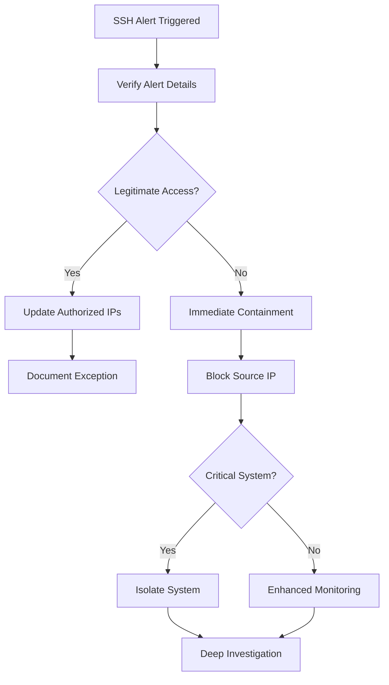
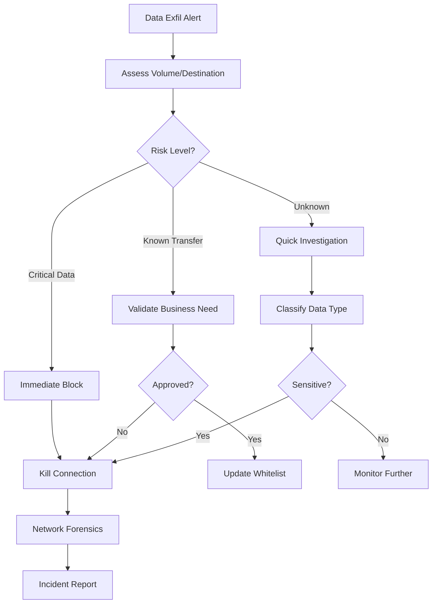
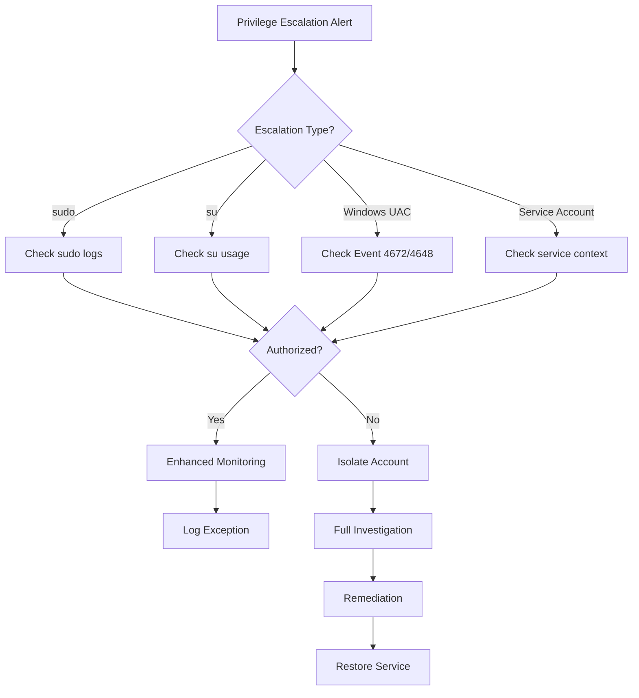
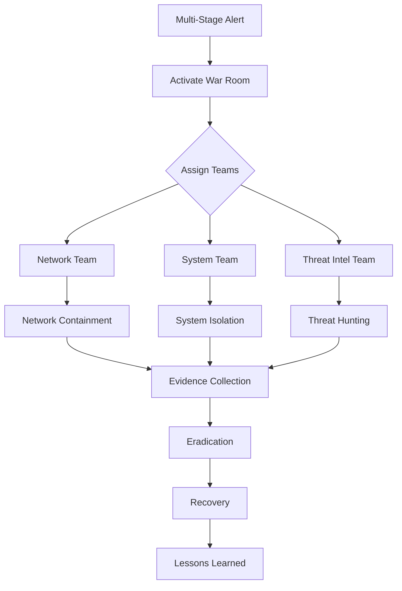
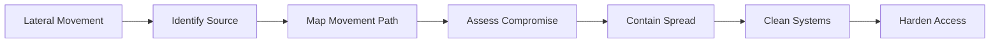
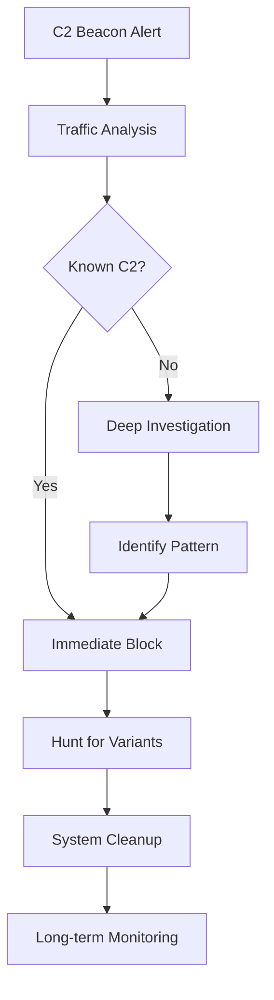
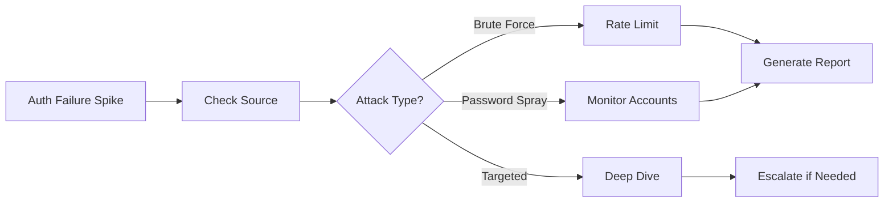
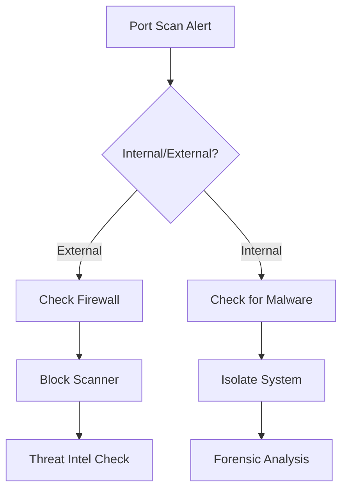
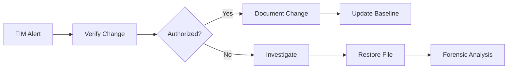
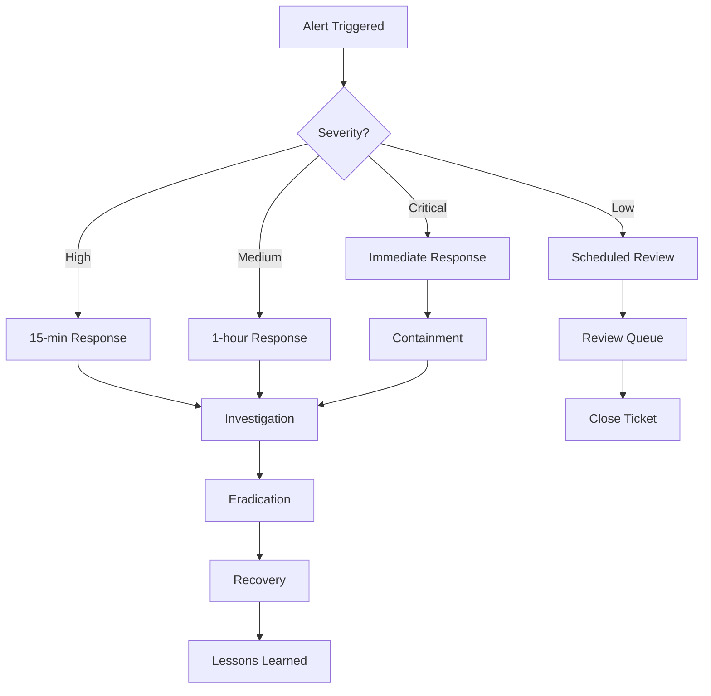

# Incident Response Playbooks

## Table of Contents
1. [Critical Priority Playbooks](#critical-priority-playbooks)
   - [Unauthorized SSH Access](#unauthorized-ssh-access-playbook)
   - [Data Exfiltration](#data-exfiltration-playbook)
   - [Privilege Escalation](#privilege-escalation-playbook)
   - [Multi-Stage Attack](#multi-stage-attack-playbook)
2. [High Priority Playbooks](#high-priority-playbooks)
   - [Lateral Movement](#lateral-movement-playbook)
   - [Command and Control Beacon](#command-and-control-beacon-playbook)
   - [Suspicious Process Execution](#suspicious-process-execution-playbook)
   - [Account Manipulation](#account-manipulation-playbook)
3. [Medium Priority Playbooks](#medium-priority-playbooks)
   - [Failed Authentication Spike](#failed-authentication-spike-playbook)
   - [Port Scanning Activity](#port-scanning-activity-playbook)
   - [File Integrity Violation](#file-integrity-violation-playbook)
4. [Incident Response Workflow](#incident-response-workflow)
5. [Evidence Collection Guidelines](#evidence-collection-guidelines)

---

## Critical Priority Playbooks

### Unauthorized SSH Access Playbook

**Alert Name**: Unauthorized SSH Access from Unknown IPs
**Severity**: Critical (5)
**Response Time**: Immediate (0-5 minutes)

#### Initial Assessment (0-5 minutes)



#### Step 1: Alert Verification (0-2 minutes)

**Splunk Query**:
```spl
index=* source="/var/log/secure*" OR source="/var/log/auth*" earliest=-1h
| rex field=_raw "sshd\[\d+\]:\s+(?<ssh_status>Accepted|Failed)\s+(?<auth_method>\S+)\s+for\s+(?<user>\S+)\s+from\s+(?<src_ip>\S+)"
| search src_ip="<ALERT_IP>" user="<ALERT_USER>"
| stats count by _time, ssh_status, auth_method, user, src_ip, host
| sort -_time
```

**Verification Checklist**:
- [ ] Confirm source IP is not in authorized_ips.csv
- [ ] Check if user account is legitimate
- [ ] Verify authentication method (password/key)
- [ ] Confirm target host criticality
- [ ] Check for multiple affected systems

#### Step 2: Immediate Containment (2-5 minutes)

**Network Level**:
```bash
# Block at firewall (example for iptables)
sudo iptables -I INPUT -s <SOURCE_IP> -j DROP
sudo iptables-save > /etc/iptables/rules.v4

# Block at Splunk forwarder host
sudo echo "sshd: <SOURCE_IP>" >> /etc/hosts.deny
```

**Account Level**:
```bash
# Lock compromised account
sudo passwd -l <USERNAME>

# Kill existing sessions
sudo pkill -u <USERNAME>
sudo pkill -t pts/<SESSION_NUMBER>

# Check for sudo privileges
sudo grep <USERNAME> /etc/sudoers
```

#### Step 3: Impact Assessment (5-15 minutes)

**Lateral Movement Check**:
```spl
index=* source="/var/log/secure*" earliest=-24h
| search user="<COMPROMISED_USER>" OR src_ip="<MALICIOUS_IP>"
| stats values(host) as affected_hosts,
        values(user) as affected_users,
        earliest(_time) as first_seen,
        latest(_time) as last_seen
| eval duration=tostring(last_seen-first_seen, "duration")
```

**Data Access Check**:
```spl
index=* (sourcetype=linux_audit OR source="/var/log/audit*")
| search user="<COMPROMISED_USER>" (type=PATH OR type=OPENAT)
| rex field=msg "name=\"(?<file_accessed>[^\"]+)\""
| stats values(file_accessed) as files_accessed by host
| where match(file_accessed, "(shadow|passwd|.ssh|.aws|.kube|database)")
```

#### Step 4: Evidence Collection (15-30 minutes)

**System Evidence**:
```bash
# Capture authentication logs
sudo tar czf /tmp/incident_auth_$(date +%Y%m%d_%H%M%S).tar.gz \
    /var/log/secure* /var/log/auth* /var/log/messages

# Capture user history
sudo tar czf /tmp/incident_history_$(date +%Y%m%d_%H%M%S).tar.gz \
    /home/<USERNAME>/.bash_history \
    /home/<USERNAME>/.ssh/ \
    /root/.bash_history

# Network connections
sudo netstat -tulpan > /tmp/incident_netstat_$(date +%Y%m%d_%H%M%S).txt
sudo ss -tulpan > /tmp/incident_ss_$(date +%Y%m%d_%H%M%S).txt

# Process snapshot
sudo ps auxf > /tmp/incident_processes_$(date +%Y%m%d_%H%M%S).txt
sudo lsof -u <USERNAME> > /tmp/incident_files_$(date +%Y%m%d_%H%M%S).txt
```

#### Step 5: Eradication (30-60 minutes)

**Remove Persistence**:
```bash
# Check for SSH keys
sudo find /home -name "authorized_keys" -exec grep -l "<PATTERN>" {} \;

# Check cron jobs
sudo crontab -u <USERNAME> -l
sudo ls -la /etc/cron.*

# Check systemd services
sudo systemctl list-units --type=service --state=running

# Check for backdoors
sudo find / -name ".*" -type f -mtime -7 2>/dev/null
```

#### Step 6: Recovery (60+ minutes)

**System Hardening**:
```bash
# Rotate all SSH keys
sudo ssh-keygen -A

# Force password reset
sudo chage -d 0 <USERNAME>

# Update SSH configuration
sudo sed -i 's/PermitRootLogin yes/PermitRootLogin no/' /etc/ssh/sshd_config
sudo sed -i 's/#MaxAuthTries 6/MaxAuthTries 3/' /etc/ssh/sshd_config
sudo systemctl restart sshd
```

#### Step 7: Post-Incident Actions

**Documentation Required**:
1. Incident timeline with all actions taken
2. Affected systems and users list
3. Data potentially accessed or exfiltrated
4. Root cause analysis
5. Remediation steps completed
6. Lessons learned and improvement recommendations

**Monitoring Enhancements**:
```spl
# Create enhanced monitoring search
index=* (src_ip="<MALICIOUS_IP>" OR user="<COMPROMISED_USER>")
| eval threat_indicator="known_malicious"
| collect index=threat_intel

# Update lookup table
| inputlookup malicious_ips.csv
| append [| makeresults | eval dest_ip="<MALICIOUS_IP>", is_malicious="true", threat_type="SSH_compromise", last_seen=now()]
| outputlookup malicious_ips.csv
```

---

### Data Exfiltration Playbook

**Alert Name**: Data Exfiltration Attempt
**Severity**: Critical (5)
**Response Time**: Immediate (0-10 minutes)

#### Initial Response Workflow



#### Step 1: Immediate Assessment (0-3 minutes)

**Volume and Destination Analysis**:
```spl
index=* (sourcetype=firewall OR sourcetype=proxy) earliest=-1h
| eval bytes_out=coalesce(bytes_out, bytes_sent, sc_bytes)
| search dest_ip="<ALERT_DESTINATION>" OR src_ip="<ALERT_SOURCE>"
| stats sum(bytes_out) as total_bytes,
        values(dest_domain) as domains,
        values(dest_port) as ports,
        dc(src_ip) as unique_sources,
        earliest(_time) as start_time,
        latest(_time) as end_time
| eval total_gb=round(total_bytes/1073741824, 2),
       duration=tostring(end_time-start_time, "duration")
```

**Threat Intelligence Check**:
```spl
| makeresults
| eval dest_ip="<DESTINATION_IP>"
| lookup malicious_ips.csv dest_ip OUTPUT is_malicious threat_type
| lookup geoip dest_ip OUTPUT country, city
| table dest_ip is_malicious threat_type country city
```

#### Step 2: Connection Termination (3-5 minutes)

**Network Level Block**:
```bash
# Immediate firewall rule
sudo iptables -I OUTPUT -d <DESTINATION_IP> -j REJECT
sudo iptables -I FORWARD -d <DESTINATION_IP> -j REJECT

# Kill active connections
sudo tcpkill -i eth0 host <DESTINATION_IP>
sudo conntrack -D -d <DESTINATION_IP>

# Block at proxy level (if applicable)
curl -X POST "http://proxy-server/api/block" \
  -H "Content-Type: application/json" \
  -d '{"ip":"<DESTINATION_IP>","action":"block","duration":"permanent"}'
```

#### Step 3: Data Classification (5-15 minutes)

**Identify Transferred Data**:
```spl
index=* sourcetype=proxy earliest=-4h
| search src_ip="<SOURCE_IP>" dest_ip="<DESTINATION_IP>"
| rex field=cs_uri_path "\/(?<filename>[^\/\?]+)$"
| rex field=cs_mime_type "(?<mime_type>[^;]+)"
| stats values(filename) as files,
        values(mime_type) as file_types,
        sum(sc_bytes) as bytes_per_file by cs_uri_stem
| eval mb_transferred=round(bytes_per_file/1048576, 2)
| sort -mb_transferred
```

**Database Query Correlation**:
```spl
index=* (sourcetype=mysql:audit OR sourcetype=postgresql)
| search user="<USERNAME>" earliest=-4h
| rex field=query "(?i)(SELECT|COPY|EXPORT|DUMP)"
| stats count by query_type, table_name, database
| where count > 100
```

#### Step 4: System Investigation (15-30 minutes)

**Source System Analysis**:
```bash
# Check for compression/encryption activities
sudo ausearch -m execve -ts recent | grep -E "(tar|zip|7z|gpg|openssl)"

# Look for staging directories
sudo find /tmp /var/tmp /dev/shm -type f -size +10M -mtime -1

# Check outbound connections
sudo lsof -i -P | grep -E "ESTABLISHED.*<DESTINATION_IP>"

# Recent large file operations
sudo find / -type f -size +100M -mtime -1 2>/dev/null
```

**User Activity Timeline**:
```spl
index=* user="<USERNAME>" earliest=-24h
| bucket _time span=1h
| stats count by _time, sourcetype, action, host
| eval suspicious=case(
    hour(_time) < 6 OR hour(_time) > 22, "after-hours",
    sourcetype="database", "database-access",
    action="download", "file-download",
    1=1, "normal"
)
| where suspicious!="normal"
```

#### Step 5: Impact Analysis (30-45 minutes)

**Data Inventory**:
```spl
# Determine what data was potentially exposed
index=* sourcetype=file_integrity earliest=-7d
| search host="<AFFECTED_HOST>"
| rex field=file_path "(?<data_class>customer|financial|medical|proprietary|confidential)"
| stats values(file_path) as files by data_class
| eval risk_level=case(
    data_class="medical", "HIPAA-regulated",
    data_class="financial", "PCI-regulated",
    data_class="customer", "GDPR-regulated",
    1=1, "internal"
)
```

#### Step 6: Containment and Recovery

**Full Containment Checklist**:
- [ ] Block destination IP at all network boundaries
- [ ] Disable affected user accounts
- [ ] Isolate source systems from network
- [ ] Preserve evidence for forensics
- [ ] Notify legal/compliance teams
- [ ] Prepare breach notification (if required)
- [ ] Reset all related credentials
- [ ] Implement enhanced DLP rules

---

### Privilege Escalation Playbook

**Alert Name**: Privilege Escalation Detected
**Severity**: Critical (5)
**Response Time**: Immediate (0-5 minutes)

#### Response Decision Tree



#### Step 1: Escalation Verification (0-2 minutes)

**Linux Privilege Escalation Check**:
```spl
index=* source="/var/log/secure*" earliest=-30m
| search ("sudo:" OR "su[" OR "pkexec")
| rex field=_raw "sudo:\s+(?<sudo_user>\S+).*COMMAND=(?<command>.*)"
| rex field=_raw "su\[.*\]:\s+(?<su_action>.*)"
| eval escalation_details=coalesce(command, su_action)
| stats count by user, escalation_details, host, _time
| where NOT match(user, "^(root|admin|service)")
```

**Windows Privilege Escalation Check**:
```spl
index=* source="WinEventLog:Security" (EventCode=4672 OR EventCode=4648) earliest=-30m
| eval privileges=mvjoin(Privileges, ", ")
| search NOT Account_Name IN ("SYSTEM", "LOCAL SERVICE", "NETWORK SERVICE")
| stats values(privileges) as elevated_privileges,
        values(Process_Name) as process,
        count by Account_Name, Computer_Name
| where match(elevated_privileges, "SeDebugPrivilege|SeTcbPrivilege")
```

#### Step 2: Account Lockdown (2-5 minutes)

**Immediate Account Suspension**:
```bash
# Linux account suspension
sudo usermod -L <USERNAME>
sudo pkill -KILL -u <USERNAME>

# Remove from sudo group
sudo deluser <USERNAME> sudo
sudo sed -i '/<USERNAME>/d' /etc/sudoers

# Windows account suspension (PowerShell)
Disable-ADAccount -Identity <USERNAME>
Get-RDUserSession | Where {$_.UserName -eq "<USERNAME>"} | Invoke-RDUserSessionLogoff
```

#### Step 3: Privilege Abuse Investigation (5-15 minutes)

**Command History Analysis**:
```bash
# Review sudo commands executed
sudo grep "sudo:" /var/log/secure* | grep <USERNAME>

# Check for privilege escalation exploits
sudo ausearch -m USER_CMD -ts recent | grep <USERNAME>

# Look for SUID/SGID abuse
find / -perm -4000 -o -perm -2000 -type f 2>/dev/null | xargs ls -la
```

**Splunk Investigation Query**:
```spl
index=* user="<USERNAME>" earliest=-24h
| search (process_name IN ("sudo", "su", "pkexec", "runas.exe") OR
         EventCode IN (4672, 4673, 4674))
| transaction user startswith=eval(escalation="started")
              endswith=eval(escalation="ended") maxspan=30m
| table _time user host duration command eventcount
| where eventcount > 10
```

#### Step 4: Lateral Movement Assessment (15-30 minutes)

**Post-Escalation Activity**:
```spl
# Check for lateral movement after escalation
index=* earliest=-4h
| search [search index=* user="<USERNAME>" escalation="detected" earliest=-4h
         | return 100 user host]
| search (EventCode=4624 OR "Accepted publickey" OR "session opened")
| stats dc(dest_host) as targets,
        values(dest_host) as target_list,
        values(action) as actions by src_host, user
| where targets > 1
```

#### Step 5: System Integrity Check

**Verify System Modifications**:
```bash
# Check for new admin users
sudo cat /etc/group | grep -E "sudo|wheel|admin"

# Verify sudoers file integrity
sudo visudo -c
sudo find /etc/sudoers.d -type f -exec cat {} \;

# Check for rootkit indicators
sudo rkhunter --check --skip-keypress
sudo chkrootkit

# Review system file changes
sudo debsums -c  # Debian/Ubuntu
sudo rpm -Va     # RHEL/CentOS
```

---

### Multi-Stage Attack Playbook

**Alert Name**: Multi-Stage Attack Chain
**Severity**: Critical (5)
**Response Time**: Immediate - War Room Activation

#### Attack Chain Analysis



#### Step 1: War Room Activation (0-5 minutes)

**Initial Assessment Dashboard**:
```spl
| multisearch
    [ search index=* alert_name="Port Scan" earliest=-4h
      | stats count as recon_count by src_ip ]
    [ search index=* alert_name="Failed Authentication Spike" earliest=-4h
      | stats count as auth_failures by src_ip ]
    [ search index=* alert_name="Privilege Escalation" earliest=-4h
      | stats count as priv_esc_count by user ]
    [ search index=* alert_name="Lateral Movement" earliest=-4h
      | stats count as lateral_count by src_host ]
    [ search index=* alert_name="Data Exfiltration" earliest=-4h
      | stats sum(bytes_out) as exfil_bytes by src_ip ]
| stats values(*) as * by src_ip
| eval attack_score = recon_count*1 + auth_failures*2 + priv_esc_count*5 + lateral_count*5 + (exfil_bytes/1048576)*10
| sort -attack_score
```

**Team Assignments**:
1. **Incident Commander**: Overall coordination
2. **Network Team**: Perimeter defense and traffic analysis
3. **System Team**: Host containment and forensics
4. **Threat Intel**: Attribution and TTP analysis
5. **Communications**: Stakeholder updates
6. **Legal/Compliance**: Breach assessment

#### Step 2: Full Kill Chain Mapping (5-15 minutes)

**Complete Attack Timeline**:
```spl
index=* (src_ip="<ATTACKER_IP>" OR dest_ip="<ATTACKER_IP>" OR user="<COMPROMISED_USER>") earliest=-7d
| eval attack_phase=case(
    searchmatch("port scan"), "1-Reconnaissance",
    searchmatch("failed auth"), "2-Initial_Access",
    searchmatch("successful auth"), "3-Execution",
    searchmatch("privilege"), "4-Privilege_Escalation",
    searchmatch("lateral"), "5-Lateral_Movement",
    searchmatch("exfil"), "6-Exfiltration",
    1=1, "0-Unknown"
)
| sort _time
| transaction src_ip maxspan=4h
| table _time src_ip attack_phase action duration eventcount
```

#### Step 3: Comprehensive Containment (15-30 minutes)

**Network Segmentation**:
```bash
# Implement emergency network segmentation
sudo iptables -N QUARANTINE
sudo iptables -A QUARANTINE -j LOG --log-prefix "QUARANTINE: "
sudo iptables -A QUARANTINE -j DROP

# Add compromised systems to quarantine
for ip in <COMPROMISED_IP_LIST>; do
    sudo iptables -A INPUT -s $ip -j QUARANTINE
    sudo iptables -A OUTPUT -d $ip -j QUARANTINE
done

# Implement micro-segmentation
sudo iptables -A FORWARD -s <CRITICAL_SUBNET> -d <COMPROMISED_SUBNET> -j DROP
```

**Global Response Actions**:
1. Disable all affected accounts globally
2. Reset all service account passwords
3. Revoke all API keys and tokens
4. Block C2 domains at DNS level
5. Isolate critical data repositories
6. Enable enhanced logging everywhere

#### Step 4: Threat Hunting (30-60 minutes)

**Hunt for Unknown Compromises**:
```spl
# Behavioral anomaly detection
index=* earliest=-7d
| eval hour=strftime(_time, "%H")
| stats avg(bytes_out) as avg_bytes,
        stdev(bytes_out) as stdev_bytes,
        dc(dest_ip) as unique_dests by src_ip, hour
| where (bytes_out > avg_bytes + 3*stdev_bytes) OR unique_dests > 20
```

**Living Off the Land Detection**:
```spl
index=* process_name IN ("powershell", "wmic", "mshta", "rundll32", "regsvr32")
| rex field=command_line "(?<suspicious_pattern>downloadstring|encodedcommand|invoke-expression|bypass)"
| where isnotnull(suspicious_pattern)
| stats count by host, process_name, suspicious_pattern
```

#### Step 5: Recovery Planning (60+ minutes)

**System Recovery Priority Matrix**:

| Priority | System Type | Recovery Time | Validation Required |
|----------|------------|---------------|-------------------|
| P1 | Domain Controllers | 2 hours | Full integrity check |
| P1 | Database Servers | 2 hours | Transaction log review |
| P2 | Application Servers | 4 hours | Code integrity verification |
| P2 | Web Servers | 4 hours | Configuration audit |
| P3 | File Servers | 8 hours | Permission reset |
| P4 | User Workstations | 24 hours | Reimage recommended |

---

## High Priority Playbooks

### Lateral Movement Playbook

**Alert Name**: Lateral Movement Detected
**Severity**: High (4)
**Response Time**: 15 minutes

#### Investigation Workflow



#### Step 1: Movement Pattern Analysis (0-5 minutes)

```spl
index=* (EventCode=4624 OR EventCode=4648 OR "Accepted publickey") earliest=-2h
| eval movement_type=case(
    EventCode=4624 AND Logon_Type=3, "network_logon",
    EventCode=4624 AND Logon_Type=10, "rdp_logon",
    EventCode=4648, "explicit_creds",
    searchmatch("Accepted publickey"), "ssh_logon"
)
| stats values(dest_host) as targets,
        dc(dest_host) as target_count,
        values(movement_type) as methods by src_host, user
| where target_count > 3
| sort -target_count
```

#### Step 2: Access Path Visualization (5-10 minutes)

```spl
index=* authentication earliest=-4h
| eval connection=src_host + "->" + dest_host
| stats count by connection, user, _time
| eval weight=case(count>10, "heavy", count>5, "medium", 1=1, "light")
| table _time user connection weight
| sort _time
```

#### Step 3: Credential Assessment (10-15 minutes)

**Identify Compromised Credentials**:
```spl
index=* (EventCode=4624 OR EventCode=4776) earliest=-24h
| search user="<SUSPECTED_USER>"
| stats dc(host) as unique_hosts,
        values(host) as host_list,
        dc(Authentication_Package) as auth_methods,
        values(Workstation_Name) as source_machines
| eval credential_risk=case(
    unique_hosts > 10, "high",
    unique_hosts > 5, "medium",
    1=1, "low"
)
```

#### Step 4: Containment Actions

**Network Isolation**:
```bash
# Restrict lateral movement protocols
sudo iptables -A INPUT -p tcp --dport 445 -j DROP  # SMB
sudo iptables -A INPUT -p tcp --dport 3389 -j DROP # RDP
sudo iptables -A INPUT -p tcp --dport 22 -j DROP   # SSH (selective)
sudo iptables -A INPUT -p tcp --dport 5985 -j DROP # WinRM
```

**Credential Reset**:
```powershell
# Force password reset for affected users
Get-ADUser -Filter {Enabled -eq $true} |
    Where {$_.SamAccountName -in $compromisedUsers} |
    Set-ADUser -ChangePasswordAtLogon $true
```

---

### Command and Control Beacon Playbook

**Alert Name**: Command and Control Beacon
**Severity**: High (4)
**Response Time**: 30 minutes

#### Detection and Response Flow



#### Step 1: Beacon Pattern Analysis (0-10 minutes)

```spl
index=* (sourcetype=firewall OR sourcetype=proxy OR sourcetype=dns) earliest=-4h
| bin _time span=5m
| stats count by _time, src_ip, dest_ip
| eventstats avg(count) as avg_count, stdev(count) as stdev_count by src_ip, dest_ip
| eval beacon_score = case(
    stdev_count < 0.5 AND count > 10, 100,
    stdev_count < 1 AND count > 5, 80,
    stdev_count < 2 AND count > 3, 60,
    1=1, 0
)
| where beacon_score > 60
| eval beacon_interval = "5 minutes"
| sort -beacon_score
```

#### Step 2: C2 Infrastructure Identification (10-20 minutes)

```spl
# DNS-based C2 detection
index=* sourcetype=dns earliest=-24h
| rex field=query "(?<subdomain>[^.]+)\.(?<domain>[^.]+\.(?:com|net|org|io))"
| eval subdomain_length = len(subdomain)
| stats dc(subdomain) as unique_subdomains,
        avg(subdomain_length) as avg_length,
        values(answer) as resolved_ips by domain
| where unique_subdomains > 50 AND avg_length > 20
```

#### Step 3: C2 Channel Disruption (20-30 minutes)

**DNS Sinkhole Implementation**:
```bash
# Add C2 domains to DNS blackhole
echo "address=/<C2_DOMAIN>/127.0.0.1" >> /etc/dnsmasq.conf
sudo systemctl restart dnsmasq

# Implement RPZ (Response Policy Zone)
cat >> /etc/bind/rpz.local <<EOF
<C2_DOMAIN> IN A 127.0.0.1
*.<C2_DOMAIN> IN A 127.0.0.1
EOF
```

**Proxy Blocking**:
```bash
# Block at proxy level
curl -X POST "http://proxy-api/block" \
  -H "Content-Type: application/json" \
  -d '{"type":"domain","value":"<C2_DOMAIN>","action":"block"}'
```

#### Step 4: Infected System Identification

```spl
index=* src_ip="*" dest_ip="<C2_IP>" earliest=-7d
| stats dc(src_ip) as infected_count,
        values(src_ip) as infected_systems,
        sum(bytes_out) as total_data_sent,
        earliest(_time) as first_contact,
        latest(_time) as last_contact by dest_ip
| eval days_active = round((last_contact - first_contact) / 86400, 2)
```

---

## Medium Priority Playbooks

### Failed Authentication Spike Playbook

**Alert Name**: Failed Authentication Spike
**Severity**: Medium (3)
**Response Time**: 1 hour

#### Response Process



#### Step 1: Attack Classification (0-15 minutes)

```spl
index=* (EventCode=4625 OR "Failed password") earliest=-1h
| bin _time span=1m
| stats count as failures,
        dc(user) as unique_users,
        values(user) as target_users by _time, src_ip
| eval attack_type = case(
    failures > 50 AND unique_users == 1, "brute_force",
    failures > 20 AND unique_users > 10, "password_spray",
    failures > 10 AND unique_users < 5, "targeted",
    1=1, "normal"
)
| where attack_type != "normal"
```

#### Step 2: Rate Limiting Implementation (15-30 minutes)

```bash
# Implement fail2ban rules
cat > /etc/fail2ban/jail.local <<EOF
[sshd]
enabled = true
maxretry = 3
findtime = 600
bantime = 3600
EOF

sudo systemctl restart fail2ban
```

#### Step 3: Account Protection (30-45 minutes)

```spl
# Identify targeted accounts
index=* EventCode=4625 earliest=-24h
| stats count as failed_attempts by Account_Name
| where failed_attempts > 10
| eval risk_level = case(
    failed_attempts > 100, "critical",
    failed_attempts > 50, "high",
    failed_attempts > 20, "medium",
    1=1, "low"
)
| table Account_Name failed_attempts risk_level
```

---

### Port Scanning Activity Playbook

**Alert Name**: Port Scanning Activity
**Severity**: Medium (3)
**Response Time**: 1 hour

#### Investigation Steps



#### Step 1: Scan Pattern Analysis (0-15 minutes)

```spl
index=* (action=blocked OR "DPT=") earliest=-1h
| rex field=_raw "DPT=(?<dest_port>\d+)"
| bin _time span=1m
| stats dc(dest_port) as unique_ports,
        values(dest_port) as scanned_ports,
        dc(dest_ip) as unique_targets by _time, src_ip
| eval scan_type = case(
    unique_ports > 1000, "full_scan",
    match(scanned_ports, "^(22|23|445|3389)"), "targeted_scan",
    unique_targets > 10, "network_sweep",
    1=1, "reconnaissance"
)
```

#### Step 2: Scanner Identification (15-30 minutes)

```spl
# Check if scanner is authorized
| makeresults
| eval src_ip="<SCANNER_IP>"
| lookup authorized_scanners.csv src_ip OUTPUT is_authorized scanner_type
| lookup malicious_ips.csv src_ip AS src_ip OUTPUT is_malicious threat_type
| eval verdict = case(
    is_authorized="true", "legitimate_scan",
    is_malicious="true", "known_threat",
    1=1, "unknown_scanner"
)
```

#### Step 3: Response Actions (30-45 minutes)

**For External Scanners**:
```bash
# Add to firewall blacklist
sudo iptables -A INPUT -s <SCANNER_IP> -j DROP
echo "<SCANNER_IP>" >> /etc/blacklist.txt

# Report to abuse contact
whois <SCANNER_IP> | grep -E "abuse|email"
```

**For Internal Scanners**:
```bash
# Isolate and investigate
sudo iptables -I OUTPUT -s <INTERNAL_IP> -j DROP

# Check for scanning tools
sudo find / -name "nmap" -o -name "masscan" -o -name "zmap" 2>/dev/null
```

---

### File Integrity Violation Playbook

**Alert Name**: File Integrity Violation
**Severity**: Medium (3)
**Response Time**: 1 hour

#### Response Workflow



#### Step 1: Change Verification (0-15 minutes)

```spl
index=* (sourcetype=aide OR sourcetype=fim) earliest=-1h
| rex field=_raw "(?<change_type>added|removed|changed):\s+(?<file_path>[^\s]+)"
| lookup critical_files.csv file_path OUTPUT is_critical protection_level
| eval severity = case(
    is_critical="true" AND protection_level="high", "critical",
    is_critical="true", "high",
    match(file_path, "/etc/|/bin/|system32"), "medium",
    1=1, "low"
)
| table _time host file_path change_type severity
```

#### Step 2: Change Authorization Check (15-30 minutes)

```bash
# Check recent package updates
rpm -qa --last | head -20  # RHEL/CentOS
dpkg-query -l | head -20   # Debian/Ubuntu

# Check change management tickets
curl -X GET "https://ticketing-system/api/changes?date=today" \
  -H "Authorization: Bearer <TOKEN>"
```

#### Step 3: File Restoration (30-45 minutes)

```bash
# Backup compromised file
sudo cp <MODIFIED_FILE> <MODIFIED_FILE>.compromised.$(date +%Y%m%d)

# Restore from known good backup
sudo cp /backup/<ORIGINAL_FILE> <MODIFIED_FILE>

# Verify restoration
sudo sha256sum <MODIFIED_FILE>
sudo rpm -V <PACKAGE_NAME>  # Verify package integrity
```

---

## Incident Response Workflow

### Standard Operating Procedure



### Escalation Matrix

| Severity | Initial Response | Escalation Time | Escalation To |
|----------|-----------------|-----------------|---------------|
| Critical | SOC Analyst | Immediate | Team Lead + CISO |
| High | SOC Analyst | 30 minutes | Team Lead |
| Medium | SOC Analyst | 2 hours | Senior Analyst |
| Low | Junior Analyst | Next Day | SOC Analyst |

### Communication Templates

#### Critical Incident Notification

```
Subject: [CRITICAL] Security Incident - <INCIDENT_TYPE>

Incident Details:
- Time Detected: <TIMESTAMP>
- Severity: CRITICAL
- Systems Affected: <SYSTEMS>
- Current Status: <CONTAINMENT/INVESTIGATION/RECOVERY>

Impact Assessment:
- Data at Risk: <YES/NO/UNKNOWN>
- Service Impact: <DESCRIPTION>
- User Impact: <COUNT> users affected

Actions Taken:
1. <ACTION_1>
2. <ACTION_2>
3. <ACTION_3>

Next Steps:
- <NEXT_STEP_1>
- <NEXT_STEP_2>

Incident Commander: <NAME>
Contact: <PHONE/EMAIL>
Bridge Line: <CONFERENCE_DETAILS>
```

---

## Evidence Collection Guidelines

### Collection Priority

1. **Volatile Data** (Memory, Network Connections)
2. **System Logs** (Event Logs, Syslogs)
3. **File System** (Modified Files, Malware)
4. **Network Captures** (PCAP, Netflow)
5. **User Artifacts** (Browser History, Downloads)

### Collection Commands

#### Linux Evidence Collection

```bash
#!/bin/bash
# Evidence Collection Script

CASE_ID="INC$(date +%Y%m%d%H%M%S)"
EVIDENCE_DIR="/evidence/${CASE_ID}"
mkdir -p ${EVIDENCE_DIR}

# System Information
hostname > ${EVIDENCE_DIR}/hostname.txt
date > ${EVIDENCE_DIR}/date.txt
uptime > ${EVIDENCE_DIR}/uptime.txt
uname -a > ${EVIDENCE_DIR}/uname.txt

# Network State
netstat -tulpan > ${EVIDENCE_DIR}/netstat.txt
ss -tulpan > ${EVIDENCE_DIR}/ss.txt
iptables -L -n -v > ${EVIDENCE_DIR}/iptables.txt
ip route > ${EVIDENCE_DIR}/routes.txt
arp -a > ${EVIDENCE_DIR}/arp.txt

# Process State
ps auxf > ${EVIDENCE_DIR}/processes.txt
lsof > ${EVIDENCE_DIR}/open_files.txt
pstree -p > ${EVIDENCE_DIR}/process_tree.txt

# User Activity
w > ${EVIDENCE_DIR}/logged_users.txt
last -50 > ${EVIDENCE_DIR}/last_logins.txt
lastb -50 > ${EVIDENCE_DIR}/failed_logins.txt
history > ${EVIDENCE_DIR}/root_history.txt

# System Logs
tar czf ${EVIDENCE_DIR}/logs.tar.gz /var/log/

# Memory Dump (if LiME is available)
# insmod /path/to/lime.ko "path=${EVIDENCE_DIR}/memory.lime format=lime"

# Hash all evidence
find ${EVIDENCE_DIR} -type f -exec sha256sum {} \; > ${EVIDENCE_DIR}/evidence_hashes.txt

echo "Evidence collected in ${EVIDENCE_DIR}"
```

#### Windows Evidence Collection

```powershell
# Windows Evidence Collection Script

$CaseID = "INC" + (Get-Date -Format "yyyyMMddHHmmss")
$EvidenceDir = "C:\Evidence\$CaseID"
New-Item -ItemType Directory -Path $EvidenceDir -Force

# System Information
Get-ComputerInfo | Out-File "$EvidenceDir\system_info.txt"
Get-Date | Out-File "$EvidenceDir\collection_time.txt"

# Network Connections
netstat -anob | Out-File "$EvidenceDir\netstat.txt"
Get-NetTCPConnection | Export-Csv "$EvidenceDir\tcp_connections.csv"
Get-NetUDPEndpoint | Export-Csv "$EvidenceDir\udp_endpoints.csv"

# Process Information
Get-Process | Export-Csv "$EvidenceDir\processes.csv"
Get-CimInstance Win32_Process | Export-Csv "$EvidenceDir\process_details.csv"

# Service Information
Get-Service | Export-Csv "$EvidenceDir\services.csv"
Get-CimInstance Win32_Service | Export-Csv "$EvidenceDir\service_details.csv"

# User Sessions
quser | Out-File "$EvidenceDir\logged_users.txt"
Get-LocalUser | Export-Csv "$EvidenceDir\local_users.csv"

# Event Logs
wevtutil epl Security "$EvidenceDir\Security.evtx"
wevtutil epl System "$EvidenceDir\System.evtx"
wevtutil epl Application "$EvidenceDir\Application.evtx"

# Registry Hives (if needed)
reg save HKLM\SYSTEM "$EvidenceDir\SYSTEM.hive"
reg save HKLM\SOFTWARE "$EvidenceDir\SOFTWARE.hive"
reg save HKLM\SAM "$EvidenceDir\SAM.hive"

# Calculate hashes
Get-ChildItem $EvidenceDir -File | Get-FileHash -Algorithm SHA256 |
    Export-Csv "$EvidenceDir\evidence_hashes.csv"

Write-Host "Evidence collected in $EvidenceDir"
```

### Chain of Custody

```markdown
# Digital Evidence Chain of Custody Form

Case Number: _______________
Date/Time Collected: _______________
Collected By: _______________
System Identifier: _______________

Evidence Items:
1. Description: _______________
   Hash: _______________
   Size: _______________

2. Description: _______________
   Hash: _______________
   Size: _______________

Transfer Log:
| Date/Time | From | To | Purpose | Signature |
|-----------|------|----|---------|-----------|
| | | | | |
| | | | | |

Notes:
_________________________________________________
_________________________________________________
```

---

## Quick Reference Cards

### Linux Incident Response Commands

```bash
# Account Investigation
last -50                      # Recent logins
lastb -50                     # Failed logins
who -a                        # Current sessions
grep sudo /var/log/secure    # Sudo usage
cut -d: -f1 /etc/passwd       # User list

# Process Investigation
ps auxf                       # Process tree
lsof -u <username>           # User's open files
netstat -tulpan              # Network connections
ss -tulpan                   # Socket statistics
pstree -p                    # Process hierarchy

# Network Investigation
iptables -L -n -v            # Firewall rules
tcpdump -w capture.pcap      # Packet capture
netstat -rn                  # Routing table
arp -a                       # ARP cache
dig <domain>                 # DNS lookup

# File System Investigation
find / -mtime -1 -type f     # Recently modified files
find / -perm -4000           # SUID files
debsums -c                   # File integrity (Debian)
rpm -Va                      # File integrity (RHEL)
auditctl -l                  # Audit rules

# Log Analysis
journalctl -xe               # System journal
grep -r "pattern" /var/log  # Search logs
tail -f /var/log/secure      # Monitor auth log
zgrep "pattern" /var/log/*.gz # Search compressed logs
```

### Windows Incident Response Commands

```powershell
# Account Investigation
Get-LocalUser                 # Local users
Get-ADUser -Filter *          # Domain users
Get-EventLog Security -Newest 100 | Where {$_.EventID -eq 4625}  # Failed logins
quser                        # Logged on users

# Process Investigation
Get-Process                  # Running processes
Get-Service                  # Services
Get-NetTCPConnection         # TCP connections
Get-NetUDPEndpoint          # UDP endpoints
tasklist /v                  # Detailed task list

# Network Investigation
netstat -anob               # Network connections with PIDs
nslookup <domain>           # DNS lookup
arp -a                      # ARP cache
route print                 # Routing table
netsh advfirewall show allprofiles # Firewall status

# File System Investigation
Get-ChildItem -Path C:\ -Recurse -ErrorAction SilentlyContinue |
    Where {$_.LastWriteTime -gt (Get-Date).AddDays(-1)}  # Recent files
fsutil fsinfo drives        # List drives
cipher /u /n                # Find encrypted files

# Event Log Analysis
Get-EventLog -LogName Security -Newest 100
Get-WinEvent -FilterHashtable @{LogName='Security';ID=4624}  # Successful logons
wevtutil qe Security /c:50 /f:text  # Query security log
```

### Splunk Investigation Queries

```spl
# User Activity Timeline
index=* user="<USERNAME>" earliest=-7d
| bucket _time span=1h
| stats count by _time, action, src_ip, dest_ip
| sort _time

# Failed Login Analysis
index=* (EventCode=4625 OR "Failed password") earliest=-24h
| stats count as failures by user, src_ip
| sort -failures
| head 20

# Data Transfer Analysis
index=* (bytes_out>1048576 OR bytes_sent>1048576) earliest=-24h
| eval mb_transferred=round(bytes_out/1048576, 2)
| stats sum(mb_transferred) as total_mb by src_ip, dest_ip
| sort -total_mb

# Privilege Escalation Detection
index=* (sudo OR "EventCode=4672" OR "privilege") earliest=-24h
| transaction user maxspan=30m
| where eventcount > 5
| table _time user host duration eventcount

# Network Reconnaissance Detection
index=* earliest=-1h
| stats dc(dest_port) as unique_ports by src_ip
| where unique_ports > 100
| sort -unique_ports

# Suspicious Process Detection
index=* (process_name="powershell.exe" OR process_name="cmd.exe") earliest=-4h
| rex field=command_line "(?<suspicious>encoded|hidden|bypass)"
| where isnotnull(suspicious)
| table _time host user process_name command_line

# Lateral Movement Tracking
index=* (EventCode=4624 OR "session opened") earliest=-4h
| stats dc(dest_host) as unique_targets by src_host, user
| where unique_targets > 5
| sort -unique_targets

# C2 Communication Detection
index=* earliest=-4h
| bin _time span=5m
| stats count by _time, src_ip, dest_ip
| eventstats avg(count) as avg, stdev(count) as stdev by src_ip
| where count > avg + (2 * stdev)

# File Integrity Monitoring
index=* (file_integrity OR fim) earliest=-24h
| stats values(file_path) as modified_files by host, change_type
| where match(file_path, "critical|system32|etc")

# Alert Correlation
| multisearch
    [ search index=* severity=critical earliest=-1h ]
    [ search index=* severity=high earliest=-1h ]
| stats values(alert_name) as alerts by src_ip
| where mvcount(alerts) > 2
```

---

## Document Revision History

| Version | Date | Author | Changes |
|---------|------|--------|---------|
| 1.0 | 2024-10-18 | SOC Team | Initial playbook creation |
| 1.1 | TBD | TBD | Add cloud-specific responses |
| 1.2 | TBD | TBD | Include automation scripts |

---

## Contact Information

**Security Operations Center**
- 24/7 Hotline: 1-800-SECURITY
- Email: soc@organization.com
- Slack: #security-incidents

**Escalation Contacts**
- CISO: [Contact Details]
- Incident Commander: [Contact Details]
- Legal Team: [Contact Details]
- Public Relations: [Contact Details]